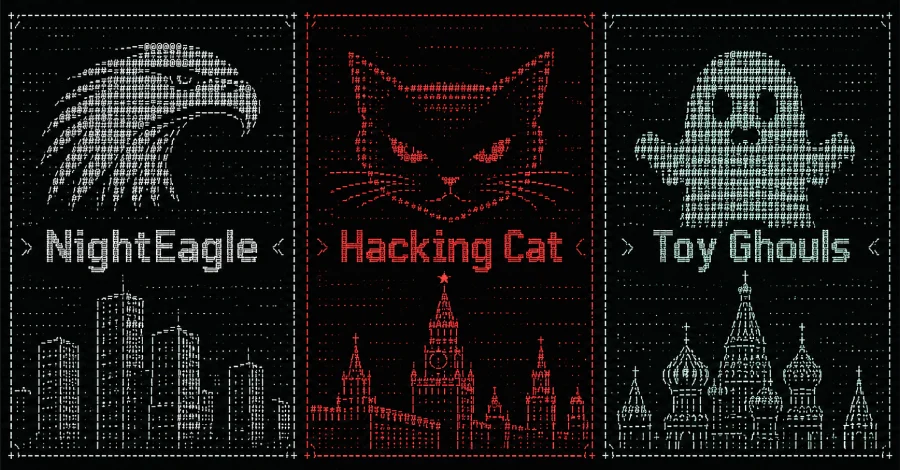
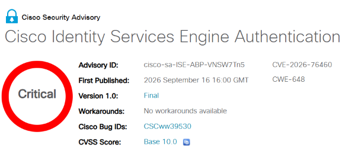
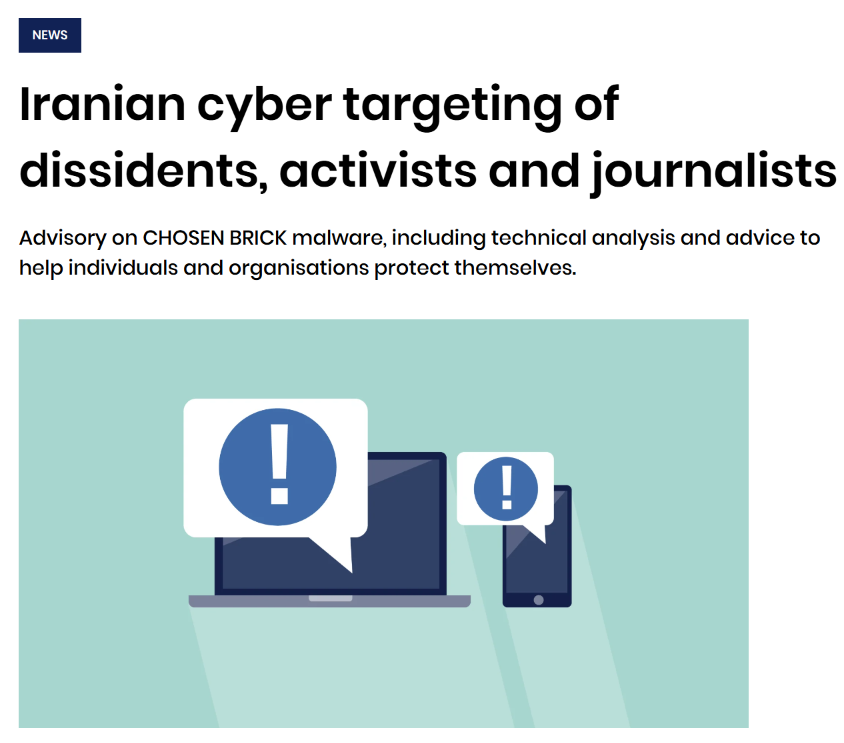

---
hide:
  - navigation
  - toc
---

# Last Week's Security Incidents
 

-   {.index-card__img}

    **CenterPoint Energy Customer Data Breach via External-Facing System**

    **CenterPoint Energy**{.cve-chip} **Utility Data Breach**{.cve-chip} **External-Facing System**{.cve-chip} **Unverified API Abuse Claims**{.cve-chip} **Customer PII Exposure**{.cve-chip}

    CenterPoint confirmed unauthorized access to customer personal information via an external-facing system, while attacker claims of 7.49M+ stolen records and API weaknesses remain unverified.

    [Read more →](2026/Week37/CenterPoint.md){.index-card__cta}

-   {.index-card__img}

    **Three Threat Clusters Target Russian Enterprises With Backdoors, Ransomware, and Wipers**

    **NightEagle (APT-Q-95)**{.cve-chip} **Hacking Cat**{.cve-chip} **Toy Ghouls**{.cve-chip} **Exchange Exploitation**{.cve-chip} **Ransomware and Wipers**{.cve-chip}

    Kaspersky reports three distinct clusters targeting Russian enterprises through VPN credential abuse, Exchange exploitation, persistent backdoors, and destructive ransomware/wiper operations.

    [Read more →](2026/Week37/Russian.md){.index-card__cta}

-   {.index-card__img}

    **Actively Exploited Cisco ISE / ISE-PIC Authentication Bypass Zero-Day**

    **Cisco ISE**{.cve-chip} **ISE-PIC**{.cve-chip} **CVE-2026-76460**{.cve-chip} **Authentication Bypass**{.cve-chip} **Active Exploitation**{.cve-chip}

    Cisco PSIRT confirmed active exploitation of a maximum-severity ISE/ISE-PIC authentication-bypass flaw that can expose centralized identity and network-access-control infrastructure.

    [Read more →](2026/Week37/Cisco.md){.index-card__cta}

-   {.index-card__img}

    **Iranian hackers use CHOSEN BRICK Windows malware to spy on targets**

    **State-Linked Espionage**{.cve-chip} **CHOSEN BRICK**{.cve-chip} **Social Engineering**{.cve-chip} **Telegram C2**{.cve-chip} **Windows Surveillance Malware**{.cve-chip}

    A joint U.S./U.K./Netherlands/FBI warning links Iranian state-backed operators to CHOSEN BRICK malware campaigns using messaging-app social engineering for surveillance, data theft, and harassment-oriented targeting.

    [Read more →](2026/Week37/Iran.md){.index-card__cta}

-   {.index-card__img}

    **DoppelCart - Large-Scale Fake Online Shop Fraud Network**

    **E-Commerce Fraud**{.cve-chip} **Fake Shops**{.cve-chip} **Card Theft**{.cve-chip} **Phishing Checkout**{.cve-chip} **Domain Churn**{.cve-chip}

    A large fraud network of about 119,000 fake shopping domains reportedly impersonates trusted retailers to steal payment-card and personal data through cloned checkout flows.

    [Read more →](2026/Week37/DoppelCart.md){.index-card__cta}

-   {.index-card__img}

    **LG Smart TV Data Collection**

    **Smart TV Privacy**{.cve-chip} **webOS**{.cve-chip} **ACR Telemetry**{.cve-chip} **IoT Exposure**{.cve-chip} **Standby Concerns**{.cve-chip}

    Researchers reported broad privacy concerns around ACR, telemetry, and standby behavior in LG webOS TVs, while LG disputes claims of secret recording and points to user controls.

    [Read more →](2026/Week37/LG.md){.index-card__cta}

-   {.index-card__img}

    **WeWorm - WeChat Zero-Click Worm**

    **WeChat Security**{.cve-chip} **Zero-Click Exploit**{.cve-chip} **Worm Propagation**{.cve-chip} **Cross-Platform Risk**{.cve-chip} **Account Takeover**{.cve-chip}

    Researchers demonstrated a zero-click WeChat call-handling exploit chain that can enable account takeover and worm-like spread across Android and iOS contact networks.

    [Read more →](2026/Week37/WeWorm.md){.index-card__cta}

-   {.index-card__img}

    **GitLab CVE-2026-85706 - Unauthenticated Path Traversal**

    **CVE-2026-85706**{.cve-chip} **Path Traversal**{.cve-chip} **Unauthenticated Access**{.cve-chip} **GitLab CE/EE**{.cve-chip} **KEV-Listed**{.cve-chip}

    A critical GitLab repository commits API flaw can allow unauthenticated arbitrary file read on vulnerable internet-facing instances, creating high risk of secret disclosure and follow-on compromise.

    [Read more →](2026/Week37/GitLab.md){.index-card__cta}

