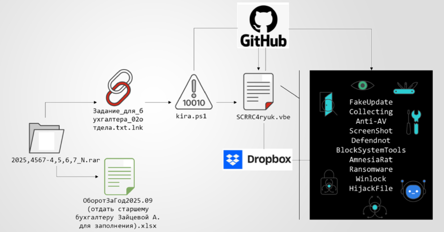

---
hide:
  - navigation
  - toc
---

# This Week's Security Incidents
 

-   

    **48 Million Gmail Usernames And Passwords Leaked Online**

    **Data Breach**{.cve-chip} **Credential Exposure**{.cve-chip} **Infostealer Campaign**{.cve-chip} **149M Records**{.cve-chip} **No Encryption**{.cve-chip}

    A massive dataset of 149,404,754 unique usernames and passwords was discovered completely unprotected on a cloud server with no authentication or encryption. The leaked credentials include an estimated 48 million Gmail accounts plus millions from Facebook, Instagram, Netflix, TikTok, and other platforms. 
    
    The dataset appears to be aggregated from infostealer malware campaigns (keylogging and password-stealing software) that collected credentials over extended periods. The repository lacked any access controls, remaining publicly accessible to anyone with the direct link, enabling widespread credential stuffing attacks and identity theft.

    [:octicons-arrow-right-24: Read more](2026/Week4/gmail.md)

-   

    **Xiaomi Redmi Buds Bluetooth RFCOMM Vulnerabilities**

    **CVE-2025-13834**{.cve-chip} **CVE-2025-13328**{.cve-chip} **Bluetooth Memory Disclosure**{.cve-chip} **Bluetooth DoS**{.cve-chip} **Proximity Exploit**{.cve-chip}

    Critical flaws in the proprietary RFCOMM implementation of Xiaomi Redmi Buds allow nearby, unauthenticated attackers to leak device memory (Heartbleed-style) and force persistent denial-of-service without pairing. 
    
    Malformed RFCOMM messages can expose real-time call data (e.g., phone numbers) or push the earbuds into a broken state until the attack stops.

    [:octicons-arrow-right-24: Read more](2026/Week4/buds.md)

-   

    **CodeBreach – AWS CodeBuild Misconfiguration Vulnerability**

    **AWS Misconfiguration**{.cve-chip} **Supply Chain Vulnerability**{.cve-chip} **Regex Filter Bypass**{.cve-chip} **Credential Theft**{.cve-chip} **GitHub Hijacking**{.cve-chip}

    A critical misconfiguration in AWS CodeBuild webhook filters allowed unauthenticated actors to trigger build jobs and access privileged credentials. Improperly anchored regex patterns in ACTOR_ID filters accepted any ID containing an approved ID as a substring, enabling attackers to create GitHub accounts with matching numeric IDs and bypass authentication. 
    
    This could have led to hijacking AWS-managed repositories, injecting malicious code into critical supply chain dependencies, and compromising countless users relying on affected packages globally.

    [:octicons-arrow-right-24: Read more](2026/Week4/codebreach.md)

-   

    **Multi-Stage Phishing Campaign Deploying Amnesia RAT and Hakuna Matata Ransomware**

    **Phishing Campaign**{.cve-chip} **Remote Access Trojan**{.cve-chip} **Ransomware**{.cve-chip} **Cloud Abuse**{.cve-chip} **Defender Bypass**{.cve-chip} **Multi-Stage**{.cve-chip}

    A targeted phishing campaign using social engineering and multi-stage malware to compromise Windows systems and deploy both Amnesia RAT (remote access trojan) and Hakuna Matata ransomware. The attack abuses cloud hosting services (GitHub, Dropbox) to host malicious scripts and binaries, and uses the defendnot tool to disable Microsoft Defender. 
    
    Initial delivery occurs via phishing emails with compressed archives and malicious Windows shortcuts using double extensions. The campaign features staged delivery through PowerShell scripts and obfuscated Visual Basic, security tool disablement, reconnaissance via Telegram bots, and dual payload deployment enabling remote control, credential theft, file encryption, and cryptocurrency transaction manipulation.

    [:octicons-arrow-right-24: Read more](2026/Week4/amnesia.md)

-   

    **CVE-2026-24061 – GNU InetUtils telnetd Remote Authentication Bypass**

    **CVE-2026-24061**{.cve-chip} **CVSS 10.0**{.cve-chip} **CWE-287**{.cve-chip} **Unauthenticated**{.cve-chip} **Root Access**{.cve-chip} **11-Year-Old Bug**{.cve-chip}

    A critical unauthenticated remote root access vulnerability (CVE-2026-24061) in GNU InetUtils telnetd allows attackers to completely bypass authentication and gain immediate root shell access by exploiting improper handling of the USER environment variable. The 11-year-old vulnerability affects GNU InetUtils versions 1.9.3 through 2.7 (spanning 2014-2025), with a perfect CVSS 9.8 score due to trivial exploitation requiring only standard telnet client tools and no credentials. The flaw stems from telnetd's failure to sanitize user-supplied environment variables before passing them to the system login(1) program—attackers connecting with USER="-f root" cause login to interpret the "-f" flag as a trusted bypass option, granting root shell without password verification.
    
    The vulnerability affects tens of thousands of systems globally including legacy Unix servers, embedded devices, industrial SCADA systems, network equipment (routers, switches), and containerized environments where telnetd has been inadvertently included. Despite Telnet's well-known security weaknesses (plaintext credentials, no encryption), telnetd remains deployed on systems requiring compatibility with vintage software, particularly in manufacturing, energy, telecommunications, and healthcare sectors. Active exploitation emerged within hours of public disclosure, with mass scanning campaigns targeting TCP port 23 and automated frameworks integrating single-command exploitation: `telnet -l '-f root' target.com`.
    
    In a documented manufacturing breach, threat actors exploited CVE-2026-24061 to compromise a SCADA Plant Control Master Server running RHEL 6.8 with GNU InetUtils 1.9.4, obtaining root access that enabled reconnaissance of 427 PLCs, extraction of production schedules, credential theft for MES/HMI systems, and deployment of ransomware targeting both IT and OT environments. 

    [:octicons-arrow-right-24: Read more](2026/Week4/gnu.md)

-   

    **DynoWiper Cyberattack on Polish Energy Systems (Sandworm Attribution)**

    **Sandworm (APT44)**{.cve-chip} **GRU Unit 74455**{.cve-chip} **Win32/KillFiles.NMO**{.cve-chip} **Wiper Malware**{.cve-chip} **Critical Infrastructure**{.cve-chip} **Unsuccessful Attack**{.cve-chip}

    In late 2025, Polish energy infrastructure became the target of a sophisticated destructive cyberattack attributed to **Sandworm** (APT44, Voodoo Bear, IRIDIUM), a Russian military intelligence-aligned threat actor operating under the GRU's Unit 74455. The attackers deployed a newly identified wiper malware dubbed **DynoWiper** (detected as Win32/KillFiles.NMO, SHA-1: 4EC3C90846AF6B79EE1A5188EEFA3FD21F6D4CF6), designed to irreversibly delete critical data and render operational technology (OT) systems inoperable. The operation aimed to disrupt electricity and heating services to potentially 500,000+ residents during winter months, representing a significant escalation in state-sponsored cyber warfare targeting European critical infrastructure and NATO member states.
    
    Despite achieving initial access through a supply chain compromise of **EnergoTech Solutions** (a Polish OT vendor whose trojanized GridWatch Pro v8.4.2 SCADA monitoring software update was distributed to Polskie Sieci Energetyczne S.A. on December 3, 2025), the attack was ultimately **unsuccessful**. Sandworm operators spent 28 days conducting reconnaissance, lateral movement, and privilege escalation across PSE's corporate and OT networks, staging DynoWiper on 46 systems (34 substation gateways and 12 control center SCADA servers) with scheduled execution at 06:45 CET on December 30—coinciding with morning peak demand and -18°C winter temperatures. Polish cybersecurity authorities, working with CERT Polska and ABW (Internal Security Agency), detected anomalous lateral movement patterns on December 29 and contained the threat before operational disruption occurred, preventing the wiper's synchronized execution that would have targeted Siemens SPECTRUM Power 7 systems managing 220kV/400kV transmission infrastructure.

    [:octicons-arrow-right-24: Read more](2026/Week4/dynowiper.md)

