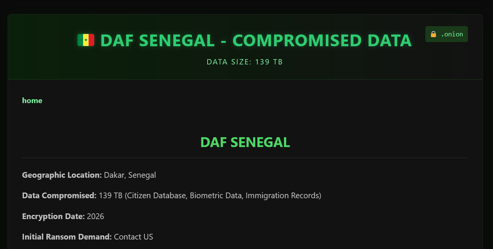
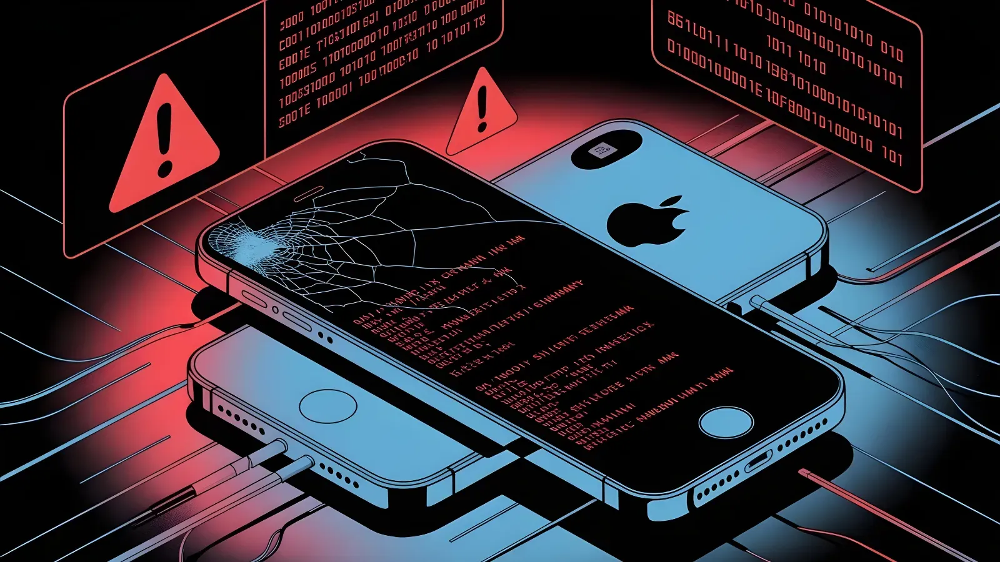
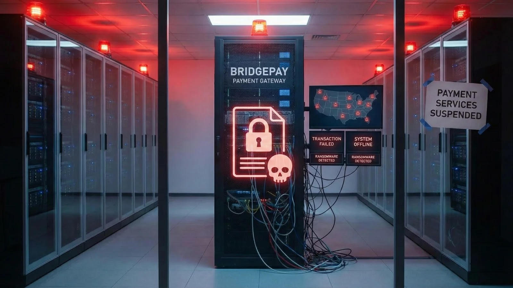
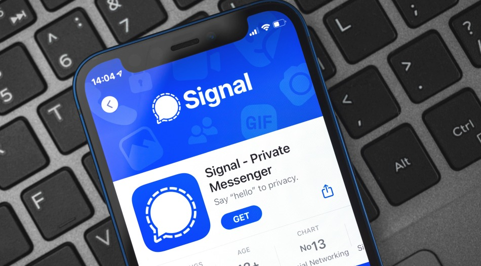

---
hide:
  - navigation
  - toc
---

# This Week's Security Incidents
 

-   

    **Windows 11 Notepad Markdown Remote Code Execution Vulnerability**

    **CVE-2026-20841**{.cve-chip} **Remote Code Execution**{.cve-chip} **Markdown Link Handling**{.cve-chip} **CVSS 8.8**{.cve-chip} **Windows 11**{.cve-chip}

    A critical flaw in Windows 11 Notepad's Markdown link handling allowed attackers to trick users into executing malicious links in .md files. Clicking specially crafted links could launch unverified protocols and run remote or local files without normal Windows security warnings.

    The vulnerability, patched in February 2026, required user interaction but could lead to full system compromise if the user had administrative privileges. Post-fix Notepad versions display warnings when clicking non-HTTP/HTTPS links.

    [:octicons-arrow-right-24: Read more](2026/Week6/notepad.md)

-   

    **Senegal National ID Office Ransomware Attack**

    **Ransomware**{.cve-chip} **National ID Systems**{.cve-chip} **Data Breach**{.cve-chip} **Green Blood Group**{.cve-chip} **Biometric Data**{.cve-chip}

    Senegal's Directorate of File Automation (DAF) was hit by a ransomware attack that forced suspension of national ID and passport issuance. The Green Blood Group claimed exfiltration of approximately 139 GB of sensitive citizen data including biometric records, immigration documents, and ID card information.

    The breach compromised card personalization servers and prompted immediate network isolation, credential rotation, and deployment of Malaysian cybersecurity experts from IRIS Corporation for forensic investigation and recovery.

    [:octicons-arrow-right-24: Read more](2026/Week6/senegal.md)

-   

    **Apple Zero-Day Exploitation (CVE-2026-20700)**

    **CVE-2026-20700**{.cve-chip} **Zero-Day**{.cve-chip} **dyld Memory Corruption**{.cve-chip} **Targeted Attacks**{.cve-chip} **Spyware**{.cve-chip}

    Apple patched a zero-day flaw in dyld (Dynamic Link Editor) used in extremely sophisticated attacks targeting specific individuals. The memory corruption vulnerability allowed attackers with memory write capability to execute arbitrary code, likely chained with WebKit exploits for full system compromise.

    The attacks are believed to be associated with commercial surveillance or mercenary spyware campaigns. Emergency patches released for iOS, iPadOS, macOS, watchOS, tvOS, and visionOS address the actively exploited vulnerability.

    [:octicons-arrow-right-24: Read more](2026/Week6/apple.md)

-   

    **ZeroDayRAT Spyware Grants Attackers Total Access to Mobile Devices**

    **Mobile Spyware**{.cve-chip} **Remote Access Trojan**{.cve-chip} **Stalkerware**{.cve-chip} **Android**{.cve-chip} **iOS**{.cve-chip}

    ZeroDayRAT is a commercially available mobile spyware toolkit marketed via underground channels like Telegram that enables complete remote access to Android and iOS devices. It provides keylogging, live camera/microphone access, GPS tracking, clipboard hijacking for crypto theft, SMS interception including OTP codes, and 2FA bypass capabilities.

    This "textbook stalkerware" represents a dangerous shift toward nation-state-level surveillance tools becoming available to criminal actors. Distribution occurs through smishing, phishing campaigns, and malicious APKs that trick victims into installing the spyware via social engineering.

    [:octicons-arrow-right-24: Read more](2026/Week6/zerodayrat.md)

-   

    **Fortinet FortiClientEMS Critical SQL Injection (CVE-2026-21643)**

    **CVE-2026-21643**{.cve-chip} **SQL Injection**{.cve-chip} **Unauthenticated**{.cve-chip} **Remote Code Execution**{.cve-chip} **Fortinet**{.cve-chip}

    A critical SQL injection in FortiClientEMS 7.4.4 allows unauthenticated attackers to send crafted HTTP requests to the admin interface and execute arbitrary SQL. The flaw can lead to remote code execution and compromise of the EMS management server.

    Because FortiClientEMS centrally manages endpoints, a successful compromise can cascade into wider enterprise risk. Upgrading to 7.4.5 or later and restricting admin interface exposure are key mitigations.

    [:octicons-arrow-right-24: Read more](2026/Week6/forticlientems.md)

-   

    **UNC3886 Cyber Espionage Campaign Against Singapore Telcos**

    **Cyber Espionage**{.cve-chip} **Telecommunications**{.cve-chip} **Zero-Day Exploitation**{.cve-chip} **Rootkits**{.cve-chip} **National Security**{.cve-chip}

    Singapore’s CSA and IMDA reported a prolonged UNC3886 espionage campaign targeting telecom networks. Attackers exploited a firewall zero-day, deployed rootkits for stealth persistence, and exfiltrated limited technical network data without disrupting core services.

    While no customer data was exposed and core 5G infrastructure remained segmented, the incident prompted a major national cyber response due to the strategic risk posed to critical infrastructure.

    [:octicons-arrow-right-24: Read more](2026/Week6/unc3886.md)

-   

    **SmarterMail Unauthenticated Remote Code Execution (RCE)**

    **CVE-2026-24423**{.cve-chip} **Unauthenticated RCE**{.cve-chip} **Email Server**{.cve-chip} **CVSS 9.3**{.cve-chip} **Active Exploitation**{.cve-chip}

    A critical flaw in SmarterMail’s ConnectToHub API allows unauthenticated attackers to submit crafted requests that cause the server to fetch attacker-controlled JSON and execute OS commands. The issue affects all builds prior to 100.0.9511 and has been linked to ransomware activity.

    Successful exploitation enables full server compromise, data theft from email systems, and lateral movement across networks. Patching to Build 9511 or later is required to mitigate the vulnerability.

    [:octicons-arrow-right-24: Read more](2026/Week6/smartermail.md)

-   

    **DKnife – Linux-based Adversary-in-the-Middle (AiTM) Traffic-Hijacking Toolkit**

    **Adversary-in-the-Middle**{.cve-chip} **Traffic Hijacking**{.cve-chip} **Router Malware**{.cve-chip} **DNS Manipulation**{.cve-chip} **Credential Theft**{.cve-chip}

    DKnife is a modular post-compromise toolkit that runs on Linux-based routers and edge devices, intercepting and manipulating network traffic to spy on users, harvest credentials, and hijack downloads and updates for malware delivery.

    The framework deploys components for DPI, TLS interception, DNS hijacking, and P2P VPN C2. It can swap update manifests, inject payloads like ShadowPad, and maintain persistence via an updater/watchdog on compromised gateways.

    [:octicons-arrow-right-24: Read more](2026/Week6/dknife.md)

-   

    **BridgePay Network Solutions Ransomware Attack**

    **Ransomware**{.cve-chip} **Payment Systems Outage**{.cve-chip} **Critical Infrastructure**{.cve-chip} **Service Disruption**{.cve-chip} **Forensic Response**{.cve-chip}

    BridgePay confirmed a ransomware attack that knocked key payment services offline, causing nationwide outages of payment APIs, virtual terminals, and hosted payment pages. Early forensic findings show file encryption but no evidence of payment card data compromise.

    Federal law enforcement and external cybersecurity teams are engaged in investigation and recovery. Merchants and municipal billing portals reported outages, with ongoing service degradation and no clear ETA for full restoration.

    [:octicons-arrow-right-24: Read more](2026/Week6/bridgepay.md)

-   

    **Signal Account Hijacking Campaign**

    **Phishing**{.cve-chip} **Account Takeover**{.cve-chip} **Social Engineering**{.cve-chip} **QR Code**{.cve-chip} **Registration Lock**{.cve-chip}

    German security agencies warned of phishing attacks on Signal that trick victims into handing over PINs or scanning QR codes, allowing attackers to hijack accounts or link their devices. The campaign relies on social engineering rather than malware or software vulnerabilities.

    Once linked, attackers can read chats, access contact lists, impersonate victims, and target group networks. High-risk targets include politicians, military personnel, and journalists.

    [:octicons-arrow-right-24: Read more](2026/Week6/signal.md)

