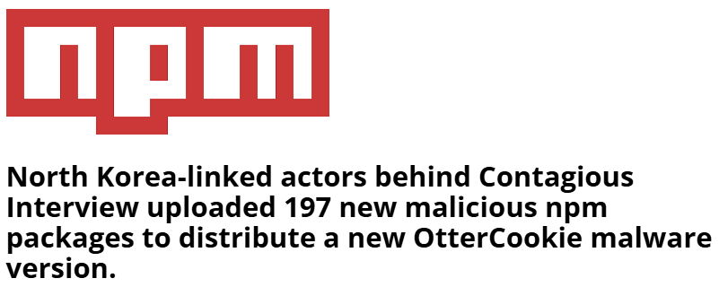

---
hide:
  - navigation
  - toc
---

# This Week's Security Incidents
 

-   
    :material-lock:{ .lg .middle } **node-forge ASN.1 Validation Bypass (CVE-2025-12816)**

    **Cryptographic Verification Bypass**{.cve-chip}  
    **Integrity Compromise**{.cve-chip}  
    ---------------------------------

    A desynchronization bug in node-forge's ASN.1 validator (asn1.validate) can allow malformed ASN.1 structures (e.g., PKCS#12, certificates) to be treated as valid, bypassing MAC/signature/certificate checks and risking forged credentials or package tampering.

    [:octicons-arrow-right-24: View Full Details](Week49/forge.md)

-   
    :material-package:{ .lg .middle } **Contagious Interview (2025 npm-registry wave)**

    **Supply-Chain / npm Registry Campaign**{.cve-chip}  
    **Loader Malware (OtterCookie / BeaverTail merge)**{.cve-chip}  
    ---------------------------------

    197 malicious npm packages added to the registry (≈31,000 downloads). Packages act as loaders that fetch OtterCookie payloads from Vercel/GitHub after developers install or run them, compromising developer machines and CI pipelines.

    [:octicons-arrow-right-24: View Full Details](Week49/npm.md)
    

