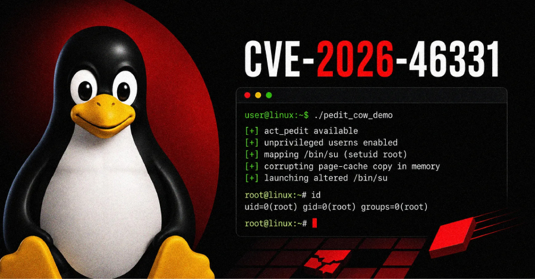
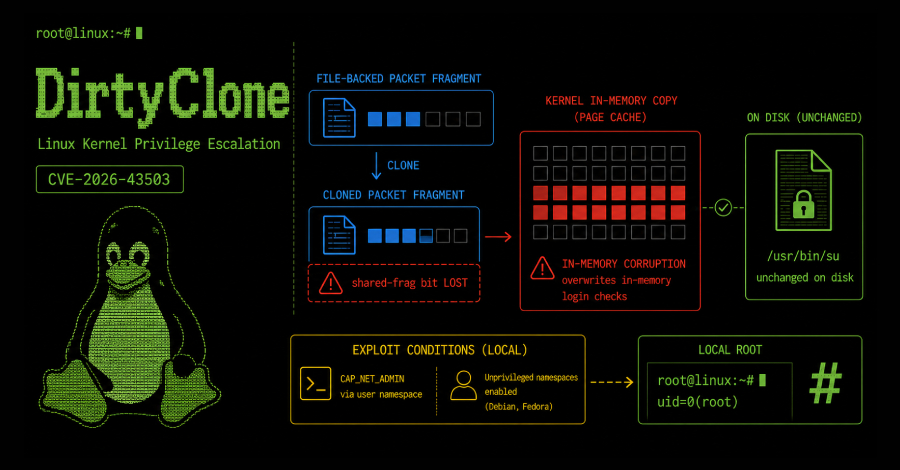

---
hide:
  - navigation
  - toc
---

# This Week's Security Incidents
 

-   

    **Russian Intelligence Phishing Targets Signal Backup Recovery Keys**

    **Phishing**{.cve-chip} **Secure Messaging**{.cve-chip} **Account Takeover**{.cve-chip} **Backup Abuse**{.cve-chip}

    FBI and CISA report that Russian intelligence‑linked actors (UNC5792, UNC4221) are posing as Signal support to trick users into enabling backups and pasting their Signal Backup Recovery Key into chats, treating the key like a “mandatory security step.” Once obtained, the key lets attackers restore encrypted backups on their own devices, read private and group histories, and potentially take over accounts, with the same key remaining valid until victims regenerate it or reset backup settings.

    [Read more](2026/Week26/Russian.md)

-   

    **Fake Guest Complaint Emails Drop Node.js Implants on Hotel Front Desks**

    **Phishing**{.cve-chip} **Hospitality Sector**{.cve-chip} **Malicious ZIP/LNK**{.cve-chip} **Persistence**{.cve-chip}

    An active “photo ZIP” phishing campaign targets hotel and hospitality staff with fake guest complaint emails carrying ZIP archives that hide malicious `.LNK` shortcuts masquerading as image files. When staff run the fake photos, PowerShell chains install a Node.js‑based TonRAT implant, tweak Microsoft Defender exclusions, and establish resilient C2 on front‑desk Windows machines, creating a foothold for later credential theft, ransomware, and wider hotel‑network intrusion.

    [Read more](2026/Week26/Hospitality.md)

-   

    **pedit COW Linux tc Bug Grants Root via Page-Cache Corruption**

    **Linux LPE**{.cve-chip} **Traffic Control (tc)**{.cve-chip} **Page Cache Corruption**{.cve-chip} **In-Memory Exploit**{.cve-chip}

    CVE-2026-46331 (“pedit COW”) is a Linux kernel net/sched act_pedit flaw where partial copy‑on‑write allows tc rules to write outside the intended buffer region, corrupting shared page‑cache memory for privileged binaries such as `/bin/su`. Local attackers who can create user namespaces and access tc can poison cached executables to obtain root shells, achieving privilege escalation entirely in memory and evading on‑disk integrity and signature checks.

    [Read more](2026/Week26/pedit-COW.md)

-   

    **DirtyClone Linux Kernel Flaw Enables Stealth Local Root via Cloned Packets**

    **Linux LPE**{.cve-chip} **Page Cache Write**{.cve-chip} **Kernel Networking**{.cve-chip} **In-Memory Tampering**{.cve-chip}

    DirtyClone (CVE-2026-43503) is a Linux kernel privilege escalation in packet-cloning helpers that drop a safety flag, allowing cloned network packets to overwrite file-backed page-cache memory and corrupt privileged binaries like `/usr/bin/su` without touching the filesystem. On vulnerable Debian, Ubuntu, Fedora, and other multi-tenant systems where unprivileged namespaces can obtain CAP_NET_ADMIN, attackers can chain cloned packets and IPsec ESP decryption into a stealth local‑root exploit that bypasses file‑integrity checks and leaves minimal audit trail.

    [Read more](2026/Week26/DirtyClone.md)

