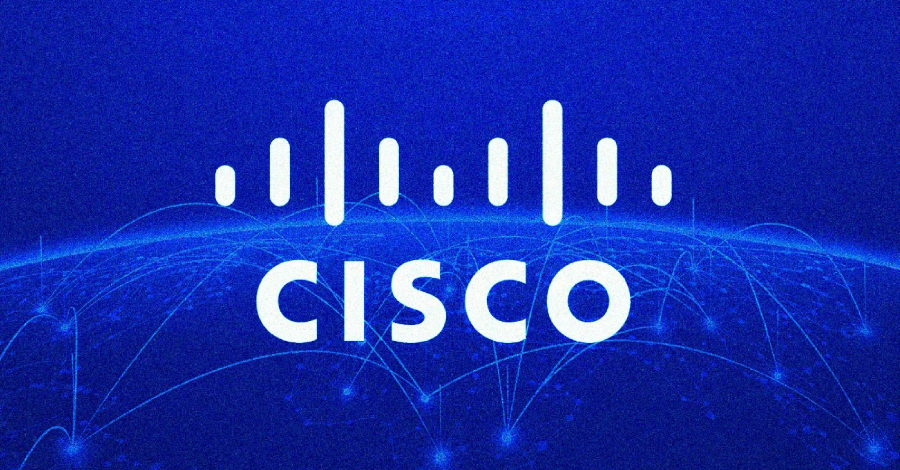

---
hide:
  - navigation
  - toc
---

# This Week's Security Incidents
 

-   

    **CVE-2026-32746 - Critical Telnetd Buffer Overflow Vulnerability**

    **GNU Inetutils**{.cve-chip} **Buffer Overflow**{.cve-chip} **Remote Code Execution**{.cve-chip}

    A critical flaw in GNU Inetutils `telnetd` can be triggered with crafted LINEMODE SLC packets, potentially causing out-of-bounds writes and remote code execution.

    Because exploitation can occur before authentication on exposed port 23 services, unpatched Telnet deployments face elevated compromise risk.

    [Read more](2026/Week11/telnetd.md)

-   

    **EU Sanctions on Chinese and Iranian Cyber Actors Targeting Critical Infrastructure**

    **Geopolitical Cybersecurity**{.cve-chip} **Critical Infrastructure**{.cve-chip} **State-Linked Activity**{.cve-chip}

    The European Union sanctioned Chinese and Iranian entities and individuals over coordinated cyber operations targeting member-state infrastructure.

    Public reporting links the campaigns to large-scale device compromise, telecom and data intrusion, and disinformation activity across multiple EU countries.

    [Read more](2026/Week11/sanctions.md)

-   

    **Honeywell IQ4x BMS Authentication Bypass Vulnerability**

    **BMS Security**{.cve-chip} **Authentication Bypass**{.cve-chip} **Critical Infrastructure**{.cve-chip}

    A critical weakness in Honeywell IQ4x controllers can allow unauthenticated access to the management interface during default initial configuration.

    Attackers may create administrator accounts and take full control of building management systems if authentication is not enabled before exposure.

    [Read more](2026/Week11/honeywellIQ.md)

-   

    **Payload Ransomware Claims the Hack of Royal Bahrain Hospital**

    **Ransomware**{.cve-chip} **Healthcare Sector**{.cve-chip} **Data Extortion**{.cve-chip}

    The Payload ransomware group claims to have breached Royal Bahrain Hospital and exfiltrated approximately 110 GB of internal and patient data.

    The incident reflects a double-extortion model with leak-site pressure and a public release deadline, while initial access details remain undisclosed.

    [Read more](2026/Week11/royal.md)

-   

    **Cisco Confirms Active Exploitation of Two Catalyst SD-WAN Manager Vulnerabilities**

    **Cisco SD-WAN**{.cve-chip} **Active Exploitation**{.cve-chip} **Critical Infrastructure**{.cve-chip}

    Cisco confirmed in-the-wild exploitation of CVE-2026-20122 and CVE-2026-20128 in Catalyst SD-WAN Manager, with risk amplified by earlier CVE-2026-20127 abuse.

    Successful compromise can enable control-plane takeover, policy manipulation, implant deployment, and long-term persistence across enterprise WAN environments.

    [Read more](2026/Week11/cisco.md)

-   

    **Cyberattack Targeting the National Centre for Nuclear Research (NCBJ)**

    **Critical Infrastructure**{.cve-chip} **Nuclear Sector**{.cve-chip} **Cyberattack**{.cve-chip}

    Poland's National Centre for Nuclear Research (NCBJ) blocked a targeted intrusion against its internal IT environment before any impact to reactor operations.

    The incident is under national-level investigation, with preliminary indicators suggesting possible links to **Iran-associated** infrastructure while attribution remains unconfirmed.

    [Read more](2026/Week11/poland.md)

-   

    **Stryker Global Network Cyberattack (Handala Attack)**

    **Healthcare Sector**{.cve-chip} **Wiper Attack**{.cve-chip} **Hacktivism**{.cve-chip}

    Stryker suffered a large-scale disruption across its global Microsoft enterprise environment, affecting corporate systems, manufacturing, and order processing.

    Public reporting and threat-actor claims indicate a destructive campaign likely involving endpoint management abuse, while Stryker stated patient-facing medical devices were not impacted.

    [Read more](2026/Week11/stryker.md)

-   

    **SocksEscort Proxy Service Disruption linked to the AVrecon Botnet**

    **Botnet**{.cve-chip} **Proxy Abuse**{.cve-chip} **Law Enforcement Action**{.cve-chip}

    U.S. and European law-enforcement agencies dismantled the SocksEscort proxy service, which used AVrecon-infected routers and IoT devices to provide criminal proxy infrastructure.

    The takedown disrupted a large-scale abuse ecosystem tied to fraud, credential stuffing, and phishing by seizing key domains, servers, and cryptocurrency assets.

    [Read more](2026/Week11/socksEscort.md)

-   

    **Microsoft Windows 11 RRAS Remote Code Execution Vulnerability - Out-of-Band Hotpatch**

    **Windows 11**{.cve-chip} **RRAS**{.cve-chip} **Remote Code Execution**{.cve-chip}

    Microsoft released OOB hotpatch `KB5084597` to fix multiple RRAS management vulnerabilities that could enable code execution when an administrator connects to a malicious RRAS server.

    The hotpatch allows supported enterprise systems to apply protections without reboot, reducing immediate exposure for managed environments.

    [Read more](2026/Week11/windows.md)

-   

    **Critical HPE Aruba Networking AOS-CX Vulnerability (CVE-2026-23813)**

    **HPE Aruba**{.cve-chip} **Authentication Bypass**{.cve-chip} **Critical Vulnerability**{.cve-chip}

    A critical flaw in the AOS-CX web management interface allows unauthenticated attackers to bypass authentication and potentially reset administrator credentials.

    Successful exploitation can lead to full switch takeover, configuration manipulation, and expanded lateral-movement risk across enterprise networks.

    [Read more](2026/Week11/hpe.md)

