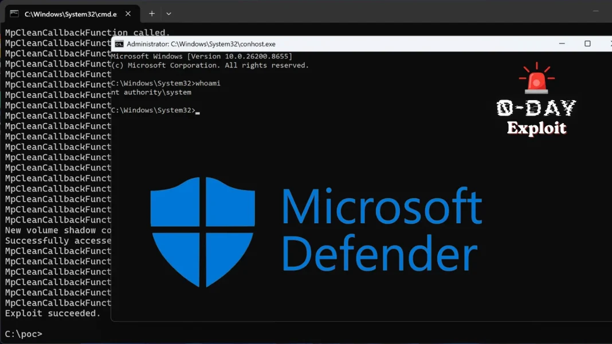
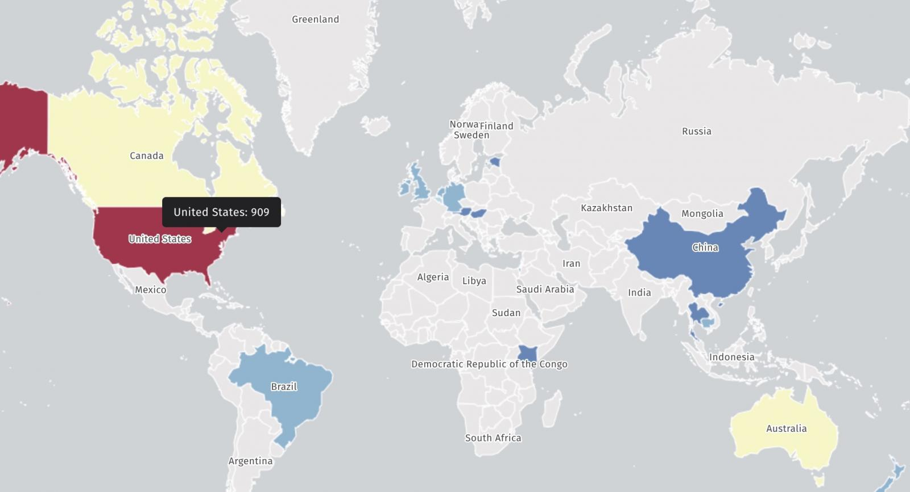
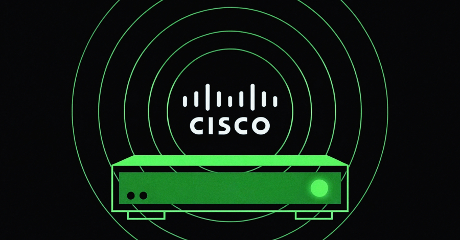
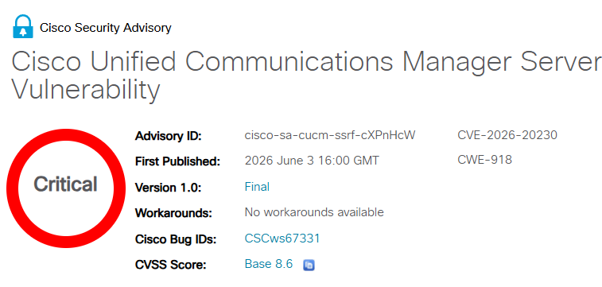

---
hide:
  - navigation
  - toc
---

# This Week's Security Incidents
 

-   

    **NFCShare Android Malware Campaign**

    **Android Malware**{.cve-chip} **NFC Theft**{.cve-chip} **Mobile Banking Fraud**{.cve-chip} **Social Engineering**{.cve-chip}

    A sophisticated Android malware campaign spreads via fake banking app updates on GitHub. It abuses Android NFC and EMV commands to steal payment card data and PINs, enabling contactless payment fraud and card emulation attacks against banking customers in Italy and Spain.

    [Read more](2026/Week23/NFCShare.md)

-   

    **Linux Kernel nf_tables One-Character Privilege Escalation Vulnerability**

    **CVE-2026-23111**{.cve-chip} **Privilege Escalation**{.cve-chip} **Use-After-Free**{.cve-chip} **Container Escape**{.cve-chip}

    A single incorrect `!` operator in the Linux kernel's nf_tables subsystem triggers a Use-After-Free condition, allowing local low-privileged attackers to escalate to root. Public PoC exploit code is available. Confirmed on Debian Bookworm/Trixie and Ubuntu 22.04/24.04 LTS. Container escape is also possible in affected environments.

    [Read more](2026/Week23/Kernel.md)

-   

    **Veeam Backup & Replication Remote Code Execution Vulnerability**

    **CVE-2026-44963**{.cve-chip} **Remote Code Execution**{.cve-chip} **Backup Infrastructure**{.cve-chip} **Ransomware Risk**{.cve-chip}

    A critical RCE vulnerability in Veeam Backup & Replication allows low-privileged domain users to compromise backup servers, enabling ransomware deployment and backup destruction. Affects version 12.3.2.4465 and earlier on domain-joined servers; patched in 12.3.2.4854.

    [Read more](2026/Week23/Veeam.md)

-   

    **WinRAR CVE-2025-8088 Exploitation Campaign**

    **CVE-2025-8088**{.cve-chip} **Path Traversal**{.cve-chip} **Russia-Aligned APT**{.cve-chip} **Ukraine Targeting**{.cve-chip}

    Russia-aligned threat actors exploited a WinRAR path traversal flaw to deliver malware via malicious RAR archives targeting Ukrainian organizations. Attackers abused NTFS Alternate Data Streams to drop GIFTEDCROOK and other payloads into Startup folders, enabling persistence and credential theft.

    [Read more](2026/Week23/WinRAR.md)

-   

    **RoguePlanet – Microsoft Defender Zero-Day Local Privilege Escalation**

    **Zero-Day**{.cve-chip} **Privilege Escalation**{.cve-chip} **Race Condition**{.cve-chip} **Microsoft Defender**{.cve-chip}

    A zero-day race condition (TOCTOU) in Microsoft Defender's remediation engine allows low-privileged local attackers to escalate to SYSTEM by abusing symbolic links and NTFS junctions during privileged file operations. No patch is yet available.

    [Read more](2026/Week23/RoguePlanet.md)

-   

    **C0XMO Botnet Spreads via DD-WRT Router Flaw, Kills Rival Malware**

    **CVE-2021-27137**{.cve-chip} **Gafgyt Variant**{.cve-chip} **IoT Botnet**{.cve-chip} **DDoS**{.cve-chip}

    A new Gafgyt variant exploits a 2021 DD-WRT UPnP stack overflow (CVE-2021-27137) for unauthenticated RCE, then deploys cross-architecture payloads (ARM, MIPS, x86, PowerPC, Android) and kills rival botnet malware to maintain exclusive control. Enrolled devices are weaponized for DDoS operations via ~19 attack methods.

    [Read more](2026/Week23/C0XMO.md)

-   

    **Exposed U.S. Gas Station Tank Gauge Systems**

    **Operational Technology (OT)**{.cve-chip} **Critical Infrastructure**{.cve-chip} **ATG Systems**{.cve-chip} **Internet Exposure**{.cve-chip}

    More than 900 U.S. internet-accessible Automatic Tank Gauge (ATG) systems were identified as exposed and vulnerable, enabling attackers to tamper with fuel monitoring and leak detection functions. Agencies warn this could trigger operational disruption, environmental risk, and broader critical infrastructure impact.

    [Read more](2026/Week23/Gas.md)

-   

    **Acer Wave 7 Router Zero-Day Vulnerabilities (CVE-2026-49200 & CVE-2026-49201)**

    **CVE-2026-49200**{.cve-chip} **CVE-2026-49201**{.cve-chip} **Zero-Day**{.cve-chip} **Router Security**{.cve-chip}

    Two maximum-severity zero-day flaws in Acer Wave 7 routers can expose plaintext credentials and allow malicious backup upload via a hardcoded AES key, enabling persistent compromise, DNS hijacking, and potential botnet abuse.

    [Read more](2026/Week23/Acer.md)

-   

    **Cisco Catalyst SD-WAN Manager Vulnerability - CVE-2026-20245**

    **CVE-2026-20245**{.cve-chip} **Cisco SD-WAN**{.cve-chip} **Active Exploitation**{.cve-chip} **Management Plane Risk**{.cve-chip}

    Cisco confirmed active exploitation of a high-severity vulnerability in Catalyst SD-WAN Manager that could enable unauthorized management-plane actions, policy tampering, and lateral movement from exposed control infrastructure.

    [Read more](2026/Week23/SD-WAN.md)

-   

    **Cisco Unified CM Critical SSRF Vulnerability - CVE-2026-20230**

    **CVE-2026-20230**{.cve-chip} **SSRF**{.cve-chip} **Cisco Unified CM**{.cve-chip} **Root Access Risk**{.cve-chip}

    Cisco disclosed a critical unauthenticated SSRF flaw in Unified CM WebDialer with public PoC exploit code available; successful exploitation can enable arbitrary file writes and escalation to root-level access on vulnerable servers.

    [Read more](2026/Week23/SSRF.md)

-   

    **Google Gemini Android Notification Prompt Injection Vulnerability**

    **Prompt Injection**{.cve-chip} **Google Gemini**{.cve-chip} **Android**{.cve-chip} **Notification Abuse**{.cve-chip}

    Researchers showed that crafted notifications from apps like WhatsApp and Slack could indirectly inject hidden instructions into Gemini on Android, potentially triggering unauthorized assistant actions through user voice confirmations.

    [Read more](2026/Week23/Gemini.md)

-   

    **Asin Android Spyware Campaign**

    **Android Spyware**{.cve-chip} **Mobile Threat**{.cve-chip} **Social Engineering**{.cve-chip} **Arabic-Speaking Targets**{.cve-chip}

    A newly identified Android spyware family named Asin is targeting Arabic-speaking users via fake APK apps and malicious websites, then abusing granted permissions to collect SMS, contacts, device data, and files while persisting in the background.

    [Read more](2026/Week23/Android.md)

-   

    **FlutterShell macOS Backdoor Campaign**

    **macOS Malware**{.cve-chip} **Backdoor**{.cve-chip} **Malvertising**{.cve-chip} **Operation FlutterBridge**{.cve-chip}

    Researchers uncovered Operation FlutterBridge, a malvertising campaign using trojanized macOS apps to deploy FlutterShell, a backdoor built with Flutter and WebView/JavaScript bridges for remote command execution, persistence, and data theft.

    [Read more](2026/Week23/FlutterShell.md)

