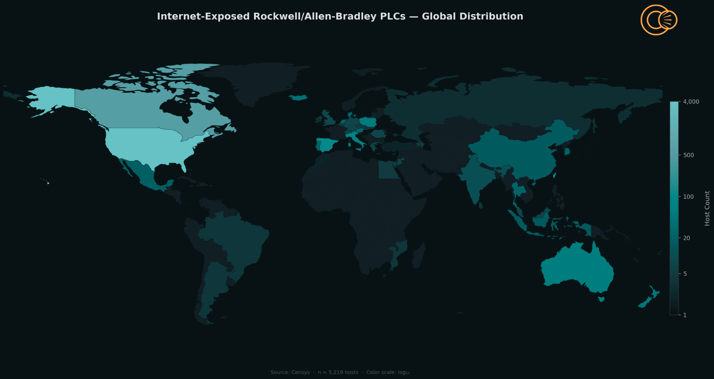

---
hide:
  - navigation
  - toc
---

# This Week's Security Incidents
 

-   

    **France Government Migration from Windows to Linux (Digital Sovereignty Initiative)**

    **Digital Sovereignty**{.cve-chip} **Linux Migration**{.cve-chip} **Public Sector Security**{.cve-chip} **Vendor Independence**{.cve-chip}

    France announced a phased public-sector shift from Windows toward Linux-based systems to reduce foreign technology dependence and increase control over sensitive infrastructure.

    The initiative prioritizes auditability, patch-governance autonomy, and long-term resilience, while requiring careful risk management during hybrid migration phases.

    [Read more](2026/Week15/France.md)

-   

    **Exposed ICS/SCADA Devices Targeted by Iranian APTs (Censys Report)**

    **ICS/SCADA Exposure**{.cve-chip} **Iranian APT Activity**{.cve-chip} **Rockwell/Allen-Bradley**{.cve-chip} **Critical Infrastructure Risk**{.cve-chip}

    Censys reported thousands of internet-exposed industrial control devices, including Rockwell/Allen-Bradley PLC-related systems, with threat activity linked to Iranian-affiliated actors.

    Exposed EtherNet/IP and weak remote services increase the risk of unauthorized PLC logic manipulation, operational disruption, and potential physical-impact incidents.

    [Read more](2026/Week15/SCADA.md)

-   

    **EngageLab SDK Flaw Opens Door to Private Data on 50M Android Devices**

    **Android SDK Risk**{.cve-chip} **Intent Redirection**{.cve-chip} **EngageLab SDK**{.cve-chip} **Mobile Data Exposure**{.cve-chip}

    A vulnerability in EngageLab's Android SDK reportedly let malicious apps abuse unsafe intent handling to access private data from other installed apps.

    The flaw affected exported component behavior in vulnerable integrations, creating credential, token, and wallet-data exposure risk at large installation scale.

    [Read more](2026/Week15/Android.md)

-   

    **Adobe Acrobat Reader Zero-Day (CVE-2026-34621)**

    **CVE-2026-34621**{.cve-chip} **Adobe Acrobat Reader**{.cve-chip} **Prototype Pollution**{.cve-chip} **Active Exploitation**{.cve-chip}

    Adobe patched an actively exploited zero-day in Acrobat Reader where malicious PDFs with embedded JavaScript could trigger code execution through prototype-pollution abuse.

    The campaign reportedly ran for months before patch release and may be chained with additional techniques for persistence, credential theft, and broader endpoint compromise.

    [Read more](2026/Week15/Adobe.md)

