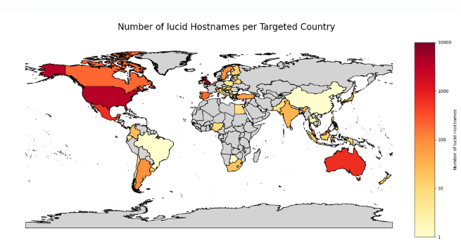
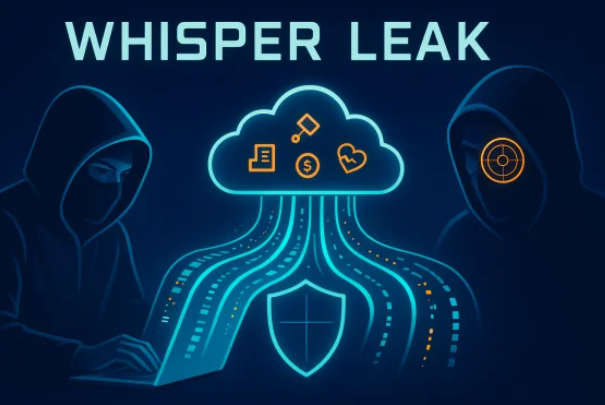

---
hide:
  - navigation
  - toc
---

# This Week's Security Incidents
 

-   
    :material-security-network:{ .lg .middle } __Lighthouse Phishing-as-a-Service (PhaaS) Operation__

    **Phishing-as-a-Service (PhaaS)**{.cve-chip}
    **Critical Global Smishing Campaign**{.cve-chip}
    ------------------------------------------------

    Google filed suit in Nov 2025 to dismantle *Lighthouse* — a China-linked PhaaS that powered mass SMS (“smishing”) campaigns, spun up ~200k phishing sites in weeks, and impersonated 400+ brands to steal millions of payment/credential records worldwide. Legal injunctions, domain takedowns, and cross-provider coordination were pursued to disrupt the service.
    [:octicons-arrow-right-24: View Full Details](Week46/Lighthouse.md)

-   
    :material-microsoft-windows:{ .lg .middle } __Actively Exploited Windows Kernel Zero-Day and Critical Zero-Click Bugs__

    **Zero-Day Exploited**{.cve-chip}
    **Critical Severity**{.cve-chip}
    ---
    Actively exploited Windows Kernel zero-day (CVE-2025-62215) and multiple critical zero-click vulnerabilities in GDI+ and Kerberos reported and patched in Microsoft’s November 2025 update. Exploitation can result in SYSTEM privilege escalation, remote code execution, or full domain compromise in enterprise networks. Immediate patching is strongly advised.

    [:octicons-arrow-right-24: View Full Details](Week46/kernel.md)

-   
    :material-network:{ .lg .middle } **Whisper Leak — LLM Side‑Channel Attack**

    **Traffic Metadata Leak**{.cve-chip}
    **High Privacy Risk**{.cve-chip}
    --------------------------------

    Whisper Leak is a new side‑channel attack that infers conversation topics (and sometimes sensitive attributes) from encrypted streaming LLM traffic by analyzing packet sizes and timing. Affects many cloud streaming LLM APIs — immediate attention recommended for privacy‑sensitive use cases.

    [:octicons-arrow-right-24: View Full Details](Week46/whisper.md)

-   
    :material-card:{ .lg .middle }__ClickFix Hospitality Phishing Campaign (a.k.a. “I Paid Twice” campaign)__

    **Hospitality Phishing / Booking Impersonation**{.cve-chip}
    **Infostealer / RAT Delivery**{.cve-chip}
    ---
    The ClickFix campaign targets hotels with spear‑phishing emails impersonating Booking.com. Staff who follow the lure run a clipboard/PowerShell payload that installs infostealers and RATs, leading to credential theft, booking compromise, and secondary phishing against guests.
    [:octicons-arrow-right-24: View Full Details](Week46/clickfix.md)

-   
    :material-airplane-alert:{ .lg .middle } __Delhi Airport GPS Spoofing Crisis__

    **GPS Spoofing**{.cve-chip}
    **Critical Aviation Disruption**{.cve-chip}
    ---
    Severe GPS spoofing at Delhi airport caused fake signals, misleading aircraft navigation and leading to positional confusion, diverted flights, delays, and manual air traffic control. Safety risk extended to over 400 flights in one week. Urgent mitigation included ILS upgrades, regulatory action, and GNSS redundancy.
    [:octicons-arrow-right-24: View Full Details](Week46/delhi.md)

-   
    :material-apple:{ .lg .middle } __Multiple Vulnerabilities in Apple Products__

    **Multiple Vulnerabilities**{.cve-chip}
    **Critical Severity**{.cve-chip}
    ---
    Multiple critical vulnerabilities disclosed and patched in iOS, iPadOS, macOS, watchOS, tvOS, visionOS, and Safari. Exploitation can lead to device compromise, privacy violations, information leakage, and remote code execution. Update to latest versions immediately.
    [:octicons-arrow-right-24: View Full Details](Week46/apple.md)

-   
    :material-factory:{ .lg .middle } __ABB FLXeon Controllers Vulnerabilities__

    **Multiple Vulnerabilities**{.cve-chip}
    **Critical Severity**{.cve-chip}
    **Remote Code Execution**{.cve-chip}
    ---
    Multiple high-severity vulnerabilities—including hard-coded credentials, improper input validation, weak password hashing, and file path manipulation—impact ABB FLXeon series controllers (FBXi, FBVi, FBTi, CBXi) running firmware version 9.3.5 and earlier. Attackers may achieve full system compromise, code execution, or disrupt industrial operations. Firmware update and strict access controls are urgently advised.
    [:octicons-arrow-right-24: View Full Details](Week46/abb-fbxi.md)

-   

    :material-cellphone:{ .lg .middle } **LANDFALL Android Spyware — Samsung Galaxy Zero‑Day Campaign**

    **CVE-2025-21042**{.cve-chip}
    **Full device takeover**{.cve-chip}
    **Persistent surveillance**{.cve-chip}
    --------------------------------------

    A previously unknown Android spyware family, **LANDFALL**, exploited a zero‑day in Samsung's image decoder (`libimagecodec.quram.so`) to achieve remote code execution via crafted DNG images. Targets included Samsung Galaxy devices in Iraq, Iran, Turkey, and Morocco. Patch with April 2025 security update.

    [:octicons-arrow-right-24: View Full Details](Week46/samsung-spyware.md)

-   

    :material-lock-alert:{ .lg .middle } **Cisco Unified Contact Center Express (Unified CCX) Critical Vulnerabilities**

    **CVE-2025-20354**{.cve-chip}
    **CVE-2025-20358**{.cve-chip}
    **Remote Code Execution**{.cve-chip}
    **Authentication Bypass**{.cve-chip}
    ------------------------------------

    Cisco disclosed two critical vulnerabilities in its **Unified Contact Center Express (Unified CCX)** appliance that could allow remote attackers to execute arbitrary commands or gain administrative control without authentication. The flaws reside in the **Java RMI process** and the **CCX Editor authentication flow**. Cisco released fixed versions **12.5 SU3 ES07** and **15.0 ES01**. No exploitation has been observed in the wild at publication time.

    [:octicons-arrow-right-24: View Full Details](Week46/cisco-ccx.md)

