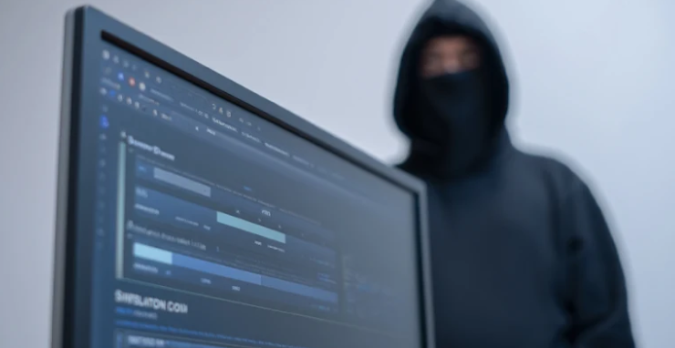

---
hide:
  - navigation
  - toc
---

# This Week's Security Incidents
 

-   
    :material-network-off:{ .lg .middle } **UDPGangster Campaigns Target Multiple Countries**

    **Windows Backdoor**{.cve-chip}  
    **UDP-Based C2**{.cve-chip}  
    ---------------------------------

    MuddyWater (Iran-aligned APT) deploys UDPGangster backdoor using spear-phishing with malicious Word documents. Unusual **UDP-based C2** (port 1269) evades traditional detection. Extensive anti-analysis checks detect VMs, sandboxes, debuggers. Targets Turkey, Israel, Azerbaijan impersonating government entities. Supports remote command execution, file exfiltration, and payload deployment. Persistence via registry and %AppData%. **Block macro-enabled documents** and monitor unusual UDP traffic.

    [:octicons-arrow-right-24: View Full Details](Week50/muddyudp.md)

-   
    :material-react:{ .lg .middle } **React2Shell (CVE-2025-55182)**

    **Remote Code Execution**{.cve-chip}  
    **Unsafe Deserialization**{.cve-chip}  
    ---------------------------------

    Critical vulnerability in React Server Components (RSC) "Flight" protocol allowing **unauthenticated remote code execution** via unsafe deserialization. Affects react-server-dom-webpack/parcel/turbopack (versions 19.0-19.2.0) and Next.js. Single malicious HTTP request triggers arbitrary code execution on server. **Public PoC available, active exploitation confirmed** by multiple threat actors including state-linked groups. ~39% of cloud environments vulnerable. **Patch immediately** to React 19.0.1/19.1.2/19.2.1 or Next.js fixed versions.

    [:octicons-arrow-right-24: View Full Details](Week50/react2shell.md)

-   
    :material-office-building:{ .lg .middle } **Johnson Controls FX80 / FX90 Vulnerability (CVE-2025-43867)**

    **Configuration File Compromise**{.cve-chip}  
    **Building Automation**{.cve-chip}  
    ---------------------------------

    Vulnerability in Johnson Controls FX80 and FX90 building-automation controllers running FX14.10.10 or FX14.14.1. Attackers with network or local access could compromise device configuration files (read/write/tamper). Affects HVAC, climate control, and access control systems. Exploitation may trigger additional CVEs (CVE-2025-3936 through CVE-2025-3945). **Update to 14.10.11 or 14.14.2** to mitigate. Risk to critical infrastructure in commercial buildings and industrial facilities.

    [:octicons-arrow-right-24: View Full Details](Week50/johnson.md)

-   
    :material-bank-transfer:{ .lg .middle } **GoldFactory Hits Southeast Asia with Modified Banking Apps Driving 11,000+ Infections**

    **Modified Banking Apps**{.cve-chip}  
    **Hooking Malware**{.cve-chip}  
    ---------------------------------

    GoldFactory distributed modified versions of legitimate banking apps in Indonesia, Vietnam, and Thailand. Over **27 banking apps** were injected with malicious hooking code (FriHook, SkyHook, PineHook) that enables remote access, intercepts app logic, steals credentials, and views balances. Social engineering (vishing) tricks victims into side-loading fake apps. Two-stage infection uses dropper trojans (Gigabud, Remo, MMRat) followed by modified banking apps. **11,000+ documented infections** with ~63% targeting Indonesian users.

    [:octicons-arrow-right-24: View Full Details](Week50/goldfactory.md)

-   
    :material-whatsapp:{ .lg .middle } **WhatsApp-Based Malware Campaign by Water Saci**

    **Banking Trojan**{.cve-chip}  
    **WhatsApp Worm**{.cve-chip}  
    ---------------------------------

    Sophisticated multi-stage campaign targeting Brazilian WhatsApp users. Attackers send malicious PDF or HTA attachments via WhatsApp from compromised contacts. If opened, triggers download of MSI installer + Python script that installs a banking trojan and auto-propagates to all contacts via WhatsApp Web (Selenium automation). Trojan monitors for Brazilian banking/crypto sites, creates fake overlays, performs keylogging, and screen capture. **Worm-like spread** through contact lists enables rapid, large-scale compromise.

    [:octicons-arrow-right-24: View Full Details](Week50/watersaci.md)
    

