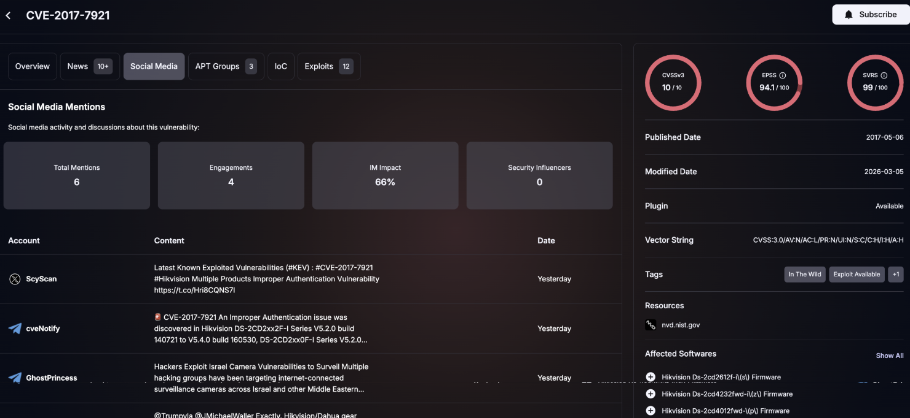
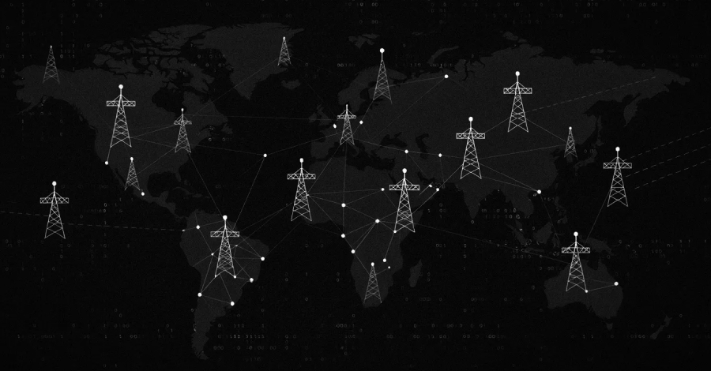

---
hide:
  - navigation
  - toc
---

# This Week's Security Incidents
 

-   

    **BoryptGrab Infostealer GitHub Distribution Campaign**

    **BoryptGrab**{.cve-chip} **Malicious GitHub Repos**{.cve-chip} **Windows Infostealer**{.cve-chip} **TunnesshClient**{.cve-chip}

    Researchers identified a large-scale malware operation abusing more than 100 fake GitHub repositories disguised as cheats, cracked tools, and utilities to deliver the BoryptGrab infostealer to Windows users. Victims are lured through SEO manipulation and social-engineering download pages.

    The malware steals browser credentials, wallet data, and messaging tokens, and in some cases installs TunnesshClient to establish reverse SSH tunnels and persistent remote access, increasing risk for both individual users and enterprise endpoints.

    [:octicons-arrow-right-24: Read more](2026/Week10/github.md)

-   

    **CVE-2025-70231 – Path Traversal Vulnerability in D-Link DIR-513 Router**

    **CVE-2025-70231**{.cve-chip} **Path Traversal**{.cve-chip} **CWE-22**{.cve-chip} **Unauthenticated Access**{.cve-chip}

    A critical path traversal flaw in D-Link DIR-513 firmware 1.10 allows unauthenticated attackers to abuse unsanitized `FILECODE` handling in `/goform/` endpoints and read sensitive files from the router filesystem.

    Successful exploitation can expose administrator credentials, Wi-Fi and network configuration data, and enable follow-on compromise such as traffic redirection, persistent device takeover, or botnet abuse.

    [:octicons-arrow-right-24: Read more](2026/Week10/dlink.md)

-   

    **SQL Injection Vulnerability in GPS Tracking System Login – CVE-2018-25192**

    **CVE-2018-25192**{.cve-chip} **SQL Injection**{.cve-chip} **CWE-89**{.cve-chip} **Authentication Bypass**{.cve-chip}

    A high-severity SQL injection vulnerability in GPS Tracking System 2.12 allows unauthenticated attackers to manipulate login queries by injecting payloads into the username parameter, bypassing authentication checks.

    Successful exploitation can expose location and fleet management data, enable unauthorized dashboard access, and provide a foothold for further compromise through record tampering, credential theft, or lateral activity.

    [:octicons-arrow-right-24: Read more](2026/Week10/gps.md)

-   

    **CVE-2026-3804 – Tenda i3 Router Stack-Based Buffer Overflow**

    **CVE-2026-3804**{.cve-chip} **Stack Overflow**{.cve-chip} **CWE-121**{.cve-chip} **Router RCE Risk**{.cve-chip}

    A vulnerability in Tenda i3 firmware 1.0.0.6(2204) affects `/goform/WifiMacFilterSet`, where improper validation of the `index` parameter can trigger a stack-based buffer overflow and destabilize or compromise device operation.

    Attackers with network reachability may exploit the flaw to gain unauthorized control, alter router configuration, redirect traffic, or crash services, creating both security and availability risks at the network edge.

    [:octicons-arrow-right-24: Read more](2026/Week10/tenda.md)

-   

    **Hikvision & Rockwell Automation Critical Vulnerabilities Added to KEV Catalog**

    **CVE-2017-7921**{.cve-chip} **CVE-2021-22681**{.cve-chip} **CISA KEV**{.cve-chip} **Critical Infrastructure Risk**{.cve-chip}

    CISA added critical Hikvision and Rockwell Automation vulnerabilities to the KEV catalog, highlighting active exploitation risk across surveillance and industrial environments. The issues enable authentication bypass and credential abuse that can grant attackers elevated operational access.

    Potential outcomes include unauthorized camera/feed access, exposure of sensitive configuration data, and industrial process manipulation through trusted engineering workflows in OT environments.

    [:octicons-arrow-right-24: Read more](2026/Week10/hikvision.md)

-   

    **Critical Vulnerabilities in Cisco Secure Firewall Management Center (FMC)**

    **CVE-2026-20079**{.cve-chip} **CVE-2026-20131**{.cve-chip} **Unauthenticated RCE**{.cve-chip} **Root Access Risk**{.cve-chip}

    Cisco patched two maximum-severity vulnerabilities in Secure Firewall Management Center that can allow remote unauthenticated attackers to execute commands and gain root-level control of the firewall management platform through crafted HTTP requests.

    Because FMC is a centralized policy control plane, successful exploitation can enable security-policy tampering, network-wide security degradation, and potential compromise across connected managed firewall infrastructure.

    [:octicons-arrow-right-24: Read more](2026/Week10/cisco.md)

-   

    **US Cyber Strategy Targets Adversaries, Critical Infrastructure, and Emerging Technologies**

    **National Cyber Strategy**{.cve-chip} **Critical Infrastructure**{.cve-chip} **Zero Trust**{.cve-chip} **AI & Quantum Security**{.cve-chip}

    The United States released a new national cyber strategy focused on strengthening resilience against nation-state threats, cybercrime, and emerging technology risks. The framework emphasizes coordinated action across government, industry, and international partners to improve prevention, deterrence, and response.

    Priorities include securing critical infrastructure, modernizing federal networks with Zero Trust and AI-driven defense, and accelerating post-quantum readiness to reduce long-term strategic cyber risk.

    [:octicons-arrow-right-24: Read more](2026/Week10/USstrategy.md)

-   

    **China-Linked Hackers Use TernDoor, PeerTime, BruteEntry in South American Telecom Attacks**

    **UAT-9244**{.cve-chip} **Telecom Espionage**{.cve-chip} **TernDoor/PeerTime**{.cve-chip} **BruteEntry**{.cve-chip}

    A China-linked threat cluster reportedly targeted South American telecom providers using a custom cross-platform toolkit that includes TernDoor (Windows), PeerTime (Linux), and BruteEntry for credential brute forcing and lateral expansion.

    The campaign demonstrates long-term espionage intent through stealthy persistence, relay-node creation, and sustained command-and-control access across telecom infrastructure supporting sensitive communications flows.

    [:octicons-arrow-right-24: Read more](2026/Week10/terndoor.md)

-   

    **Iranian APT Hacked US Airport, Bank, Software Company**

    **Iran-Linked APT**{.cve-chip} **Dindoor Backdoor**{.cve-chip} **Fakeset Malware**{.cve-chip} **Critical Sector Targeting**{.cve-chip}

    Researchers reported Iran-linked intrusion activity targeting aviation, banking, and software supply-chain organizations, with persistent access operations observed across multiple victims. The campaign deployed custom backdoors including Dindoor and Fakeset to sustain long-term espionage footholds.

    Reported tradecraft includes certificate-signed malware, lateral movement, and attempted data exfiltration from high-value environments, highlighting ongoing strategic intelligence collection risk in critical sectors.

    [:octicons-arrow-right-24: Read more](2026/Week10/dindoor.md)

