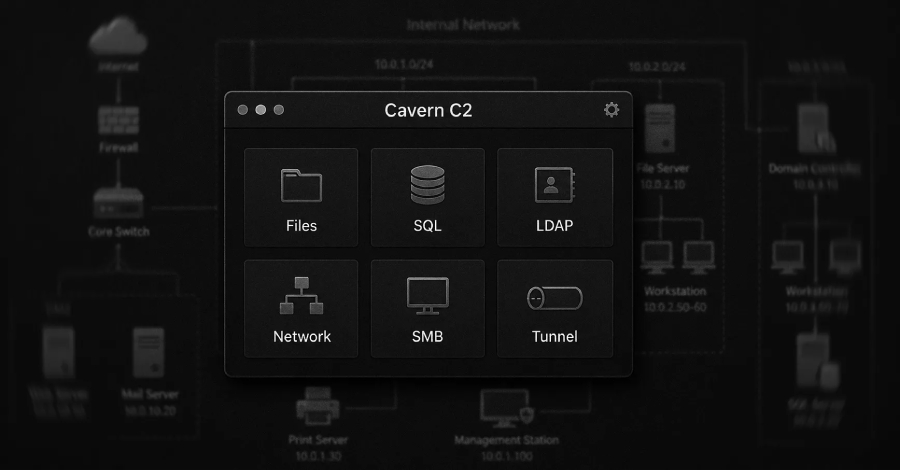
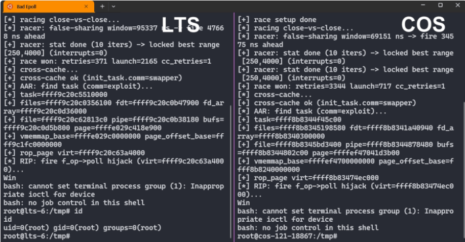

---
hide:
  - navigation
  - toc
---

# This Week's Security Incidents
 

-   

    **Iran-linked Cavern Manticore Uses Cavern (Cav3rn) Modular C2 Framework**

    **Iran-Nexus Threat Actor**{.cve-chip} **Cavern (Cav3rn) C2**{.cve-chip} **DLL Sideloading**{.cve-chip} **Supply Chain Targeting**{.cve-chip} **CVE-2025-54068 Context**{.cve-chip}

    Cavern Manticore is using a modular .NET C2 framework and stealthy sideloading techniques to target Israeli IT providers and government organizations, with related Iran-linked activity exploiting internet-facing services and enabling credential theft and sensitive data exfiltration.

    [Read more](2026/Week27/Cavern.md)

-   

    **Januscape - Linux KVM/x86 Shadow MMU Use-After-Free (CVE-2026-53359)**

    **CVE-2026-53359**{.cve-chip} **Linux KVM**{.cve-chip} **Shadow MMU UAF**{.cve-chip} **Guest-to-Host Escape Risk**{.cve-chip} **Nested Virtualization**{.cve-chip}

    Januscape is a long-lived KVM shadow MMU use-after-free flaw that can let a malicious guest corrupt host kernel memory, trigger host panic, and potentially escape from guest to host in vulnerable nested virtualization environments.

    [Read more](2026/Week27/Januscape.md)

-   

    **DHS HSIN information-sharing platform breach (HSIN and associated SharePoint compromised)**

    **Government Breach**{.cve-chip} **HSIN**{.cve-chip} **SharePoint**{.cve-chip} **Sensitive But Unclassified (SBU)**{.cve-chip} **Interagency Coordination Risk**{.cve-chip}

    DHS confirmed attackers breached HSIN and a connected SharePoint collaboration system in late May to early June 2026. Affected systems were isolated and patched, with DHS I&A and DOJ investigating scope. While classified systems were not impacted, potential exposure of sensitive unclassified coordination data creates high operational risk.

    [Read more](2026/Week27/HSIN.md)

-   

    **DuneSlide - Critical Cursor AI IDE Prompt Injection Vulnerabilities**

    **CVE-2026-50548**{.cve-chip} **CVE-2026-50549**{.cve-chip} **Prompt Injection**{.cve-chip} **Sandbox Escape**{.cve-chip} **AI IDE RCE**{.cve-chip}

    DuneSlide is a vulnerability chain in Cursor versions before 3.0 where attacker-controlled content can trigger indirect prompt injection and sandbox escape, enabling arbitrary OS command execution on developer workstations. Impact includes credential and source-code theft, malware installation, and downstream software supply-chain risk.

    [Read more](2026/Week27/DuneSlide.md)

-   

    **Multiple Unpatched Vulnerabilities in FatFs Filesystem Library**

    **CVE-2026-6682**{.cve-chip} **Embedded Systems**{.cve-chip} **FAT/exFAT Parsing**{.cve-chip} **Memory Corruption**{.cve-chip} **Potential RCE**{.cve-chip}

    Seven unpatched vulnerabilities in the FatFs filesystem library can be triggered by malicious FAT/exFAT metadata from removable media, leading to crashes, memory corruption, and possible code execution on embedded devices that integrate the library.

    [Read more](2026/Week27/FatFs.md)

-   

    **Bad Epoll (CVE-2026-46242)**

    **CVE-2026-46242**{.cve-chip} **Linux Kernel LPE**{.cve-chip} **Use-After-Free**{.cve-chip} **Race Condition**{.cve-chip} **Android Impact**{.cve-chip}

    Bad Epoll is a Linux kernel epoll/eventpoll race-condition vulnerability that enables unprivileged local users to gain root privileges via use-after-free memory corruption, affecting Linux and Android systems on vulnerable kernels.

    [Read more](2026/Week27/BadEpoll.md)

-   

    **NetNut Residential Proxy Network Disruption**

    **Residential Proxy Abuse**{.cve-chip} **Android Botnet**{.cve-chip} **NetNut Disruption**{.cve-chip} **FBI Operation**{.cve-chip} **BadBox 2.0**{.cve-chip}

    Google and the FBI disrupted NetNut, a malicious residential proxy service powered by about 2 million compromised Android-based devices, which attackers used to hide identity during credential attacks, malware delivery, and command-and-control activity.

    [Read more](2026/Week27/NetNut.md)

