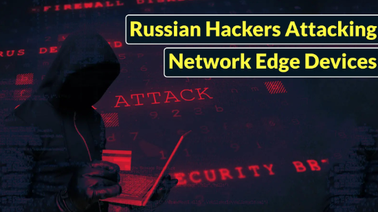
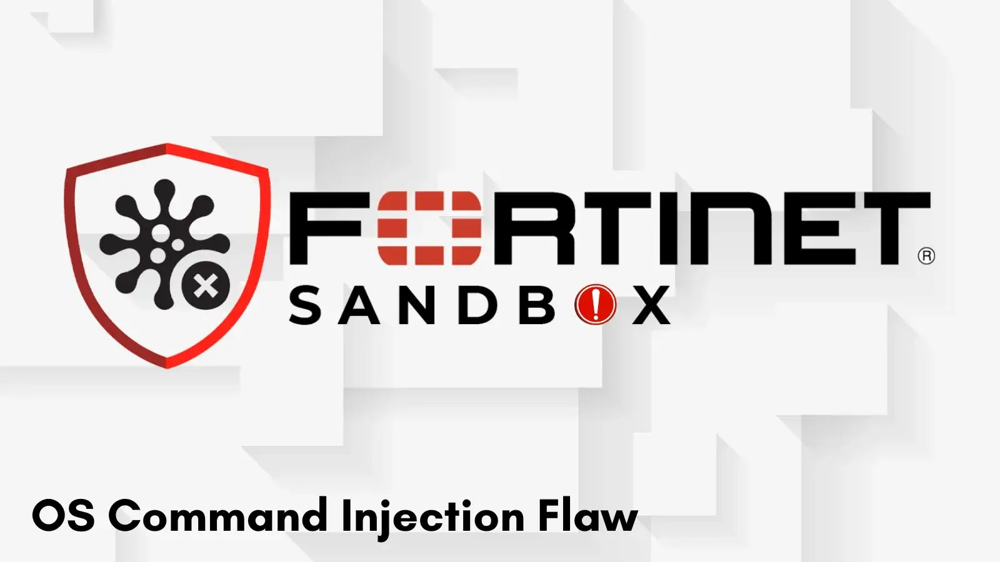
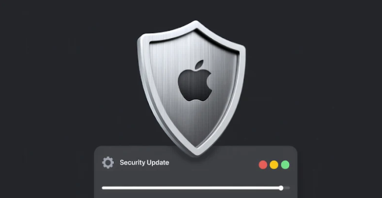
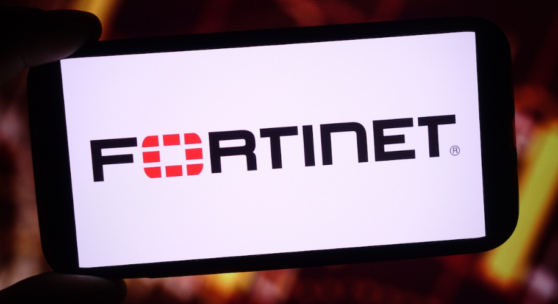
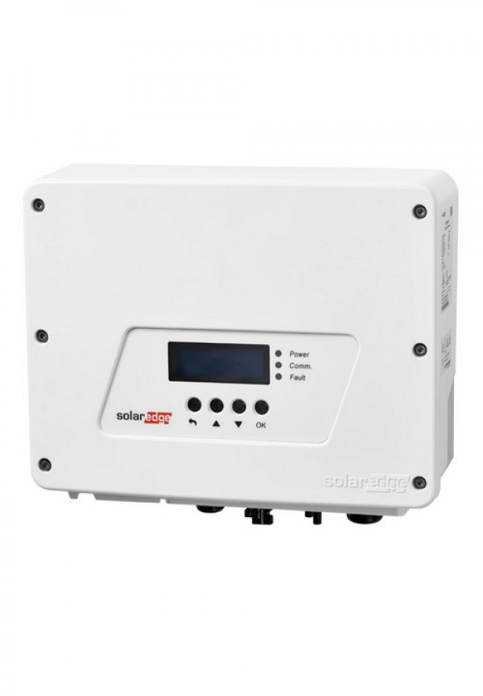

---
hide:
  - navigation
  - toc
---

# This Week's Security Incidents
 

-   
    :material-email-alert:{ .lg .middle } **CVE-2025-20393 Cisco AsyncOS Zero-Day Actively Exploited**

    **Zero-Day**{.cve-chip}  
    **Remote Code Execution**{.cve-chip}  
    **No Patch Available**{.cve-chip}  
    ---------------------------------

    Critical **zero-day** in Cisco AsyncOS email security appliances enables **unauthenticated remote attackers** to execute arbitrary commands with **root privileges**. **Actively exploited** by China-linked APT group **UAT-9686** deploying sophisticated toolset: **AquaShell** backdoor, **AquaTunnel** reverse SSH, **Chisel** tunneling, and **AquaPurge** log cleaner. Affects Cisco Secure Email Gateway and Email/Web Manager when **Spam Quarantine exposed to Internet**. **No patch available yet**. **Disable Spam Quarantine**, restrict Internet access, and rebuild compromised devices. Improper input validation (CWE-20).

    [:octicons-arrow-right-24: View Full Details](Week51/AsyncOS.md)

-   
    :material-package-variant-closed-remove:{ .lg .middle } **CVE-2025-59374 ASUS Live Update Supply Chain Compromise**

    **Supply Chain Compromise**{.cve-chip}  
    **Embedded Malicious Code**{.cve-chip}  
    **Actively Exploited**{.cve-chip}  
    ---------------------------------

    Sophisticated **supply chain attack** embedded malicious code in ASUS Live Update installers. Trojanized software contains **hard-coded targeting criteria** (MAC addresses, device IDs) executing malicious payloads only on specific systems. **Actively exploited** per CISA. ASUS Live Update reached **end-of-support** - no future fixes expected. Enables arbitrary code execution, data exfiltration, and lateral movement. **Remove ASUS Live Update entirely** (recommended) or update to v3.6.8+. Use Windows Update instead. APT-level selective targeting suggests espionage objectives. CWE-506.

    [:octicons-arrow-right-24: View Full Details](Week51/asus.md)

-   
    :material-vpn:{ .lg .middle } **CVE-2025-40602/23006 SonicWall SMA1000 Exploit Chain**

    **Zero-Day**{.cve-chip}  
    **Exploit Chain**{.cve-chip}  
    **Actively Exploited**{.cve-chip}  
    ---------------------------------

    **Actively exploited** exploit chain targeting SonicWall SMA1000 remote access gateways. Attackers chain **CVE-2025-23006** (deserialization RCE) with **CVE-2025-40602** (zero-day privilege escalation) achieving **unauthenticated root access**. Missing authorization checks in Appliance Management Console enable escalation. Compromises critical **VPN gateways** enabling credential harvesting, backdoor installation, and **lateral movement** into corporate networks. **Patch immediately** to firmware 12.4.3-03245+, 12.5.0-02283+. Restrict management interfaces, disable public AMC access, and monitor for compromise. Trust boundary breach.

    [:octicons-arrow-right-24: View Full Details](Week51/sonicWall.md)

-   
    :material-shield-alert:{ .lg .middle } **Russian GRU Cyber Campaign Targeting Critical Infrastructure**

    **Russian GRU**{.cve-chip}  
    **State-Sponsored**{.cve-chip}  
    **Edge Device Targeting**{.cve-chip}  
    ---------------------------------

    Multi-year **Russian military intelligence (GRU)** campaign targeting Western critical infrastructure via **misconfigured network edge devices**. Tactical evolution from vulnerability exploitation (2021-2024) to sustained focus on **misconfigurations in routers, VPN gateways, and network appliances** (2025). Uses **passive packet capture for credential harvesting** and **replay attacks** against cloud and energy sectors. Exposed by Amazon Threat Intelligence. Linked to **Curly COMrades** and other GRU clusters. **Harden edge device configurations**, implement MFA, restrict management interfaces, and deploy continuous monitoring for state-sponsored threats.

    [:octicons-arrow-right-24: View Full Details](Week51/RussianGRU.md)

-   
    :material-shield-bug:{ .lg .middle } **CVE-2025-53949 Fortinet FortiSandbox OS Command Injection**

    **OS Command Injection**{.cve-chip}  
    **Remote Code Execution**{.cve-chip}  
    **Critical**{.cve-chip}  
    ---------------------------------

    Critical OS command injection in FortiSandbox `upload_vdi_file` endpoint. Authenticated attackers can inject malicious commands due to **improper input validation**, achieving **root-level code execution** on the appliance. Affects FortiSandbox **5.0.0-5.0.2, 4.4.0-4.4.7, and all 4.2/4.0 versions**. Compromises **security infrastructure**, disrupts malware analysis, and enables **lateral movement**. **Patch immediately** to FortiSandbox 5.0.3+, 4.4.8+. Restrict management access, implement MFA, and monitor for suspicious activity. CWE-78.

    [:octicons-arrow-right-24: View Full Details](Week51/sandbox.md)

-   
    :material-apple:{ .lg .middle } **CVE-2025-43529 Apple WebKit Use-After-Free Vulnerability**

    **Use-After-Free**{.cve-chip}  
    **Remote Code Execution**{.cve-chip}  
    **Actively Exploited**{.cve-chip}  
    ---------------------------------

    Critical use-after-free vulnerability in WebKit HTML parser affects **iOS, iPadOS, macOS, Safari** and third-party apps using WebKit. Malicious web content triggers **memory corruption** leading to crashes or **arbitrary code execution**. **Actively exploited in sophisticated attacks** - Added to CISA KEV. Can lead to **device compromise, spyware installation, and data theft**. Affects both Apple and non-Apple products using WebKit. **Update to Safari 26.2+** and apply latest iOS/iPadOS/macOS patches immediately. Enable automatic updates on all devices. CWE-416.

    [:octicons-arrow-right-24: View Full Details](Week51/useAfterFree.md)

-   
    :material-shield-lock:{ .lg .middle } **CVE-2025-59718/59719 Fortinet FortiCloud SSO Authentication Bypass**

    **Authentication Bypass**{.cve-chip}  
    **SAML Signature Bypass**{.cve-chip}  
    **Critical**{.cve-chip}  
    ---------------------------------

    Critical authentication bypass in Fortinet FortiCloud SSO feature. Improper verification of **SAML cryptographic signatures** allows **unauthenticated remote attackers** to gain **full administrative access** by crafting malicious SAML responses. Affects **FortiOS, FortiProxy, FortiSwitchManager, FortiWeb** when FortiCloud SSO enabled. Enables complete device compromise, firewall rule modification, and backdoor creation. **Patch immediately** or disable FortiCloud SSO. Fixed versions: FortiOS 7.6.4+/7.4.9+, FortiProxy 7.6.4+/7.4.11+, FortiWeb 8.0.1+/7.6.5+. CWE-347.

    [:octicons-arrow-right-24: View Full Details](Week51/forticloud.md)

-   
    :material-solar-power:{ .lg .middle } **CVE-2025-36745 SolarEdge SE3680H Linux Kernel Vulnerabilities**

    **Unpatched Linux Kernel**{.cve-chip}  
    **Remote Code Execution**{.cve-chip}  
    **Unmaintained Components**{.cve-chip}  
    ---------------------------------

    Solar inverter shipped with **outdated, unpatched Linux kernel** containing multiple vulnerabilities. Allows attackers to achieve **remote code execution, privilege escalation, and information disclosure** without authentication. Affects SolarEdge SE3680H inverters up to firmware **v4.21** in **solar power installations**. Risks include **grid stability concerns, safety hazards, and lateral movement** in networks. Use of unmaintained third-party components (CWE-1104). **Contact SolarEdge for firmware updates**, isolate devices on segmented networks, and restrict management access. CVSS 8.6 (High).

    [:octicons-arrow-right-24: View Full Details](Week51/solaredge.md)

-   
    :material-shield-alert:{ .lg .middle } **Pro-Russia Hacktivists Target Critical Infrastructure via VNC**

    **Hacktivist Campaign**{.cve-chip}  
    **VNC Exploitation**{.cve-chip}  
    **OT/ICS Targeting**{.cve-chip}  
    ---------------------------------

    Pro-Russia hacktivist groups (CARR, Z-Pentest, NoName057(16), Sector16) exploit **internet-facing VNC services** to access OT/ICS systems in critical infrastructure. Opportunistic attacks use **weak/default credentials and brute force** to compromise HMIs and SCADA devices. Targets include **energy, utilities, water, manufacturing** sectors globally. While less sophisticated than APTs, **impact on physical processes can be significant**. **Remove internet exposure of OT assets**, implement strong authentication, segment OT/IT networks, and deploy continuous monitoring. Joint advisory from NSA, FBI, CISA, and international partners.

    [:octicons-arrow-right-24: View Full Details](Week51/hacktivists.md)

-   
    :material-web:{ .lg .middle } **CVE-2025-14174 Google Chromium ANGLE Out-of-Bounds Memory Access**

    **Out-of-Bounds Memory Access**{.cve-chip}  
    **Remote Code Execution**{.cve-chip}  
    **Actively Exploited**{.cve-chip}  
    ---------------------------------

    High-severity out-of-bounds memory access vulnerability in Chromium's ANGLE graphics component. Remote attacker can trigger memory corruption via **crafted HTML page**, leading to crashes or **arbitrary code execution**. Affects **Chrome, Edge, Opera, Brave** and other Chromium-based browsers. **Actively exploited in the wild** - Added to CISA KEV. Federal agencies must patch by **Jan 2, 2026** per BOD 22-01. **Update Chrome to 143.0.7499.110+** immediately and patch all Chromium-based browsers. Affects desktop and mobile across platforms. CVSS score varies (High severity).

    [:octicons-arrow-right-24: View Full Details](Week51/chromium.md)

-   
    :material-door:{ .lg .middle } **Johnson Controls iSTAR Ultra Multiple Vulnerabilities**

    **OS Command Injection**{.cve-chip}  
    **Firmware Authentication Bypass**{.cve-chip}  
    **Default Credentials**{.cve-chip}  
    ---------------------------------

    Multiple high-severity vulnerabilities in Johnson Controls iSTAR Ultra series door controllers allow attackers to **modify firmware, gain elevated privileges, and access protected systems**. Flaws include **OS command injection**, insufficient firmware verification, and **default root credentials**. Affects iSTAR Ultra, SE, G2, G2 SE, and Edge G2 models in **physical access control systems**. Exploitation enables **unauthorized door control, device takeover, and lateral movement**. **Upgrade to firmware 6.9.3+**, replace default credentials, isolate devices on dedicated networks, and implement physical security controls. CVSS 8.7 (High).

    [:octicons-arrow-right-24: View Full Details](Week51/istar.md)

-   
    :material-flash:{ .lg .middle } **CVE-2025-59392 Siemens Energy Services Authentication Bypass**

    **Authentication Bypass**{.cve-chip}  
    **Physical Access Required**{.cve-chip}  
    ---------------------------------

    Security vulnerability in Siemens Energy Services Elspec G5 devices allows authentication bypass via alternate path. Attacker with **physical access** can insert USB drive with publicly documented reset string to **reset admin password** and gain full device control. Affects Elspec G5 devices through firmware **1.2.2.19** in **critical infrastructure environments**. Despite requiring physical access, impact on energy systems can be **significant**. **Upgrade firmware beyond 1.2.2.19**, restrict physical access, implement tamper detection, and monitor USB port activity. CVSS score varies (Physical vector).

    [:octicons-arrow-right-24: View Full Details](Week51/siemensesa.md)

-   
    :material-earth:{ .lg .middle } **GeoServer XXE Vulnerability Exploitation (CVE-2025-58360)**

    **XML External Entity (XXE)**{.cve-chip}  
    **Unauthenticated File Access**{.cve-chip}  
    ---------------------------------

    Critical unauthenticated XXE vulnerability in OSGeo GeoServer's `/geoserver/wms` GetMap endpoint. Crafted XML enables **arbitrary file access, SSRF, and DoS** without authentication. Affects versions before 2.25.6 and 2.26.0-2.26.1. **Active exploitation confirmed** - Added to CISA KEV. Over **14,000 instances exposed** online. **Federal agencies must patch by Jan 1, 2026**. Upgrade to 2.25.6+, 2.26.2+, 2.27.0+, or 2.28.1+ immediately. CVSS 9.8 (Critical).

    [:octicons-arrow-right-24: View Full Details](Week51/geoserver.md)
    
-   
    :material-router-wireless:{ .lg .middle } **CVE-2018-4063 Sierra Wireless AirLink ALEOS Remote Code Execution**

    **Remote Code Execution**{.cve-chip}  
    **Unrestricted File Upload**{.cve-chip}  
    ---------------------------------

    Vulnerability in Sierra Wireless AirLink ALEOS router firmware's web management interface (`upload.cgi`) allows authenticated attackers to upload arbitrary executable files. Attackers can replace system scripts and execute code as **root**, gaining full device control. Affects ES450 and related models in **OT/ICS environments** (utilities, transportation). **Active exploitation confirmed** - Added to CISA KEV. **Patch to latest ALEOS firmware** immediately, change default credentials, and restrict management interface access. CVSS 8.8 (High).

    [:octicons-arrow-right-24: View Full Details](Week51/sierra.md)

