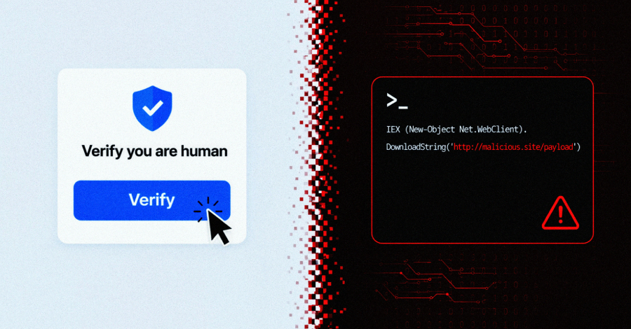
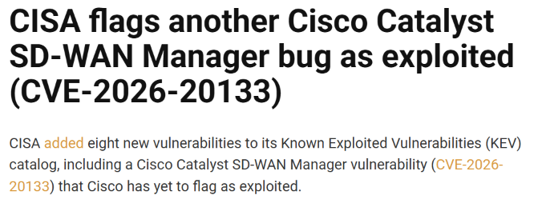
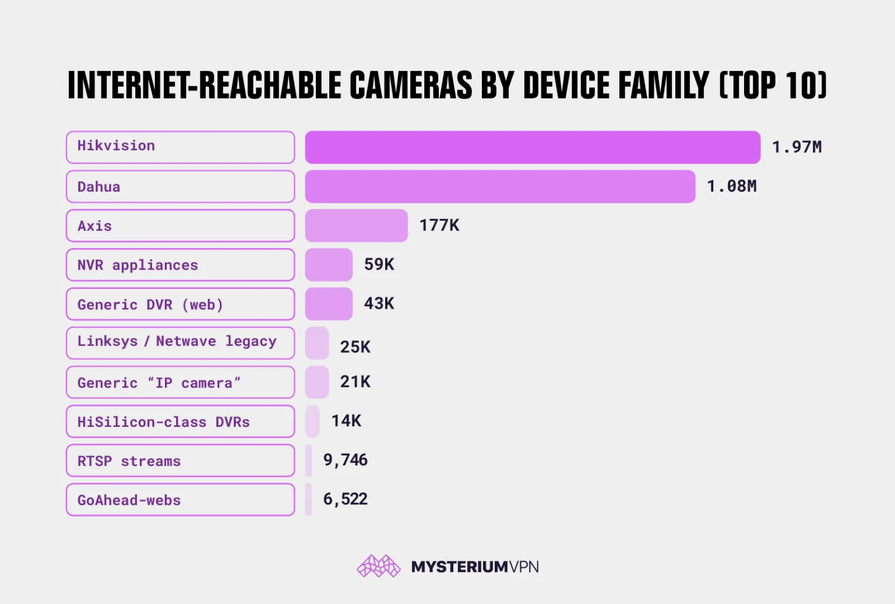
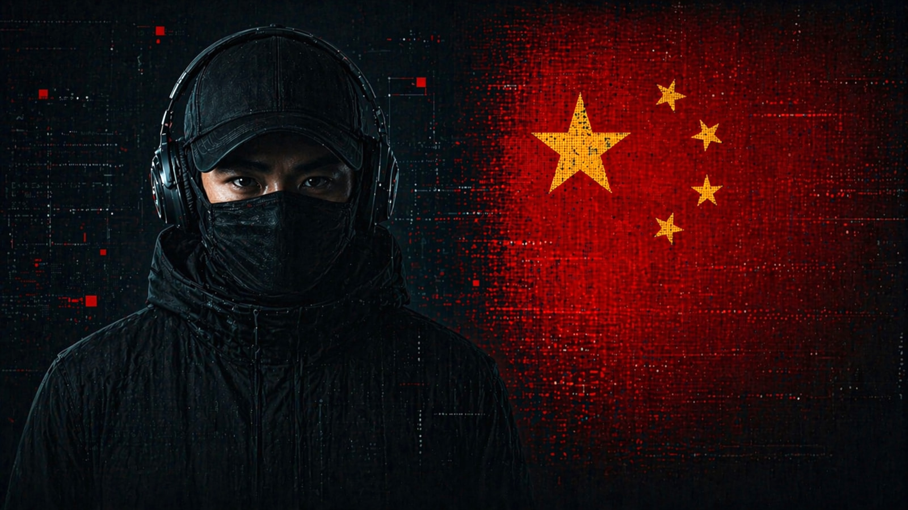
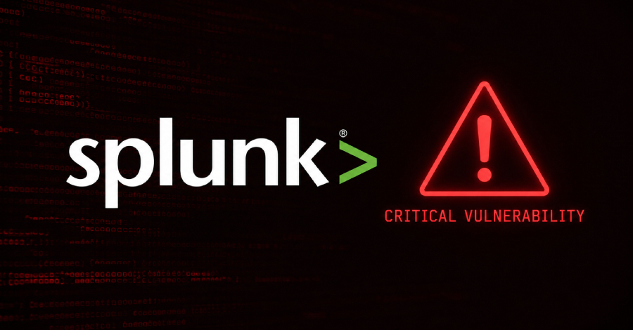

---
hide:
  - navigation
  - toc
---

# This Week's Security Incidents
 

-   

    **Rokarolla Android Banking Malware Campaign**

    **Android Malware**{.cve-chip} **Banking Trojan**{.cve-chip} **Overlay Attack**{.cve-chip} **Cryptocurrency Theft**{.cve-chip} **MFA Bypass**{.cve-chip}

    A new Android banking malware targets 217 banking and crypto apps via fake Chrome/TikTok update pages. It abuses Accessibility Services to perform overlay phishing, intercept SMS OTPs, and remotely control infected devices, enabling account takeover and financial fraud.

    [Read more](2026/Week24/Rokarolla.md)

-   

    **ClickFix Malware Campaign Expanding Delivery of BabaDeda, Lorem Ipsum, and Potemkin Loaders**

    **ClickFix**{.cve-chip} **Social Engineering**{.cve-chip} **Malware Loader**{.cve-chip} **LOLBins Abuse**{.cve-chip} **Ransomware**{.cve-chip}

    Fake CAPTCHA and browser update pages trick users into manually running malicious PowerShell commands, delivering the BabaDeda, Lorem Ipsum, and Potemkin loaders. Final payloads include ransomware, infostealers, and RATs deployed via LOLBin abuse and process injection.

    [Read more](2026/Week24/ClickFix.md)

-   

    **FortiSandbox Critical Vulnerabilities Actively Exploited**

    **CVE-2026-39813**{.cve-chip} **CVE-2026-39808**{.cve-chip} **CVE-2026-25089**{.cve-chip} **Authentication Bypass**{.cve-chip} **Active Exploitation**{.cve-chip} **Remote Code Execution**{.cve-chip}

    Three critical (CVSS 9.8) unauthenticated vulnerabilities in Fortinet FortiSandbox 4.4.0–4.4.8 and 5.0.0–5.0.5 are actively exploited, enabling attackers to bypass authentication and execute OS commands, potentially compromising malware detection and broader Security Fabric infrastructure.

    [Read more](2026/Week24/FortiSandbox.md)

-   

    **Cisco SD-WAN 'Make-Me-Root' Bug Under Attack in Catalyst SD-WAN Manager**

    **CVE-2026-20127**{.cve-chip} **CVE-2026-20182**{.cve-chip} **CVE-2026-20245**{.cve-chip} **Authentication Bypass**{.cve-chip} **Active Exploitation**{.cve-chip} **CISA KEV**{.cve-chip}

    A chain of critical vulnerabilities in Cisco Catalyst SD-WAN Manager allows unauthenticated attackers to bypass authentication and escalate to root, giving full control of the SD-WAN management plane. Actively exploited since 2023 with CISA emergency directives issued. CVE-2026-20127 carries a CVSS score of 10.0.

    [Read more](2026/Week24/SD-WAN.md)

-   

    **Exposure of 21,786 Internet-Connected Home Cameras Without Password Protection**

    **IoT Exposure**{.cve-chip} **Unsecured Cameras**{.cve-chip} **Privacy Risk**{.cve-chip} **Attack Surface**{.cve-chip}

    Researchers identified 21,786+ internet-connected home and surveillance cameras exposed without authentication, enabling direct remote viewing of live feeds and increasing the risk of privacy violations, lateral movement, and IoT botnet abuse.

    [Read more](2026/Week24/Cameras.md)

-   

    **U.S. Government Restricts Foreign Access to Anthropic Fable 5 and Mythos 5 AI Models**

    **AI Governance**{.cve-chip} **National Security**{.cve-chip} **Model Access Controls**{.cve-chip} **Anthropic**{.cve-chip}

    U.S. authorities reportedly required Anthropic to limit foreign access to Fable 5 and Mythos 5 over concerns that advanced model capabilities could support offensive cyber activity and safety-control bypass attempts.

    [Read more](2026/Week24/Anthropic.md)

-   
    
    **Handala Cyberattack on California Water Service (Cal Water)**

    **Handala**{.cve-chip} **Critical Infrastructure**{.cve-chip} **Water Utility**{.cve-chip} **Data Breach**{.cve-chip}

    The Iran-linked Handala group claimed a breach of Cal Water and leaked about 5GB of alleged data, with reporting indicating a likely foothold through an exposed RTKBase system and lateral movement into internal enterprise environments.

    [Read more](2026/Week24/CalWater.md)

-   

    **China-linked Linux Authentication Backdoor Campaign & Long-term Authentication Flow Hijacking Operation**

    **Linux Backdoor**{.cve-chip} **Authentication Hijacking**{.cve-chip} **China-Linked Threat**{.cve-chip} **Long-Term Espionage**{.cve-chip}

    A China-linked campaign reportedly tampered with PAM and OpenSSH authentication components to silently intercept credentials and monitor privileged activity, maintaining covert access across enterprise Linux environments for years.

    [Read more](2026/Week24/Hijacking.md)

-   

    **Critical Splunk Enterprise Vulnerability**

    **CVE-2026-20253**{.cve-chip} **Splunk Enterprise**{.cve-chip} **Unauthenticated Access**{.cve-chip} **Potential RCE**{.cve-chip}

    A critical Splunk Enterprise flaw in PostgreSQL recovery/backup API endpoints may allow unauthenticated unsafe file operations that can be chained into remote code execution and full server compromise.

    [Read more](2026/Week24/Splunk.md)

