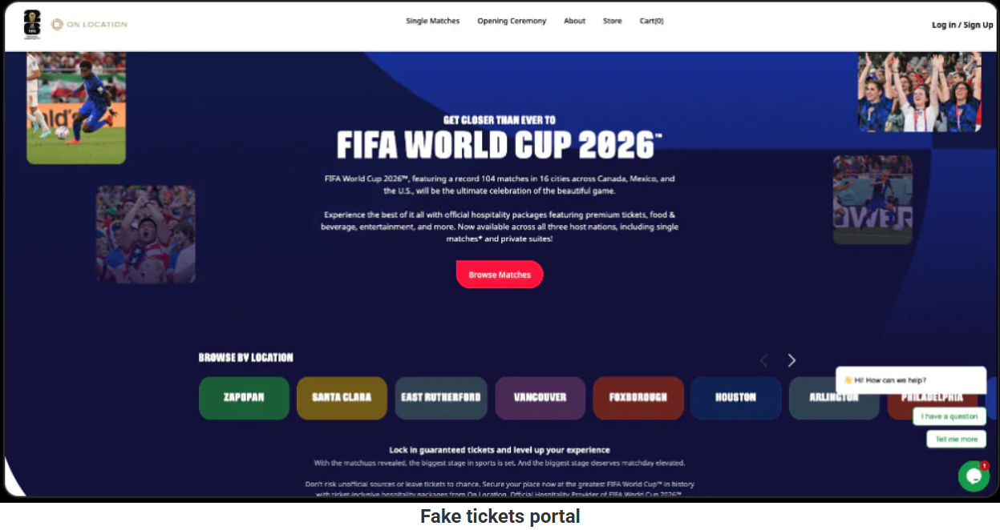
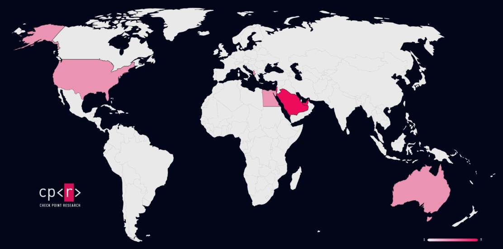

---
hide:
  - navigation
  - toc
---

# This Week's Security Incidents
 

-   

    **Meta AI Support Chatbot Instagram Account Takeover**

    **AI Exploitation**{.cve-chip} **Account Takeover**{.cve-chip} **Prompt Manipulation**{.cve-chip} **Instagram**{.cve-chip}

    Attackers manipulated Meta's AI account recovery chatbot through crafted prompts to change recovery emails and trigger password resets without identity verification — hijacking Instagram accounts including the Obama White House page and Sephora. Weak or absent MFA amplified the success rate.

    [Read more](2026/Week22/Instagram.md)

-   

    **Google Android June 2026 Security Update – Actively Exploited Android Zero-Day**

    **CVE-2025-48595**{.cve-chip} **Zero-Day**{.cve-chip} **Android**{.cve-chip} **Privilege Escalation**{.cve-chip}

    Google's June 2026 bulletin patches 124 Android flaws including CVE-2025-48595, an actively exploited Framework privilege escalation zero-day requiring no additional permissions. Devices must reach patch level 2026-06-05 for full coverage; unmanaged and BYOD devices face elevated enterprise risk.

    [Read more](2026/Week22/Android.md)

-   

    **FIFA World Cup 2026 Fraud and Phishing Campaign**

    **Phishing**{.cve-chip} **Typosquatting**{.cve-chip} **Financial Fraud**{.cve-chip} **Event-Themed Scam**{.cve-chip}

    The FBI warned of thousands of fraudulent FIFA-themed domains stealing tickets payments, credentials, and PII from fans. The "Ghost Stadium" operation uses cloned portals, fake SSO pages, and malicious search ads to impersonate legitimate FIFA services for the 2026 World Cup.

    [Read more](2026/Week22/FIFA.md)

-   

    **Nimbus Manticore Expanded Attacks with AI-Assisted Malware and Fake Zoom Installers**

    **Nimbus Manticore**{.cve-chip} **Iran-Linked APT**{.cve-chip} **MiniFast Malware**{.cve-chip} **AppDomain Hijacking**{.cve-chip}

    IRGC-linked Nimbus Manticore deployed the new MiniFast backdoor via trojanized Zoom installers and SEO poisoning, abusing .NET AppDomain Hijacking to load malicious DLLs in trusted processes. AI-assisted malware development and Zoom scheduled-task persistence target aviation, defense, telecom, and software sectors.

    [Read more](2026/Week22/Nimbus.md)

-   

    **Zero-Click WhatsApp Account Takeover Targeting iOS 16 Devices**

    **CVE-2025-43300**{.cve-chip} **CVE-2025-55177**{.cve-chip} **Zero-Click Exploit**{.cve-chip} **WhatsApp**{.cve-chip}

    A two-CVE zero-click chain (Apple ImageIO + WhatsApp linked-device weakness) silently hijacks WhatsApp accounts on iOS 16 with no user interaction. The rogue session may not appear in Linked Devices, leaving victims unaware until an unexpected logout — particularly dangerous for journalists, executives, and government officials.

    [Read more](2026/Week22/WhatsApp.md)

-   

    **Dutch Authorities Dismantle 17-Million-Device Botnet**

    **Botnet Takedown**{.cve-chip} **Residential Proxy**{.cve-chip} **ASOCKS**{.cve-chip} **Law Enforcement**{.cve-chip}

    Dutch authorities seized 200+ servers and dismantled a ~17-million-device botnet linked to the ASOCKS residential proxy network. Compromised routers, phones, and IoT devices were abused to route criminal traffic — enabling phishing, DDoS, credential abuse, and fraud while disguising the true origin.

    [Read more](2026/Week22/Botnet.md)

