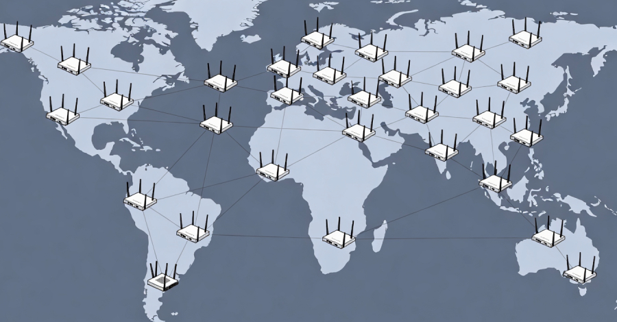

---
hide:
  - navigation
  - toc
---

# This Week's Security Incidents
 

-   

    **Cyberattack Targeting the National Centre for Nuclear Research (NCBJ)**

    **Critical Infrastructure**{.cve-chip} **Nuclear Sector**{.cve-chip} **Cyberattack**{.cve-chip}

    Poland's National Centre for Nuclear Research (NCBJ) blocked a targeted intrusion against its internal IT environment before any impact to reactor operations.

    The incident is under national-level investigation, with preliminary indicators suggesting possible links to **Iran-associated** infrastructure while attribution remains unconfirmed.

    [Read more](2026/Week11/poland.md)

-   

    **Stryker Global Network Cyberattack (Handala Attack)**

    **Healthcare Sector**{.cve-chip} **Wiper Attack**{.cve-chip} **Hacktivism**{.cve-chip}

    Stryker suffered a large-scale disruption across its global Microsoft enterprise environment, affecting corporate systems, manufacturing, and order processing.

    Public reporting and threat-actor claims indicate a destructive campaign likely involving endpoint management abuse, while Stryker stated patient-facing medical devices were not impacted.

    [Read more](2026/Week11/stryker.md)

-   

    **SocksEscort Proxy Service Disruption linked to the AVrecon Botnet**

    **Botnet**{.cve-chip} **Proxy Abuse**{.cve-chip} **Law Enforcement Action**{.cve-chip}

    U.S. and European law-enforcement agencies dismantled the SocksEscort proxy service, which used AVrecon-infected routers and IoT devices to provide criminal proxy infrastructure.

    The takedown disrupted a large-scale abuse ecosystem tied to fraud, credential stuffing, and phishing by seizing key domains, servers, and cryptocurrency assets.

    [Read more](2026/Week11/socksEscort.md)

-   

    **Microsoft Windows 11 RRAS Remote Code Execution Vulnerability - Out-of-Band Hotpatch**

    **Windows 11**{.cve-chip} **RRAS**{.cve-chip} **Remote Code Execution**{.cve-chip}

    Microsoft released OOB hotpatch `KB5084597` to fix multiple RRAS management vulnerabilities that could enable code execution when an administrator connects to a malicious RRAS server.

    The hotpatch allows supported enterprise systems to apply protections without reboot, reducing immediate exposure for managed environments.

    [Read more](2026/Week11/windows.md)

-   

    **Critical HPE Aruba Networking AOS-CX Vulnerability (CVE-2026-23813)**

    **HPE Aruba**{.cve-chip} **Authentication Bypass**{.cve-chip} **Critical Vulnerability**{.cve-chip}

    A critical flaw in the AOS-CX web management interface allows unauthenticated attackers to bypass authentication and potentially reset administrator credentials.

    Successful exploitation can lead to full switch takeover, configuration manipulation, and expanded lateral-movement risk across enterprise networks.

    [Read more](2026/Week11/hpe.md)

