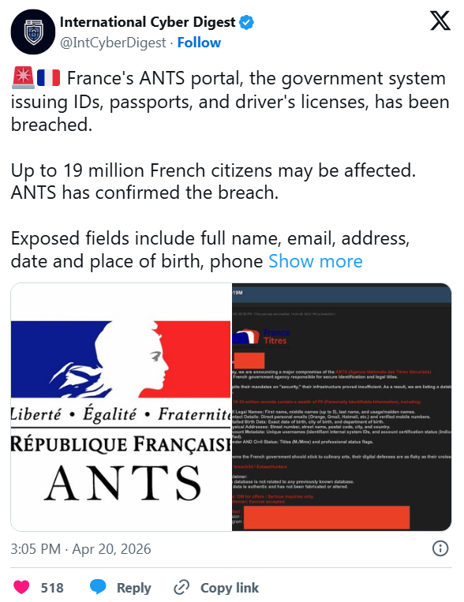
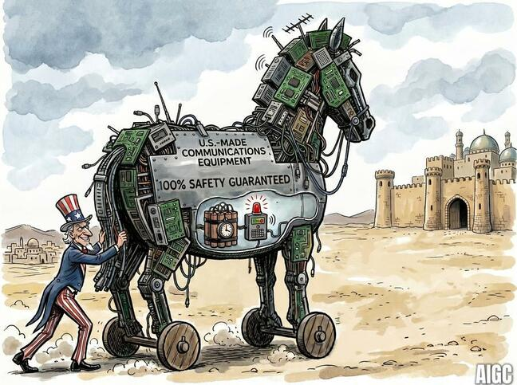
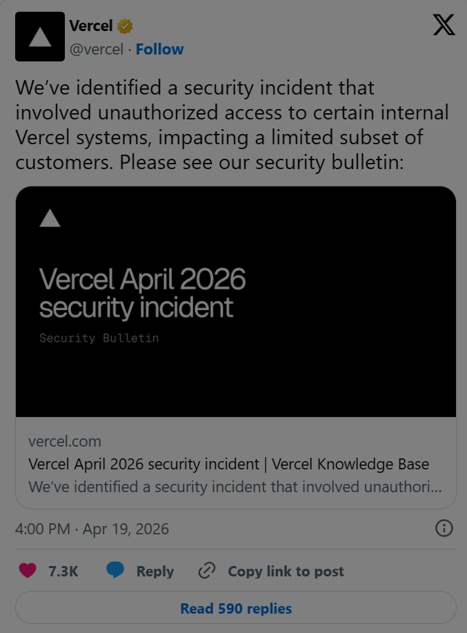

---
hide:
  - navigation
  - toc
---

# This Week's Security Incidents
 

-   

    **France ANTS ID System Cyberattack / Data Breach**

    **Government Data Breach**{.cve-chip} **PII Exposure**{.cve-chip} **Identity Documents**{.cve-chip}

    A cyberattack on France's National Agency for Secure Documents (ANTS) may have exposed the personal data of millions of users, including names, email addresses, dates of birth, and login identifiers. The exact attack vector remains unknown; no evidence of uploaded ID document scans being accessed has been reported.

    [Read more](2026/Week16/ANTS.md)

-   

    **Iran Claims US Used Backdoors to Knock Out Networking Equipment During War**

    **Nation-State Claim**{.cve-chip} **Supply Chain Security**{.cve-chip} **Hardware Backdoor**{.cve-chip}

    Iranian authorities claimed that foreign-manufactured networking hardware containing embedded backdoors was used to remotely disrupt national infrastructure during active conflict. No independent forensic evidence has been released; exploitation of known vulnerabilities remains an alternative explanation.

    [Read more](2026/Week16/backdoors.md)

-   
    
    **Vercel Confirms Breach as Hackers Claim to Be Selling Stolen Data**

    **Cloud Platform Breach**{.cve-chip} **OAuth Abuse**{.cve-chip} **Third-Party Risk**{.cve-chip}

    Vercel confirmed unauthorized access linked to a compromised third-party integration and abused Google Workspace OAuth app permissions, which enabled attacker access to an employee account and internal systems.

    Exposed data reportedly included employee metadata and non-sensitive environment variables, while sensitive variables were protected; attackers later advertised stolen data for sale.

    [Read more](2026/Week16/Vercel.md)

-   

    **Microsoft Defender Zero-Day Vulnerabilities (BlueHammer, RedSun, UnDefend)**

    **Microsoft Defender**{.cve-chip} **Zero-Day Exposure**{.cve-chip} **Privilege Escalation**{.cve-chip} **Defense Tampering Risk**{.cve-chip}

    Three disclosed Defender zero-days, including two reported as unpatched, can enable SYSTEM-level privilege escalation and interference with endpoint protection updates.

    The chain increases risk of stealthy payload deployment, longer dwell time, and ransomware or surveillance activity on affected Windows endpoints.

    [Read more](2026/Week16/Microsoft.md)

-   

    **Nexcorium (Mirai Variant IoT Botnet Campaign)**

    **Mirai Variant**{.cve-chip} **IoT Botnet**{.cve-chip} **DVR/Router Exploitation**{.cve-chip} **DDoS Threat**{.cve-chip}

    Nexcorium is a Mirai-based malware campaign targeting vulnerable DVRs and outdated routers through known CVEs, then deploying architecture-specific payloads with persistence and propagation routines.

    Compromised devices are enrolled into a botnet used for multi-vector DDoS operations, with continued spread via Telnet brute-force and default credential abuse.

    [Read more](2026/Week16/Nexcorium.md)

-   

    **Hackers Target Israeli Desalination Plants With ZionSiphon Sabotage Malware**

    **ZionSiphon**{.cve-chip} **ICS Sabotage Malware**{.cve-chip} **Water Infrastructure**{.cve-chip} **Cyber-Physical Risk**{.cve-chip}

    ZionSiphon is designed to target water treatment/desalination environments and manipulate operational parameters such as chlorine dosing and pressure levels.

    Although observed samples had coding limitations, the campaign demonstrates credible intent toward disruptive cyber-physical impact on critical services.

    [Read more](2026/Week16/Israel.md)

