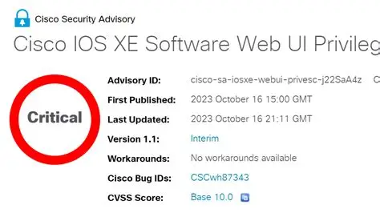
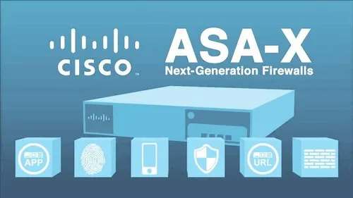
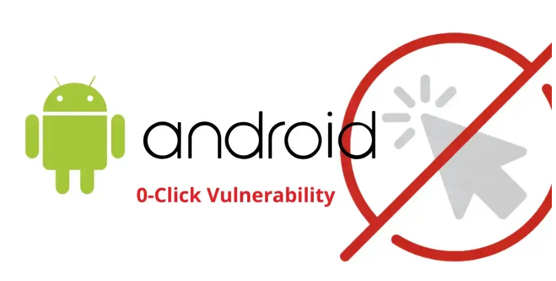

---
hide:
  - navigation
  - toc
---

# This Week's Security Incidents
 

-   
    :material-router:{ .lg .middle } __Cisco IOS XE BADCANDY Web Shell Implant__

    **CVE-2023-20198**{.cve-chip}
    **Remote full system compromise**{.cve-chip}
    **Credential theft**{.cve-chip}
    ---
    BADCANDY is a malicious Lua-based web shell implant deployed by threat actors on vulnerable Cisco IOS XE devices, exploiting a critical zero-day in the web UI for complete remote compromise and persistent access.
    [:octicons-arrow-right-24: View Full Details](Week45/Cisco-IOS-XE.md)

-   
    :material-laptop:{ .lg .middle } __VMware Aria Operations and VMware Tools Vulnerability__

    **CVE-2025-41244**{.cve-chip}
    **Privilege escalation**{.cve-chip}
    **Root access on guest VMs**{.cve-chip}
    ---
    CVE-2025-41244 is a local privilege escalation vulnerability affecting VMware Aria Operations and VMware Tools, allowing local attackers to escalate privileges and execute arbitrary code as root on guest VMs.
    [:octicons-arrow-right-24: View Full Details](Week45/VMware-tools.md)

-   
    :material-cellphone:{ .lg .middle } __Android/BankBot-YNRK Malware__

    **Advanced Android banking trojan**{.cve-chip}
    **Credential and fund theft**{.cve-chip}
    **Accessibility abuse**{.cve-chip}
    ---
    Sophisticated Android banking trojan disguised as the Indonesian government’s “Identitas Kependudukan Digital” (Digital ID) app; automates theft of credentials and funds from banking and crypto apps using accessibility abuse, environment detection, persistent C2, and advanced social engineering.
    [:octicons-arrow-right-24: View Full Details](Week45/Android-BankBot.md)

-   
    :material-fire:{ .lg .middle } __Storm-1849/UAT4356 Exploiting Cisco ASA Secure Firewall__

    **Critical RCE and persistent access**{.cve-chip}
    **ArcaneDoor campaign**{.cve-chip}
    ---
    Chinese threat actor Storm-1849 (UAT4356) exploits Cisco ASA Secure Firewalls worldwide, chaining VPN Web Server vulnerabilities for persistent access and remote code execution, even after device reboots/upgrades.
    [:octicons-arrow-right-24: View Full Details](Week45/Cisco-ASA.md)

-   
    :material-shield:{ .lg .middle } __Multiple Critical Vulnerabilities in Moxa ICS Network Appliances and Routers__

    **Administrative takeover**{.cve-chip}
    **High severity CVEs**{.cve-chip}
    ---
    Five high-severity vulnerabilities affecting Moxa industrial routers and gateways that allow authentication bypass, privilege escalation, and admin account creation. Patch to v3.21 or later.
    [:octicons-arrow-right-24: View Full Details](Week45/Moxa.md)

-   
    :material-lock:{ .lg .middle } __Super Value Co. Ransomware Breach__

    **Qilin ransomware**{.cve-chip}
    **Data leak & extortion**{.cve-chip}
    ---
    Qilin actors published internal documents from Super Value Co.; double-extortion data theft and leak site publication. Investigate exfiltration and restore from immutable backups.
    [:octicons-arrow-right-24: View Full Details](Week45/Super-Value.md)

-   
    :material-android:{ .lg .middle } __Android Security Bulletin - November 2025__

    **Zero-Click RCE**{.cve-chip}
    **Critical Severity**{.cve-chip}
    ---
    Critical remote code execution vulnerability in Android System component affects versions 13-16, allowing zero-click exploitation without user interaction. Patch to 2025-11-01 level required.
    [:octicons-arrow-right-24: View Full Details](Week45/Android-Security-Bulletin.md)

-   

    :material-security:{ .lg .middle } __Cyber Toufan – Maya Engineering Surveillance Breach__

    **Espionage Operation**{.cve-chip} 
    **Data Exfiltration**{.cve-chip} 
    **Surveillance Compromise**{.cve-chip}
    ---

    An Iran-linked threat group **Cyber Toufan** claims to have infiltrated Israeli defense contractor **Maya Engineering**, accessing internal surveillance cameras, QNAP archives, and other networked systems and releasing dozens of internal videos. The authenticity of the claims remains unverified, but the operation — if true — represents long-term espionage and psychological-warfare tactics.

    [:octicons-arrow-right-24: View Full Details](Week45/maya-engineering-breach.md)

