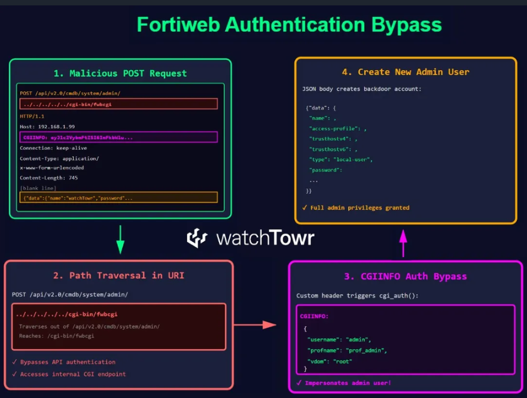

---
hide:
  - navigation
  - toc
---

# This Week's Security Incidents
 

-   
    :material-shield-lock:{ .lg .middle } **Fortinet FortiWeb Authentication Bypass (CVE-2025-64446)**

    **Authentication Bypass**{.cve-chip}
    **Critical Severity**{.cve-chip}
    --------------------------------

    A critical authentication bypass vulnerability (CVE-2025-64446) in Fortinet FortiWeb is being actively exploited in the wild. Attackers abuse a path traversal flaw and a crafted CGIINFO header to impersonate the built-in admin account, create rogue administrator users, and gain persistent full control over the Web Application Firewall (WAF). Immediate patching is mandatory to prevent compromise of network perimeter defenses.

    [:octicons-arrow-right-24: View Full Details](Week47/fortiweb.md)

-   
    :material-server-security:{ .lg .middle } **Critical IBM AIX NIM Remote Code Execution (CVE-2025-36250)**

    **Remote Code Execution**{.cve-chip}
    **CVSS 10.0 Critical**{.cve-chip}
    ---------------------------------

    A critical vulnerability (CVE-2025-36250) in IBM AIX’s Network Installation Manager (NIM) allows **unauthenticated remote code execution** due to improper process controls in the *nimesis* service. Combined with related flaws (CVE-2025-36251, CVE-2025-36096, CVE-2025-36236), attackers can **execute commands remotely**, **steal NIM private keys**, and **write arbitrary files via directory traversal**, enabling full compromise of AIX and VIOS systems.
    Immediate patching of all AIX/VIOS installations and rotation of NIM keys is critical to prevent exploitation.

    [:octicons-arrow-right-24: View Full Details](Week47/aix.md)

-   
    :material-alert-decagram:{ .lg .middle } **D-Link DIR-816L Stack-Based Buffer Overflow (CVE-2025-13189)**

    **Stack Buffer Overflow**{.cve-chip}  
    **High Severity**{.cve-chip}
    --------------------------------

    A high-severity vulnerability (CVE-2025-13189) in the D-Link DIR-816L router allows remote attackers to trigger a **stack-based buffer overflow** via crafted `SERVER_ID` or `HTTP_SID` parameters in the `gena.cgi` script. Exploitation can lead to **remote code execution**, device takeover, or denial-of-service. The router is **end-of-life**, and **no security patch will be released**.

    [:octicons-arrow-right-24: View Full Details](Week47/dlink.md)
    

