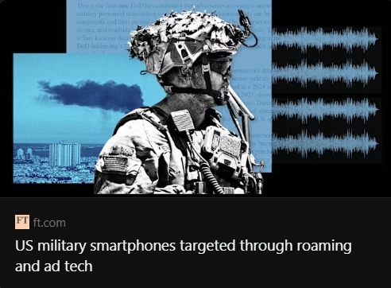
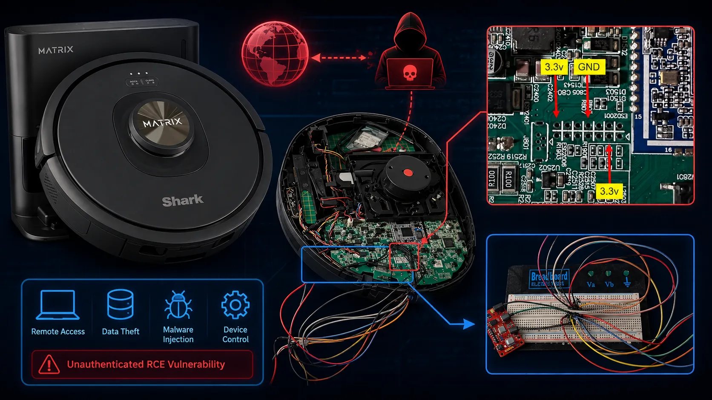

---
hide:
  - navigation
  - toc
---

# This Week's Security Incidents
 

-      

    **Iranian Mobile Tracking Campaign Targeting U.S. Military Personnel via SS7 Roaming and AdTech Data**

    **SS7 Abuse**{.cve-chip} **AdTech Data Correlation**{.cve-chip} **Location Intelligence**{.cve-chip} **OPSEC Risk**{.cve-chip} **Telecom Signaling**{.cve-chip}

    Iranian-linked actors reportedly combined SS7 roaming query abuse with commercial AdTech location data correlation to map movement patterns of U.S. military personnel and contractors in the Gulf, creating significant operational security and force-protection risk.

    [Read more](2026/Week29/Roaming.md)

-      

    **Unpatched Shark Robot Vacuum AWS IoT Authorization Vulnerability**

    **IoT Cloud Misconfiguration**{.cve-chip} **AWS IoT Core**{.cve-chip} **Certificate Abuse**{.cve-chip} **Cross-Device Access**{.cve-chip} **Privacy Exposure**{.cve-chip}

    Researchers found that extracting one Shark vacuum's AWS IoT certificate and key can enable unauthorized cross-device access in the same AWS region due to permissive cloud authorization policy, exposing map data, credentials, telemetry, and remote-control functions.

    [Read more](2026/Week29/Vacuum.md)

-      

    **PhantomEnigma Malware Campaign Leveraging Hijacked Brazilian Government Websites**

    **Supply-Chain Style Delivery**{.cve-chip} **Government Site Hijack**{.cve-chip} **Node.js Backdoor**{.cve-chip} **Trojanized Installers**{.cve-chip} **C2-Controlled Modules**{.cve-chip}

    Attackers compromised more than 20 Brazilian government websites and replaced legitimate software downloads with trojanized installers that deploy a modular Node.js backdoor, enabling persistent remote command execution and follow-on payload delivery.

    [Read more](2026/Week29/PhantomEnigma.md)

-      

    **7-Zip Remote Code Execution Vulnerability (CVE-2026-14266)**

    **CVE-2026-14266**{.cve-chip} **7-Zip**{.cve-chip} **Heap Overflow**{.cve-chip} **XZ Archive Parsing**{.cve-chip} **RCE Risk**{.cve-chip}

    A heap-based buffer overflow in 7-Zip's XZ archive processing can enable arbitrary code execution when victims open malicious archives with vulnerable versions prior to 26.02.

    [Read more](2026/Week29/7-Zip.md)

