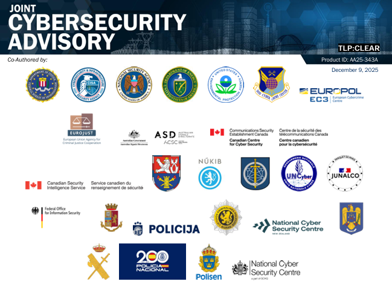
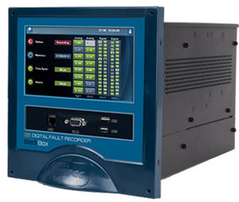

---
hide:
  - navigation
  - toc
---

# This Week's Security Incidents
 

-   
    :material-shield-alert:{ .lg .middle } **Pro-Russia Hacktivists Target Critical Infrastructure via VNC**

    **Hacktivist Campaign**{.cve-chip}  
    **VNC Exploitation**{.cve-chip}  
    **OT/ICS Targeting**{.cve-chip}  
    ---------------------------------

    Pro-Russia hacktivist groups (CARR, Z-Pentest, NoName057(16), Sector16) exploit **internet-facing VNC services** to access OT/ICS systems in critical infrastructure. Opportunistic attacks use **weak/default credentials and brute force** to compromise HMIs and SCADA devices. Targets include **energy, utilities, water, manufacturing** sectors globally. While less sophisticated than APTs, **impact on physical processes can be significant**. **Remove internet exposure of OT assets**, implement strong authentication, segment OT/IT networks, and deploy continuous monitoring. Joint advisory from NSA, FBI, CISA, and international partners.

    [:octicons-arrow-right-24: View Full Details](Week51/hacktivists.md)

-   
    :material-web:{ .lg .middle } **CVE-2025-14174 Google Chromium ANGLE Out-of-Bounds Memory Access**

    **Out-of-Bounds Memory Access**{.cve-chip}  
    **Remote Code Execution**{.cve-chip}  
    **Actively Exploited**{.cve-chip}  
    ---------------------------------

    High-severity out-of-bounds memory access vulnerability in Chromium's ANGLE graphics component. Remote attacker can trigger memory corruption via **crafted HTML page**, leading to crashes or **arbitrary code execution**. Affects **Chrome, Edge, Opera, Brave** and other Chromium-based browsers. **Actively exploited in the wild** - Added to CISA KEV. Federal agencies must patch by **Jan 2, 2026** per BOD 22-01. **Update Chrome to 143.0.7499.110+** immediately and patch all Chromium-based browsers. Affects desktop and mobile across platforms. CVSS score varies (High severity).

    [:octicons-arrow-right-24: View Full Details](Week51/chromium.md)

-   
    :material-door:{ .lg .middle } **Johnson Controls iSTAR Ultra Multiple Vulnerabilities**

    **OS Command Injection**{.cve-chip}  
    **Firmware Authentication Bypass**{.cve-chip}  
    **Default Credentials**{.cve-chip}  
    ---------------------------------

    Multiple high-severity vulnerabilities in Johnson Controls iSTAR Ultra series door controllers allow attackers to **modify firmware, gain elevated privileges, and access protected systems**. Flaws include **OS command injection**, insufficient firmware verification, and **default root credentials**. Affects iSTAR Ultra, SE, G2, G2 SE, and Edge G2 models in **physical access control systems**. Exploitation enables **unauthorized door control, device takeover, and lateral movement**. **Upgrade to firmware 6.9.3+**, replace default credentials, isolate devices on dedicated networks, and implement physical security controls. CVSS 8.7 (High).

    [:octicons-arrow-right-24: View Full Details](Week51/istar.md)

-   
    :material-flash:{ .lg .middle } **CVE-2025-59392 Siemens Energy Services Authentication Bypass**

    **Authentication Bypass**{.cve-chip}  
    **Physical Access Required**{.cve-chip}  
    ---------------------------------

    Security vulnerability in Siemens Energy Services Elspec G5 devices allows authentication bypass via alternate path. Attacker with **physical access** can insert USB drive with publicly documented reset string to **reset admin password** and gain full device control. Affects Elspec G5 devices through firmware **1.2.2.19** in **critical infrastructure environments**. Despite requiring physical access, impact on energy systems can be **significant**. **Upgrade firmware beyond 1.2.2.19**, restrict physical access, implement tamper detection, and monitor USB port activity. CVSS score varies (Physical vector).

    [:octicons-arrow-right-24: View Full Details](Week51/siemensesa.md)

-   
    :material-earth:{ .lg .middle } **GeoServer XXE Vulnerability Exploitation (CVE-2025-58360)**

    **XML External Entity (XXE)**{.cve-chip}  
    **Unauthenticated File Access**{.cve-chip}  
    ---------------------------------

    Critical unauthenticated XXE vulnerability in OSGeo GeoServer's `/geoserver/wms` GetMap endpoint. Crafted XML enables **arbitrary file access, SSRF, and DoS** without authentication. Affects versions before 2.25.6 and 2.26.0-2.26.1. **Active exploitation confirmed** - Added to CISA KEV. Over **14,000 instances exposed** online. **Federal agencies must patch by Jan 1, 2026**. Upgrade to 2.25.6+, 2.26.2+, 2.27.0+, or 2.28.1+ immediately. CVSS 9.8 (Critical).

    [:octicons-arrow-right-24: View Full Details](Week51/geoserver.md)
    
-   
    :material-router-wireless:{ .lg .middle } **CVE-2018-4063 Sierra Wireless AirLink ALEOS Remote Code Execution**

    **Remote Code Execution**{.cve-chip}  
    **Unrestricted File Upload**{.cve-chip}  
    ---------------------------------

    Vulnerability in Sierra Wireless AirLink ALEOS router firmware's web management interface (`upload.cgi`) allows authenticated attackers to upload arbitrary executable files. Attackers can replace system scripts and execute code as **root**, gaining full device control. Affects ES450 and related models in **OT/ICS environments** (utilities, transportation). **Active exploitation confirmed** - Added to CISA KEV. **Patch to latest ALEOS firmware** immediately, change default credentials, and restrict management interface access. CVSS 8.8 (High).

    [:octicons-arrow-right-24: View Full Details](Week51/sierra.md)

