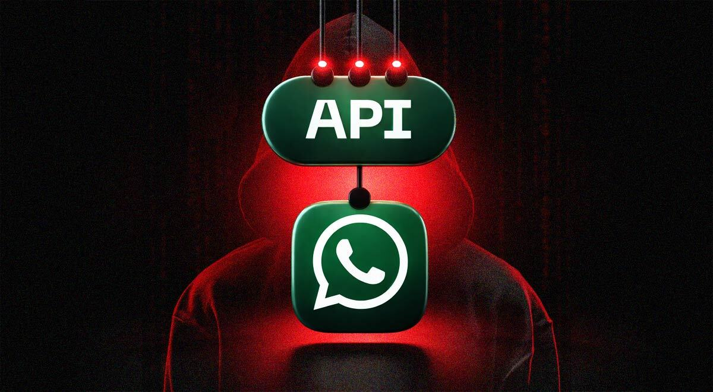
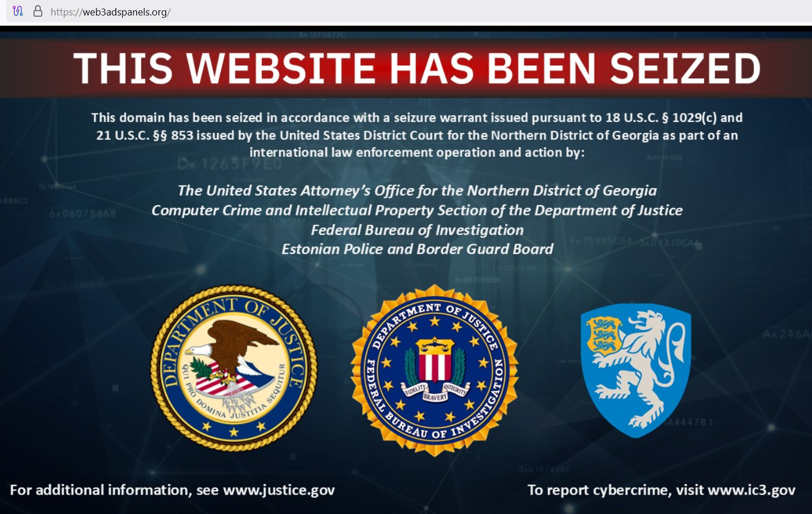
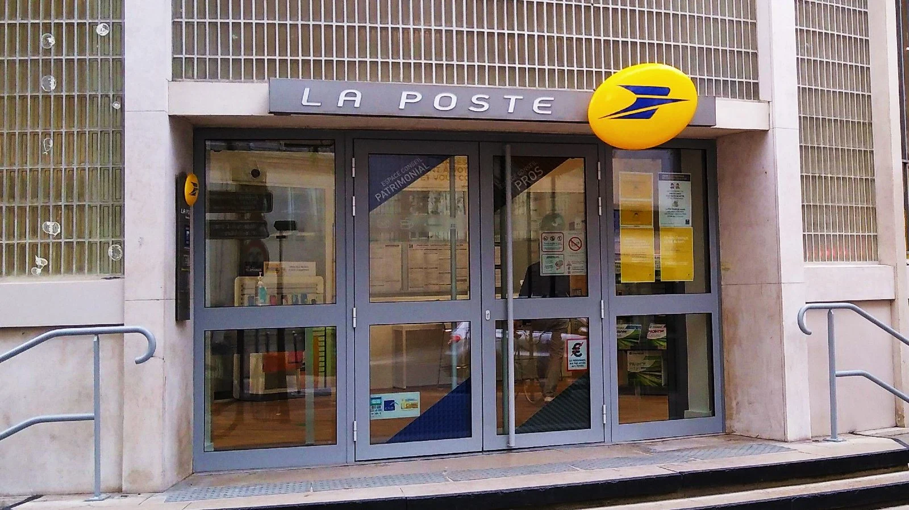
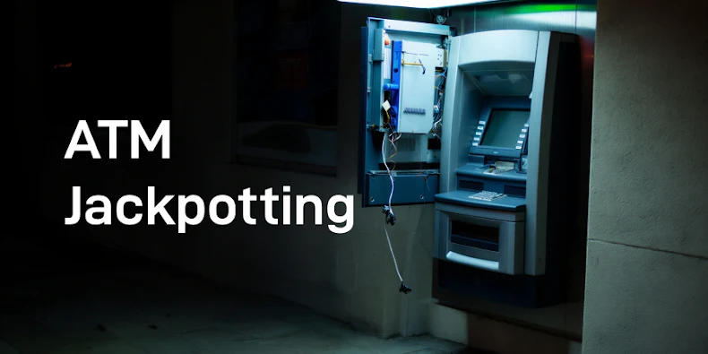
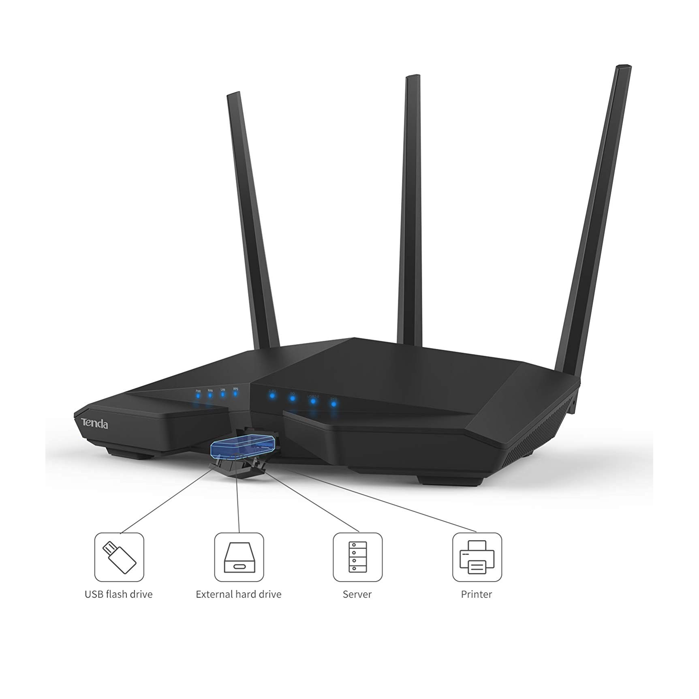
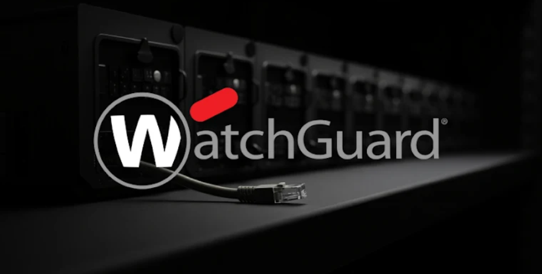

---
hide:
  - navigation
  - toc
---

# This Week's Security Incidents
 

-   
    :material-package-variant-closed:{ .lg .middle } **Lotusbail Malicious npm Package**

    **Supply Chain Attack**{.cve-chip}  
    **npm Package**{.cve-chip}  
    **WhatsApp Compromise**{.cve-chip}  
    **56,000+ Downloads**{.cve-chip}  
    ---------------------------------

    **Lotusbail** malicious npm package disguised as WhatsApp Web API library downloaded **56,000+ times**. Trojanized fork of **@whiskeysockets/baileys** appeared functional while secretly intercepting WhatsApp traffic. **Malicious WebSocket wrapper** captured **credentials, messages, contacts, media, and session tokens**. Used **hardcoded pairing code** to silently link **attacker's device** to victim's WhatsApp account, creating **persistent access** surviving package removal. Data exfiltrated via custom encryption to attacker servers. **Remove package**, **unlink unknown devices** in WhatsApp settings, rotate credentials, vet packages before installation, use **npm audit** and scanning tools (Snyk, Socket.dev), monitor runtime behavior, and enable WhatsApp two-step verification. Supply chain attack targeting developers.

    [:octicons-arrow-right-24: View Full Details](Week52/lotusbail.md)

-   
    :material-apple:{ .lg .middle } **MacSync macOS Stealer: Code-Signed Gatekeeper Bypass**

    **macOS Malware**{.cve-chip}  
    **Code-Signed**{.cve-chip}  
    **Gatekeeper Bypass**{.cve-chip}  
    **Credential Theft**{.cve-chip}  
    ---------------------------------

    **MacSync** macOS stealer distributed via **digitally signed and Apple-notarized** fake installers (e.g., "zk-call-messenger-installer-3.9.2-lts.dmg"). **Valid Apple Developer ID signature** and notarization bypass **Gatekeeper and XProtect** without warnings. Swift dropper performs environment checks, downloads encoded payload from remote server. **Go-based stealer** (derived from Mac.c) harvests **Keychain passwords**, **browser credentials**, **cryptocurrency wallets**, **SSH keys**, and **cloud tokens**. Establishes **LaunchAgent persistence** and C2 connection. .dmg padded to ~25.5 MB with decoy PDFs. Certificate later revoked. Download from **App Store or official sites only**, verify developer signatures, keep macOS updated, deploy EDR with behavioral monitoring, enable Application Firewall, and monitor LaunchAgents/network connections.

    [:octicons-arrow-right-24: View Full Details](Week52/macsync.md)

-   
    :material-bank-remove:{ .lg .middle } **FBI Seizure: $14.6M Bank Fraud Domain**

    **Bank Fraud**{.cve-chip}  
    **Phishing Campaign**{.cve-chip}  
    **$14.6M Losses**{.cve-chip}  
    **Domain Seizure**{.cve-chip}  
    ---------------------------------

    **FBI seized web3adspanels.org** used to store stolen **online banking credentials** from U.S. victims. Attackers purchased **malicious Google/Bing ads** targeting banking keywords, redirecting to **fake bank websites** mimicking legitimate portals. Victims entered credentials on phishing sites; **JavaScript capture scripts** transmitted data to centralized backend on seized domain. Attackers used credentials for **account takeovers** and **fraudulent wire transfers**. **$14.6M confirmed losses**, **$28M attempted fraud**. Avoid clicking search ads, **bookmark banking URLs**, manually type domains, enable **phishing-resistant MFA**, use password managers, monitor accounts with real-time alerts, and report phishing infrastructure to FBI/IC3.

    [:octicons-arrow-right-24: View Full Details](Week52/fbi.md)

-   
    :material-email-fast:{ .lg .middle } **Cyberattack on La Poste and La Banque Postale**

    **DDoS Attack**{.cve-chip}  
    **Critical Infrastructure**{.cve-chip}  
    **Banking Services**{.cve-chip}  
    **No Data Breach**{.cve-chip}  
    ---------------------------------

    **La Poste** (France's national postal service) and **La Banque Postale** suffered **DDoS cyberattack** disrupting **online and mobile services**. High-volume traffic flooding rendered **postal tracking**, **online banking portals**, **mobile apps**, and **digital identity services** unavailable. **Core banking systems and payment infrastructure remained operational**. **No data breach confirmed**—no malware, data exfiltration, or internal system compromise detected. Physical operations continued with increased branch/call center load. Services gradually restored via **DDoS scrubbing**, rate limiting, traffic rerouting. Strengthen DDoS protection (ISP/cloud-based), improve redundancy, enhance monitoring, stress-test services, and coordinate with ANSSI. Critical infrastructure availability attack.

    [:octicons-arrow-right-24: View Full Details](Week52/laposte.md)

-   
    :material-robot-confused:{ .lg .middle } **CVE-2025-68613 n8n Critical RCE Vulnerability**

    **Remote Code Execution**{.cve-chip}  
    **CVSS 9.9**{.cve-chip}  
    **103,000+ Instances**{.cve-chip}  
    **Authenticated**{.cve-chip}  
    ---------------------------------

    **CVE-2025-68613** critical RCE in **n8n workflow automation platform** allows **authenticated attackers** to execute arbitrary code. **Insufficient sandboxing** of user-supplied workflow expressions enables **sandbox escape** accessing Node.js internal objects (`process`, `require`, `child_process`). Attacker with workflow permissions crafts malicious expression executing **system-level commands** with n8n process privileges. Affects **v0.211.0-v1.120.3** and **v1.121.0** (pre-patch). **~103,000+ exposed instances** globally. Enables **full system compromise**, **credential theft** (API keys, OAuth tokens), **workflow manipulation**, and **lateral movement**. **Upgrade to v1.120.4, v1.121.1, or v1.122.0**, restrict workflow permissions to trusted admins, enforce MFA, run with minimal OS privileges, and monitor for suspicious expressions.

    [:octicons-arrow-right-24: View Full Details](Week52/n8n.md)

-   
    :material-water:{ .lg .middle } **Romanian Waters Authority Ransomware Attack**

    **Ransomware**{.cve-chip}  
    **BitLocker Abuse**{.cve-chip}  
    **Critical Infrastructure**{.cve-chip}  
    **1,000 Systems**{.cve-chip}  
    ---------------------------------

    **Romanian Waters authority** (Apele Române) suffered ransomware incident compromising **~1,000 IT systems** across national and regional offices. Attackers abused **Windows BitLocker** native encryption to maliciously encrypt systems, avoiding traditional ransomware detection. Affected **GIS servers, databases, email, web, and DNS infrastructure**. Ransom note demanded contact within **7 days**. Website taken offline. **Critical OT systems remained operational** due to proper **IT/OT segregation**—dam control, flood monitoring, and water distribution unaffected. No threat actor claimed responsibility. **DNSC and Romanian Intelligence** investigating. Systems being restored from backups. **Policy: no negotiation**. Integration into national critical infrastructure cyber monitoring underway. BitLocker abuse technique requires enhanced endpoint detection.

    [:octicons-arrow-right-24: View Full Details](Week52/romanian.md)

-   
    :material-robot-angry:{ .lg .middle } **Kimwolf Botnet: 1.8M Android Devices Hijacked**

    **Android Botnet**{.cve-chip}  
    **1.8M Devices**{.cve-chip}  
    **DDoS**{.cve-chip}  
    **Proxy Network**{.cve-chip}  
    ---------------------------------

    **Kimwolf botnet** compromised **~1.8 million Android devices** (smart TVs, set-top boxes, tablets) into distributed attack network. Built with **Android NDK** native code. Capabilities: **DDoS (TCP/UDP/ICMP)**, **proxy forwarding**, **reverse shell**, file management. Uses **DNS-over-TLS encryption**, **ECDSA-signed commands**, and **Ethereum Name Service (ENS)** blockchain domains (pawsatyou.eth) for resilient C2 (EtherHiding). Linked to **AISURU botnet** via shared code. Issued **~1.7 billion DDoS commands**; **96% of activity is proxy monetization**. C2 domain briefly **ranked above Google** in Cloudflare traffic. Infected via trojanized apps, insecure firmware, or **uncertified Android TV boxes**. Use certified devices, avoid sideloading, update firmware, change default passwords, disable ADB, segment IoT networks.

    [:octicons-arrow-right-24: View Full Details](Week52/kimwolf.md)

-   
    :material-shield-alert:{ .lg .middle } **China-Linked Ink Dragon APT Espionage Campaign**

    **APT Campaign**{.cve-chip}  
    **China-Linked**{.cve-chip}  
    **ShadowPad**{.cve-chip}  
    **Government Targets**{.cve-chip}  
    ---------------------------------

    **Ink Dragon** China-linked APT targeting **government and telecom networks** across Asia, South America, and Europe. Exploits **misconfigured IIS/SharePoint servers** using **ASP.NET ViewState deserialization** (predictable machine keys) for RCE. Deploys **ShadowPad backdoor** and **FINALDRAFT (Squidoor)** malware. Establishes **C2 relay network** converting compromised IIS servers into traffic-forwarding nodes blending with legitimate traffic. Harvests credentials via **LSASS dumps**, registry hive extraction. Maintains **stealthy long-term persistence** via scheduled tasks, services, firewall modifications. Exfiltrates sensitive government data. Harden IIS/SharePoint, rotate machine keys, deploy EDR, segment networks, monitor relay behavior, and reset all credentials after detection.

    [:octicons-arrow-right-24: View Full Details](Week52/dragon.md)

-   
    :material-gavel:{ .lg .middle } **U.S. DOJ Charges 54 in $40M ATM Jackpotting Scheme**

    **ATM Malware**{.cve-chip}  
    **Physical Attack**{.cve-chip}  
    **Organized Crime**{.cve-chip}  
    **$40.73M Stolen**{.cve-chip}  
    ---------------------------------

    **U.S. Department of Justice** indicted **54 individuals** for conspiracy involving **ATM jackpotting** using **Ploutus malware**. Criminals physically breached ATM cabinets via lock picking, key duplication, or drilling, then installed malware via **hard drive replacement** or **USB deployment**. Ploutus malware issued unauthorized commands to cash dispensers, forcing ATMs to eject currency. **Over 1,500 incidents** since 2021 resulted in **$40.73 million stolen**. Proceeds allegedly laundered and funneled to **Tren de Aragua**, Venezuelan **foreign terrorist organization**. Defendants face **20-335 years imprisonment**. Harden physical security with tamper-proof locks and alarms, phase out **Windows XP**, deploy endpoint protection, enable secure boot, and implement transaction anomaly detection. Cybercrime-terrorism nexus.

    [:octicons-arrow-right-24: View Full Details](Week52/doj.md)

-   
    :material-router-wireless:{ .lg .middle } **CVE-2025-14993 Tenda AC18 Router Stack Overflow**

    **Stack-Based Buffer Overflow**{.cve-chip}  
    **Remote Code Execution**{.cve-chip}  
    **Denial of Service**{.cve-chip}  
    ---------------------------------

    Stack-based buffer overflow in Tenda AC18 router firmware **v15.03.05.05** affects `/goform/SetDlnaCfg` HTTP handler. **Insufficient input validation** allows remote attackers to send **crafted HTTP requests** triggering stack overflow. No authentication required if admin interface exposed. Improper bounds checking in **sprintf-like logic** overwrites stack memory (CWE-121). Enables **DoS via service crash** or **arbitrary code execution** with HTTP daemon privileges. Full **router compromise** allows traffic interception, DNS hijacking, and **lateral movement** to internal networks. **Disable WAN admin access**, update firmware, restrict interface access, and monitor `/goform/*` endpoints. Perimeter device vulnerability.

    [:octicons-arrow-right-24: View Full Details](Week52/ac18.md)

-   
    :material-fire:{ .lg .middle } **CVE-2025-14733 WatchGuard Firebox IKEv2 Zero-Day**

    **Out-of-Bounds Write**{.cve-chip}  
    **Remote Code Execution**{.cve-chip}  
    **Actively Exploited**{.cve-chip}  
    ---------------------------------

    Critical memory corruption in WatchGuard Fireware OS **iked process** enables **unauthenticated remote attackers** to execute arbitrary code via crafted **IKEv2 packets**. **Actively exploited in the wild**. Affects Mobile User VPN and Branch Office VPN with **dynamic gateway peers**. Out-of-bounds write (CWE-787) in IKEv2 handling causes memory corruption leading to **firewall compromise**. Enables VPN traffic interception, credential theft, and **lateral movement**. **Patch Fireware OS immediately**, disable IKEv2 dynamic peers if not needed, restrict VPN access, and monitor for exploitation. Perimeter breach risk.

    [:octicons-arrow-right-24: View Full Details](Week52/watchguard.md)

