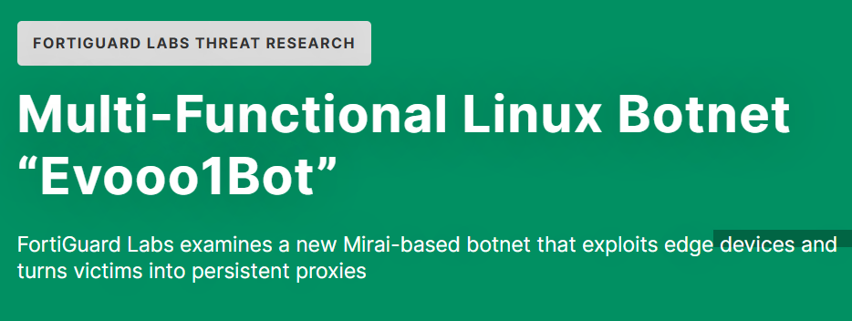
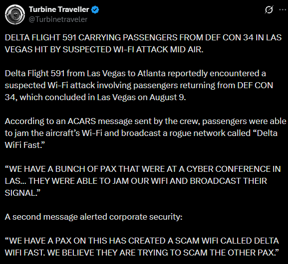
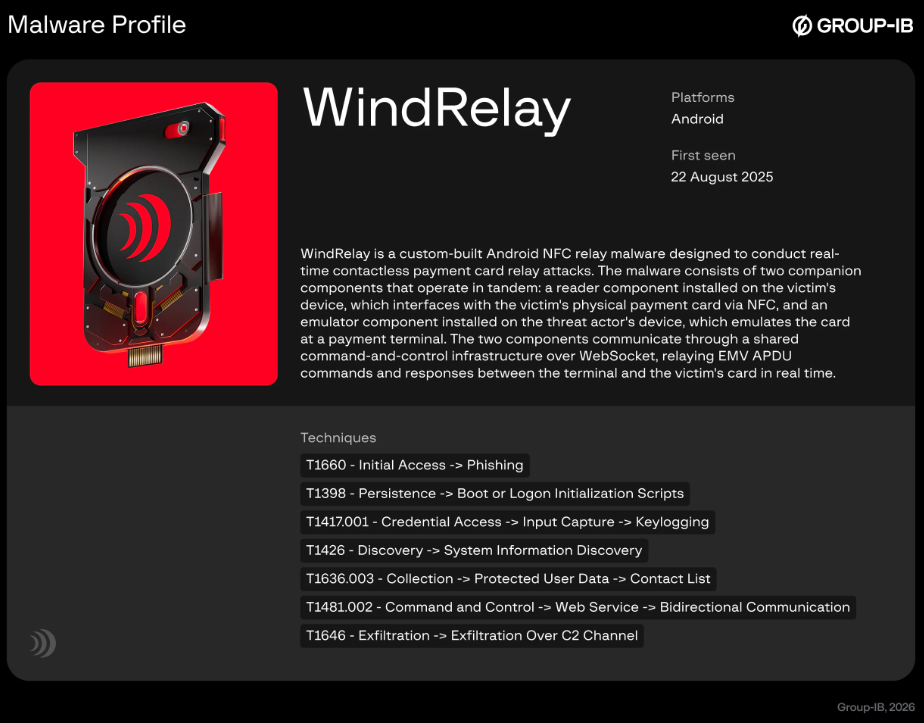

---
hide:
  - navigation
  - toc
---

# This Week's Security Incidents
 

-   {.index-card__img}

    **Evooo1Bot - Multi-Functional Mirai-Based Linux Botnet**

    **Mirai Variant**{.cve-chip} **Linux Botnet**{.cve-chip} **SOCKS5 Relay Abuse**{.cve-chip} **SSH Brute Force**{.cve-chip} **DDoS + Proxy Operations**{.cve-chip}

    Evooo1Bot extends Mirai-style operations with encrypted C2, multi-layer obfuscation, SSH propagation, credential sniffing, and SOCKS5 relay modes that can convert compromised edge devices into persistent traffic-proxy nodes.

    [Read more →](2026/Week33/Evooo1Bot.md){.index-card__cta}

-   {.index-card__img}

    **Rogue Wi-Fi Network on Delta Flight 591**

    **Rogue Access Point**{.cve-chip} **In-Flight Wi-Fi Spoofing**{.cve-chip} **Potential Phishing**{.cve-chip} **Deauthentication Suspicion**{.cve-chip} **Aviation Cybersecurity**{.cve-chip}

    An unauthorized SSID resembling Delta Wi-Fi was reportedly detected on Flight 591; while the full attack chain remains unconfirmed, the event raised phishing and credential-theft concerns and led to temporary onboard Wi-Fi shutdown.

    [Read more →](2026/Week33/Delta.md){.index-card__cta}

-   {.index-card__img}

    **WindRelay Android Malware**

    **Android Malware**{.cve-chip} **Vishing Fraud**{.cve-chip} **SpyNote RAT**{.cve-chip} **NFC Relay Attack**{.cve-chip} **Banking Abuse**{.cve-chip}

    Attackers used vishing to deploy SpyNote and a second-stage WindRelay payload, then relayed live NFC card communication to attacker devices for fraudulent POS transactions and unauthorized loan abuse.

    [Read more →](2026/Week33/WindRelay.md){.index-card__cta}

