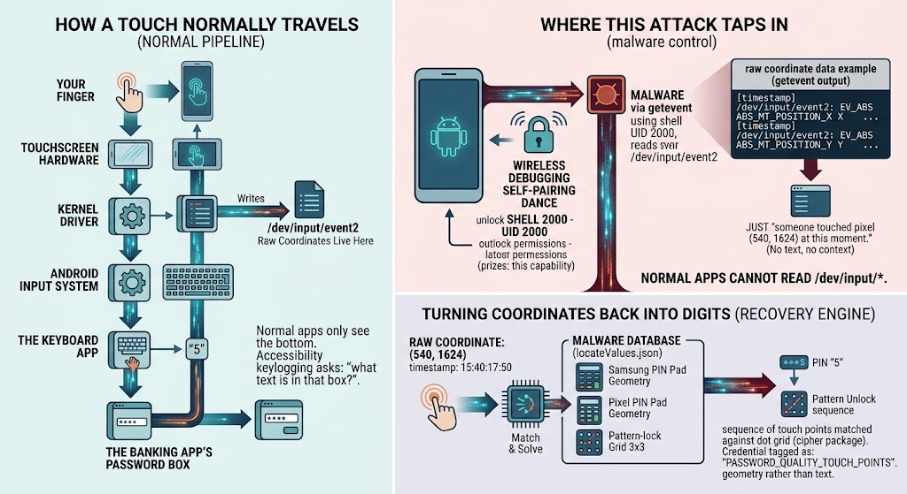

---
hide:
  - navigation
  - toc
---

# This Week's Security Incidents
 

-   {.index-card__img}

    **MikroTrick - MikroTik RouterOS SSH Exploitation Chain**

    **MikroTik RouterOS**{.cve-chip} **MikroTrick**{.cve-chip} **CVE-2026-67276**{.cve-chip} **CVE-2026-86060**{.cve-chip} **Admin Takeover**{.cve-chip}

    Attackers are exploiting a RouterOS SSH chain that can grant full administrative access on vulnerable internet-exposed MikroTik routers without valid credentials.

    [Read more →](2026/Week38/MikroTrick.md){.index-card__cta}

-   {.index-card__img}

    **Zyxel GS1900 CVE-2026-7273 & Veeam Agent for Windows CVE-2026-32996**

    **Zyxel GS1900**{.cve-chip} **CVE-2026-7273**{.cve-chip} **Veeam Agent**{.cve-chip} **CVE-2026-32996**{.cve-chip} **Active Exploitation**{.cve-chip}

    Active attacks combine unauthenticated LAN command execution on Zyxel GS1900 switches and local SYSTEM privilege escalation on vulnerable Veeam Agent for Windows deployments.

    [Read more →](2026/Week38/Zyxel.md){.index-card__cta}

-   {.index-card__img}

    **D-Link DIR-822A - Stack-Based Buffer Overflow (CVE-2026-86296)**

    **D-Link DIR-822A**{.cve-chip} **CVE-2026-86296**{.cve-chip} **Stack Overflow**{.cve-chip} **Unauthenticated**{.cve-chip} **PoC Available**{.cve-chip}

    A critical unauthenticated overflow in DIR-822A DHCP processing can be triggered with crafted traffic and may cause router crash or potential code execution.

    [Read more →](2026/Week38/DLink.md){.index-card__cta}

-   {.index-card__img}

    **ShinyHunters - FBIJobs.gov Data Breach**

    **ShinyHunters**{.cve-chip} **FBIJobs.gov**{.cve-chip} **PeopleSoft RCE Claim**{.cve-chip} **Personnel Data Risk**{.cve-chip} **Federal Portal Incident**{.cve-chip}

    ShinyHunters claimed a breach of FBIJobs.gov with sensitive personnel/applicant data exposure, while the FBI confirmed investigation of unauthorized activity and continued scope assessment.

    [Read more →](2026/Week38/ShinyHunters.md){.index-card__cta}

-   {.index-card__img}

    **Three Actively Exploited Linux Kernel Vulnerabilities Added to CISA KEV**

    **CISA KEV**{.cve-chip} **Linux Kernel**{.cve-chip} **Active Exploitation**{.cve-chip} **CVE-2025-39964**{.cve-chip} **CVE-2026-53266**{.cve-chip} **CVE-2025-39682**{.cve-chip}

    CISA placed three actively exploited Linux kernel flaws into KEV and required urgent remediation and forensic triage, while public attribution and attack-chain details remain undisclosed.

    [Read more →](2026/Week38/CISA.md){.index-card__cta}

-   {.index-card__img}

    **Foreign Cyber Intrusions Targeting Two Colorado Water Utilities**

    **Water Utilities**{.cve-chip} **OT/ICS**{.cve-chip} **Alarm Disablement**{.cve-chip} **Pumping-Cycle Changes**{.cve-chip} **Foreign Actors**{.cve-chip}

    Foreign actors reportedly changed OT settings at two small Colorado water utilities, including disabling alarms and remote access, though officials reported no impact to water quality or public safety.

    [Read more →](2026/Week38/Colorado.md){.index-card__cta}

-   {.index-card__img}

    **HEAVYGRAM: A Telegram-based Surveillance Backdoor Linked to Handala Hack**

    **HEAVYGRAM**{.cve-chip} **Handala Hack**{.cve-chip} **Telegram C2**{.cve-chip} **Windows Backdoor**{.cve-chip} **Surveillance Malware**{.cve-chip}

    Iran-linked activity reportedly uses the HEAVYGRAM Windows backdoor with Telegram-based C2 to execute commands, capture surveillance data, steal sensitive information, and persist on victim systems.

    [Read more →](2026/Week38/HEAVYGRAM.md){.index-card__cta}

-   {.index-card__img}

    **RatHat Android Trojan**

    **RatHat**{.cve-chip} **Android Trojan**{.cve-chip} **Accessibility Abuse**{.cve-chip} **ADB Self-Pairing**{.cve-chip} **AI-Assisted UI Automation**{.cve-chip}

    RatHat abuses Accessibility and Wireless Debugging to self-pair ADB, gain shell-level control, steal credentials/OTPs, and automate attack flows with AI-assisted UI navigation.

    [Read more →](2026/Week38/Android.md){.index-card__cta}

-   {.index-card__img}

    **Four Linux Kernel Local Privilege-Escalation Vulnerabilities**

    **Linux Kernel**{.cve-chip} **LPE**{.cve-chip} **DirtyAH6**{.cve-chip} **TUNderflow**{.cve-chip} **PPPoEject**{.cve-chip} **DiagSpill**{.cve-chip}

    Public exploit code was released for four Linux kernel memory-corruption flaws that can enable root escalation from low-privileged access under affected configurations.

    [Read more →](2026/Week38/Linux.md){.index-card__cta}

