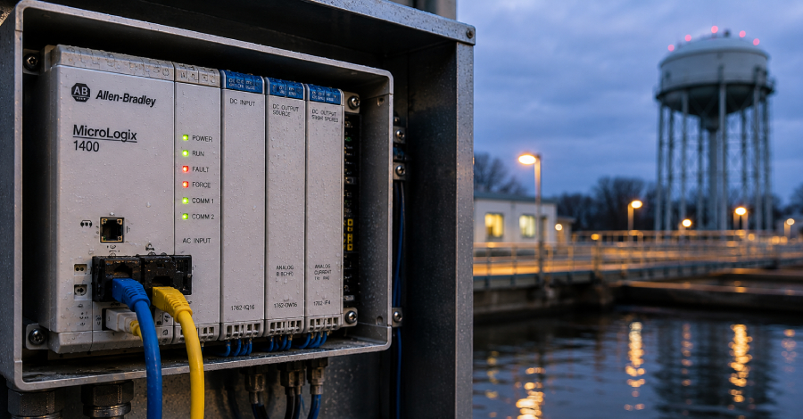

---
hide:
  - navigation
  - toc
---

# This Week's Security Incidents
 

-   {.index-card__img}

    **Internet-Exposed Rockwell Automation PLCs**

    **ICS Exposure**{.cve-chip} **Rockwell PLCs**{.cve-chip} **EtherNet/IP**{.cve-chip} **Water Sector Risk**{.cve-chip} **OT Attack Surface**{.cve-chip}

    Forescout identified 4,407 internet-exposed Rockwell PLCs, including 2,844 in the U.S., with notable concentration in cellular-connected deployments and overlap with municipalities linked to recent water-sector cyber incidents.

    [Read more →](2026/Week32/Rockwell.md){.index-card__cta}

-   {.index-card__img}

    **Cisco Catalyst SD-WAN & IOS XE Security Vulnerabilities - 12 CVEs**

    **Cisco SD-WAN**{.cve-chip} **Cisco IOS XE**{.cve-chip} **Multi-CVE Advisory**{.cve-chip} **Management-Plane Risk**{.cve-chip} **Network Infrastructure Security**{.cve-chip}

    Cisco patched 12 vulnerabilities in Catalyst SD-WAN and IOS XE, including multiple critical issues that could enable unauthorized access or command execution against reachable management and control-plane components.

    [Read more →](2026/Week32/Cisco.md){.index-card__cta}

-   {.index-card__img}

    **Linux SCTP Flaw Could Let Local Users Gain Root**

    **Kernel Privilege Escalation**{.cve-chip} **SCTP ASCONF**{.cve-chip} **Use-After-Free**{.cve-chip} **Container Escape Risk**{.cve-chip} **Local Exploitation**{.cve-chip}

    An 18-year-old Linux SCTP use-after-free flaw in ASCONF handling can allow local root privilege escalation and, in some containerized scenarios, escape to host compromise when SCTP paths are reachable.

    [Read more →](2026/Week32/SCTP.md){.index-card__cta}

