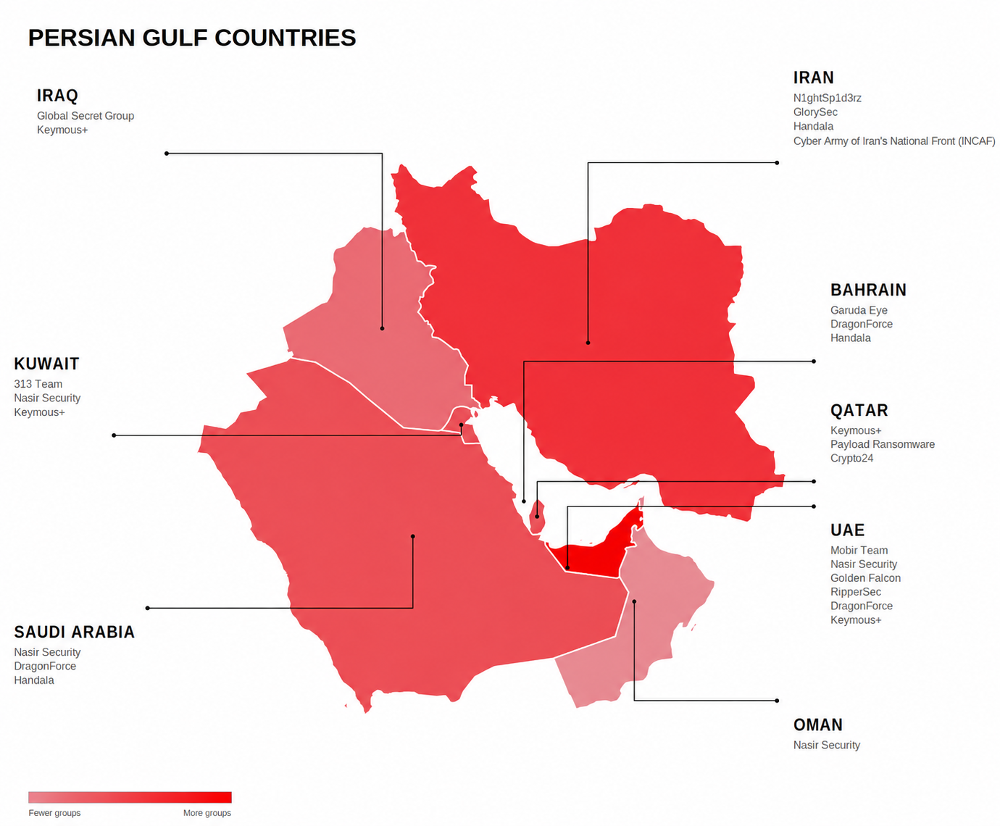

---
hide:
  - navigation
  - toc
---

# This Week's Security Incidents
 

-   {.index-card__img}

    **AI-Agent E-Commerce Skimming Campaign**

    **AI-Agent Campaign**{.cve-chip} **E-Commerce Skimming**{.cve-chip} **Magecart-style JS**{.cve-chip} **600K+ Cards**{.cve-chip} **100+ Sites**{.cve-chip}

    Threat actors reportedly used AI-agent frameworks to automate recon, exploitation, credential theft, and checkout skimmer deployment at scale across online retailers.

    [Read more →](2026/Week39/Skimming.md){.index-card__cta}

-   {.index-card__img}

    **ShinyHunters / UNC6240 - Oracle PeopleSoft WAF Bypass Campaign**

    **ShinyHunters**{.cve-chip} **UNC6240**{.cve-chip} **CVE-2026-35273**{.cve-chip} **PeopleSoft**{.cve-chip} **WAF Bypass**{.cve-chip}

    Attackers resumed mass exploitation of vulnerable PeopleSoft systems by URL-encoding the PSEMHUB path to bypass some WAF-only protections and deploy JSP web shells.

    [Read more →](2026/Week39/ShinyHunters.md){.index-card__cta}

-   {.index-card__img}

    **Lunex Stealer Abuses AMD Driver**

    **Lunex**{.cve-chip} **Psychedelic Stealer**{.cve-chip} **BYOVD**{.cve-chip} **CVE-2023-20598**{.cve-chip} **ClickFix**{.cve-chip}

    Campaigns use fake CAPTCHA/ClickFix delivery, UAC bypass, and vulnerable AMD driver loading to weaken security visibility before stealing browser credentials, cookies, and wallet data.

    [Read more →](2026/Week39/Lunex.md){.index-card__cta}

-   {.index-card__img}

    **Increasingly Complex Cyberattacks Targeting UAE and Saudi Arabia**

    **UAE**{.cve-chip} **Saudi Arabia**{.cve-chip} **RAT Activity**{.cve-chip} **Ransomware Pressure**{.cve-chip} **Critical Infrastructure Risk**{.cve-chip}

    H1 2026 reporting highlights a concentrated cyber-threat burden in the UAE and Saudi Arabia, with vulnerability exploitation, malware deployment, and social engineering driving complex regional incidents.

    [Read more →](2026/Week39/Cyberattacks.md){.index-card__cta}

-   {.index-card__img}

    **Times Car Data Breach**

    **Times Mobility**{.cve-chip} **Times Car**{.cve-chip} **6.6M Accounts**{.cve-chip} **Personal Data Exposure**{.cve-chip} **Web-System Breach**{.cve-chip}

    Times Mobility confirmed unauthorized access affecting information associated with roughly 6.6 million Times Car accounts, including member and application-related records.

    [Read more →](2026/Week39/Times.md){.index-card__cta}

-   {.index-card__img}

    **U.S.-China AI Incident Communication Channel**

    **U.S.-China Relations**{.cve-chip} **AI Governance**{.cve-chip} **Incident Channel**{.cve-chip} **Crisis De-escalation**{.cve-chip} **Policy Coordination**{.cve-chip}

    Washington summit outcomes established a bilateral government channel for AI-related incident communication and a broader AI dialogue framework.

    [Read more →](2026/Week39/Communication.md){.index-card__cta}

