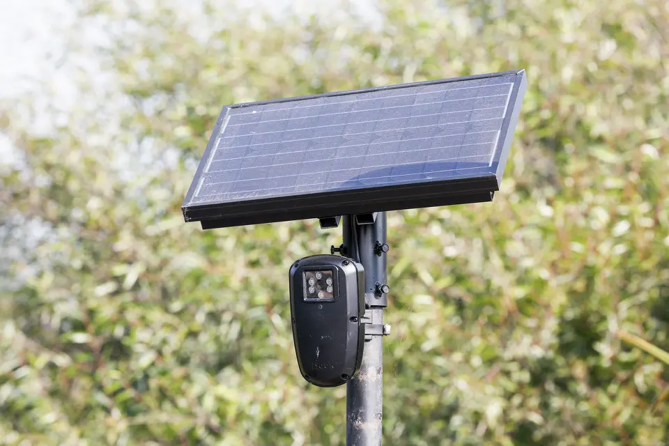
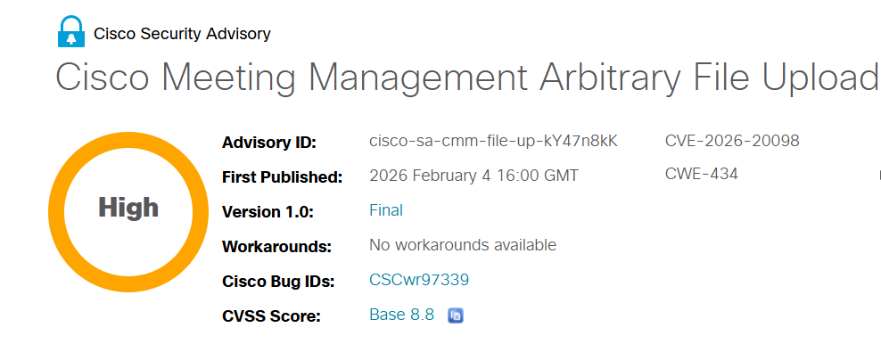

---
hide:
  - navigation
  - toc
---

# Today's Security Incidents

-   

    **Shutdown of Flock Safety ALPR System in Mountain View**

    **Misconfiguration**{.cve-chip} **Access Control Failure**{.cve-chip} **Privacy Breach**{.cve-chip} **Law Enforcement**{.cve-chip} **License Plate Data**{.cve-chip}

    Mountain View police shut down all Flock Safety ALPR cameras after discovering that hundreds of unauthorized law enforcement agencies could search the city's license-plate data. The incident stemmed from misconfiguration and overly permissive default settings that enabled statewide and nationwide lookups despite local policy restrictions.

    The system was configured to allow broad access across state and federal agencies without proper authorization controls. An internal police audit uncovered the vulnerability, leading to immediate suspension of all cameras pending a City Council review scheduled for February 24, 2026.

    [:octicons-arrow-right-24: Read more](2026/Week5/flock.md)

-   

    **CVE-2026-25049 – Critical Remote Code Execution in n8n Workflow Expressions**

    **CVE-2026-25049**{.cve-chip} **Remote Code Execution**{.cve-chip} **Workflow Automation**{.cve-chip} **Expression Injection**{.cve-chip} **Sandbox Escape**{.cve-chip}

    A critical vulnerability in n8n workflow automation platform allows authenticated users with workflow creation rights to execute arbitrary system commands on the host server. Insufficient sanitization of workflow expressions enables attackers to escape the sandbox and run malicious JavaScript that reaches the underlying operating system.

    When combined with public webhooks, the vulnerability can be triggered remotely. Attackers can steal API tokens, database credentials, and OAuth secrets, then pivot to connected systems including cloud services and internal APIs, compromising the entire automation infrastructure.

    [:octicons-arrow-right-24: Read more](2026/Week5/n8n.md)

-   

    **CVE-2026-25202 – MagicINFO 9 Server Hardcoded Database Credentials Vulnerability**

    **CVE-2026-25202**{.cve-chip} **Hardcoded Credentials**{.cve-chip} **Database Compromise**{.cve-chip} **Digital Signage**{.cve-chip} **Unauthenticated Access**{.cve-chip}

    A critical vulnerability in Samsung MagicINFO 9 Server embeds database credentials directly into the application code. Attackers with network access can discover these hardcoded credentials and log directly into the backend database, bypassing all application-level authentication controls.

    The flaw affects versions prior to 21.1090.1 and enables unauthorized access to sensitive signage content and configurations. Internet-exposed signage infrastructure face high risk of manipulation, data theft, and service disruption.

    [:octicons-arrow-right-24: Read more](2026/Week5/magicinfo.md)

-   

    **Cisco Meeting Management Arbitrary File Upload Vulnerability**

    **CVE-2026-20098**{.cve-chip} **Arbitrary File Upload**{.cve-chip} **Remote Code Execution**{.cve-chip} **Privilege Escalation**{.cve-chip} **Authenticated**{.cve-chip}

    A critical vulnerability in Cisco Meeting Management allows authenticated users with video operator privileges to upload arbitrary files that can overwrite critical server files. The unrestricted file upload functionality bypasses type validation, enabling attackers to inject malicious scripts and achieve remote code execution.

    Attackers can leverage this vulnerability to escalate privileges to root, fully compromise the Meeting Management server, and gain unauthorized access to sensitive organizational data, meeting recordings, and certificates.

    [:octicons-arrow-right-24: Read more](2026/Week5/cisco.md)

