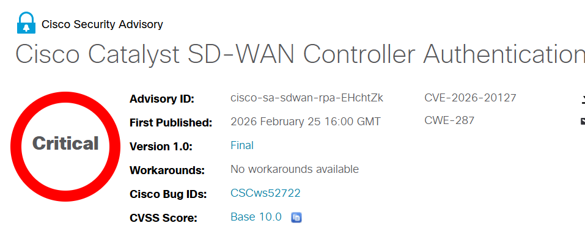

---
hide:
  - navigation
  - toc
---

# Today's Security Incidents

-   
    
    **Cisco SD-WAN Zero-Day CVE-2026-20127 Exploited Since 2023 for Admin Access**

    **CVE-2026-20127**{.cve-chip} **Authentication Bypass**{.cve-chip} **CVSS 10.0**{.cve-chip} **UAT-8616**{.cve-chip}

    Cisco disclosed a critical zero-day authentication bypass in Catalyst SD-WAN Controller (vSmart) and Manager (vManage) that has reportedly been exploited since at least 2023. Successful exploitation allows a remote attacker to gain high-privileged access to SD-WAN control-plane functions and management APIs.

    Reporting indicates observed campaigns used rogue peer insertion and downgrade/upgrade chains to escalate to root and maintain persistence, creating risk of traffic interception, policy tampering, and broad enterprise WAN disruption.

    [:octicons-arrow-right-24: Read more](2026/Week8/sdwan.md)

-   

    **Zyxel Warns of Critical RCE Flaw Affecting Over a Dozen Routers**

    **CVE-2025-13942**{.cve-chip} **Remote Code Execution**{.cve-chip} **UPnP SOAP Injection**{.cve-chip} **CVSS 9.8**{.cve-chip}

    Zyxel patched a critical unauthenticated command-injection flaw in UPnP that can allow remote OS command execution when devices are misconfigured with both WAN access and UPnP enabled. The issue affects multiple router/CPE product families and presents significant edge-network risk for exposed deployments.

    The same advisory also fixed two post-auth command-injection bugs (CVE-2025-13943 and CVE-2026-1459) tied to log-download and TR-369 certificate functions, increasing impact when administrative credentials are compromised.

    [:octicons-arrow-right-24: Read more](2026/Week8/zyxel.md)

