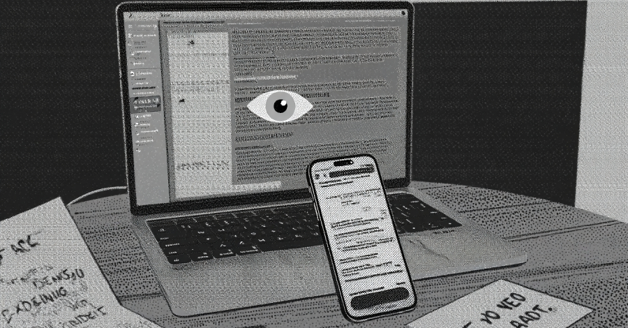
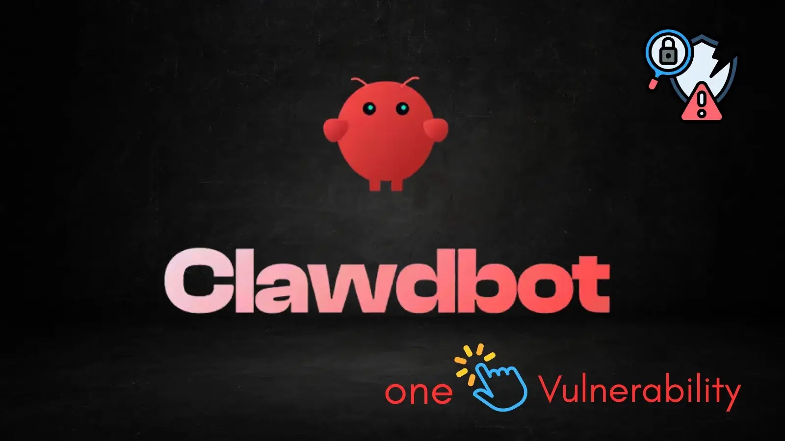

---
hide:
  - navigation
  - toc
---

# Today's Security Incidents

-   

    **RedKitten — Iran-Linked Cyber-Espionage Campaign**

    **Cyber-Espionage**{.cve-chip} **Macro Malware**{.cve-chip} **SloppyMIO Backdoor**{.cve-chip} **Telegram C2**{.cve-chip} **Spear-Phishing**{.cve-chip}

    RedKitten uses weaponized Excel spreadsheets with malicious macros to install the SloppyMIO backdoor. The files are crafted as sensitive data about protesters or missing persons, pressuring victims to enable macros and triggering infection via AppDomainManager injection.
    
    The malware retrieves configuration hidden in images from GitHub and Google Drive, then uses the Telegram Bot API for C2. Operators can run commands, exfiltrate files, establish persistence, and target civil society organizations.

    [:octicons-arrow-right-24: Read more](2026/Week5/redkitten.md)

-   

    **eScan Antivirus Update Server Compromise**

    **Supply Chain Compromise**{.cve-chip} **Malicious Update**{.cve-chip} **Persistence**{.cve-chip} **AMSI Bypass**{.cve-chip} **PowerShell**{.cve-chip}

    Attackers gained access to a regional eScan update server and inserted a trojanized update into the official distribution path. The malicious update replaced a legitimate component (Reload.exe) and executed Base64-encoded PowerShell payloads to disable future updates and establish persistence.
    
    A downloader contacted attacker infrastructure for additional payloads, while HOSTS and registry modifications interfered with normal update mechanisms. Affected systems required manual remediation after the Jan 20, 2026 update window.

    [:octicons-arrow-right-24: Read more](2026/Week5/escan.md)

-   

    **Clawdbot (OpenClaw) 1-Click Remote Code Execution Vulnerability**

    **CVE-2026-25253**{.cve-chip} **Remote Code Execution**{.cve-chip} **1-Click Exploit**{.cve-chip} **Token Hijacking**{.cve-chip} **WebSocket**{.cve-chip}

    A critical vulnerability in Clawdbot AI assistant allows attackers to achieve remote code execution with a single user click. By crafting a malicious URL with a rogue gatewayUrl parameter, attackers can hijack authentication tokens through insecure WebSocket handling when a logged-in user clicks the link.
    
    The stolen token grants full administrative access to the Clawdbot instance, enabling arbitrary command execution on the host system. The flaw affects systems believed to be "localhost-only" due to weak origin checks and implicit trust of local connections.

    [:octicons-arrow-right-24: Read more](2026/Week5/clawdbot.md)

