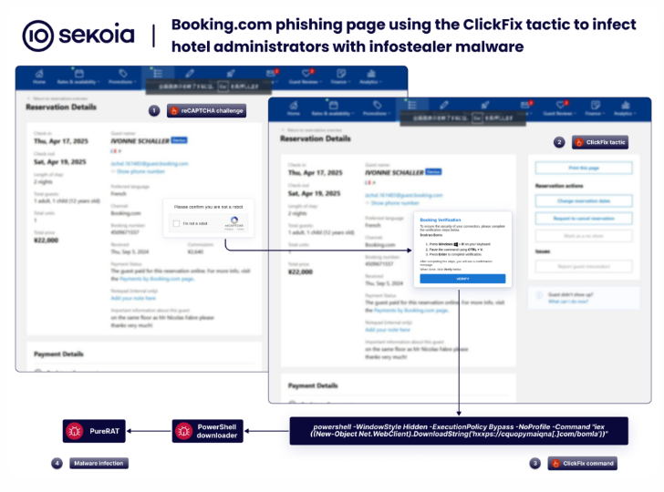

---
hide:
  - navigation
  - toc
---

# Today's Security Incidents

-   
    __ClickFix Hospitality Phishing Campaign (a.k.a. “I Paid Twice” campaign)__

    **Hospitality Phishing / Booking Impersonation**{.cve-chip}
    **Infostealer / RAT Delivery**{.cve-chip}
    ---
    The ClickFix campaign targets hotels with spear‑phishing emails impersonating Booking.com. Staff who follow the lure run a clipboard/PowerShell payload that installs infostealers and RATs, leading to credential theft, booking compromise, and secondary phishing against guests.
    [:octicons-arrow-right-24: View Full Details](Week46/clickfix.md)

-   
    :material-airplane-alert:{ .lg .middle } __Delhi Airport GPS Spoofing Crisis__

    **GPS Spoofing**{.cve-chip}
    **Critical Aviation Disruption**{.cve-chip}
    ---
    Severe GPS spoofing at Delhi airport caused fake signals, misleading aircraft navigation and leading to positional confusion, diverted flights, delays, and manual air traffic control. Safety risk extended to over 400 flights in one week. Urgent mitigation included ILS upgrades, regulatory action, and GNSS redundancy.
    [:octicons-arrow-right-24: View Full Details](Week46/delhi.md)

