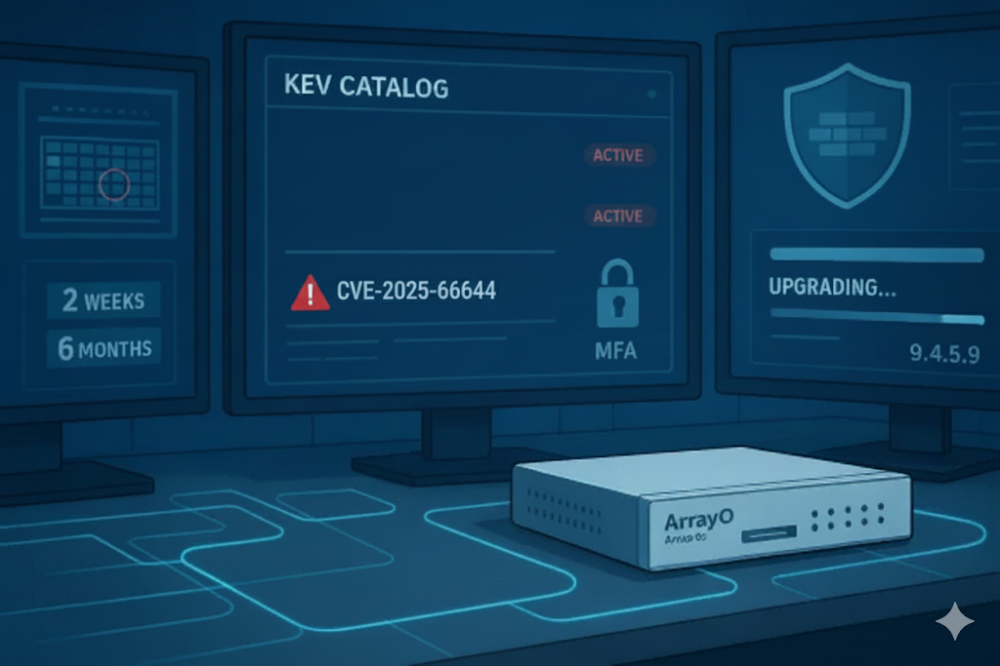

---
hide:
  - navigation
  - toc
---

# Today's Security Incidents

-   
    :material-android:{ .lg .middle } **Android Malware Surge: FvncBot, SeedSnatcher, and Upgraded ClayRat**

    **Banking Trojan**{.cve-chip}  
    **Cryptocurrency Stealer**{.cve-chip}  
    ---------------------------------

    Three major Android malware strains circulating globally. **FvncBot** poses as Polish mBank app, abuses Accessibility Services for hidden VNC remote control and automated banking fraud. **SeedSnatcher** distributed via Telegram steals crypto seed phrases and intercepts SMS/OTP. **Upgraded ClayRat** spyware with keylogging, screen recording, overlay attacks, and PIN bypass. Full device compromise enabling financial theft, account takeover, and remote control. **Avoid sideloading APKs** and never grant Accessibility Services to untrusted apps.

    [:octicons-arrow-right-24: View Full Details](Week50/andSurge.md)

-   
    :material-vpn:{ .lg .middle } **ArrayOS AG VPN (CVE-2025-66644)**

    **Command Injection**{.cve-chip}  
    **VPN Gateway Compromise**{.cve-chip}  
    ---------------------------------

    Command-injection flaw in ArrayOS AG (versions before 9.4.5.9) affecting **DesktopDirect** remote-access feature. Remotely authenticated attackers inject OS commands leading to arbitrary code execution on the gateway. Attackers drop **webshells** under `/ca/aproxy/webapp/` and create unauthorized user accounts for persistent access. **Active exploitation confirmed** - Added to CISA KEV. Full gateway compromise exposes internal networks. **Patch immediately to 9.4.5.9** and conduct forensic inspection for webshells and rogue accounts.

    [:octicons-arrow-right-24: View Full Details](Week50/arrayos.md)

