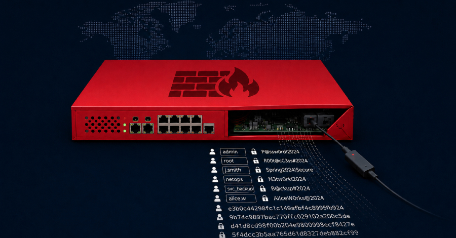

---
hide:
  - navigation
  - toc
---

# Today's Security Incidents

-   

    **Samsung KNOX Kernel UAF Exposes Millions of Galaxy Devices**

    **Kernel UAF**{.cve-chip} **Android Privilege Escalation**{.cve-chip} **Mobile Security**{.cve-chip} **KNOX Stack**{.cve-chip}

    CVE-2026-20971 is a use-after-free race condition in Samsung’s KNOX PROCA/FIVE subsystems that allows an untrusted app to corrupt kernel memory, potentially enabling full device takeover on Galaxy S9–S25 and A-series devices despite KNOX protections.The flaw remained in production for roughly eight years before being patched in the January 2026 Android Security Maintenance Release, leaving hundreds of millions of devices globally exposed until they receive firmware with security patch level 2026-01-01 or later.

    [Read more](2026/Week25/Samsung.md)

-   

    **FortiBleed Campaign Turns FortiGate Firewalls into Credential Stealers**

    **Credential Harvesting**{.cve-chip} **Initial Access**{.cve-chip} **Edge Device Compromise**{.cve-chip} **Password Cracking**{.cve-chip} **VPN Abuse**{.cve-chip}

    FortiBleed is a Russian-speaking initial-access broker campaign that brute-forces and compromises Fortinet FortiGate firewalls, deploying a Golang sniffer to harvest over 110 million credentials from more than 430,000 targets and converting edge firewalls into large-scale credential sensors.Harvested admin and VPN credentials for roughly 73,000–87,000 FortiGate devices across 194 countries are cracked on a 45‑GPU cluster and reused for VPN, AD/LDAP, RDWeb, Citrix, and database access, enabling deep lateral movement and data theft in government, telecom, finance, healthcare, and other critical sectors.

    [Read more](2026/Week25/Fortibleed.md)

