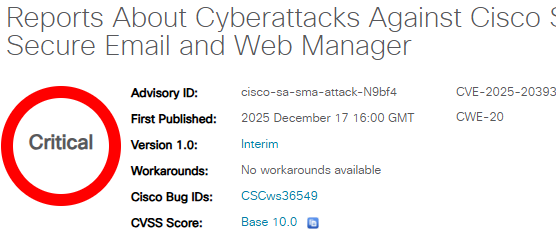

---
hide:
  - navigation
  - toc
---

# Today's Security Incidents

-   
    :material-email-alert:{ .lg .middle } **CVE-2025-20393 Cisco AsyncOS Zero-Day Actively Exploited**

    **Zero-Day**{.cve-chip}  
    **Remote Code Execution**{.cve-chip}  
    **No Patch Available**{.cve-chip}  
    ---------------------------------

    Critical **zero-day** in Cisco AsyncOS email security appliances enables **unauthenticated remote attackers** to execute arbitrary commands with **root privileges**. **Actively exploited** by China-linked APT group **UAT-9686** deploying sophisticated toolset: **AquaShell** backdoor, **AquaTunnel** reverse SSH, **Chisel** tunneling, and **AquaPurge** log cleaner. Affects Cisco Secure Email Gateway and Email/Web Manager when **Spam Quarantine exposed to Internet**. **No patch available yet**. **Disable Spam Quarantine**, restrict Internet access, and rebuild compromised devices. Improper input validation (CWE-20).

    [:octicons-arrow-right-24: View Full Details](Week51/AsyncOS.md)

-   
    :material-package-variant-closed-remove:{ .lg .middle } **CVE-2025-59374 ASUS Live Update Supply Chain Compromise**

    **Supply Chain Compromise**{.cve-chip}  
    **Embedded Malicious Code**{.cve-chip}  
    **Actively Exploited**{.cve-chip}  
    ---------------------------------

    Sophisticated **supply chain attack** embedded malicious code in ASUS Live Update installers. Trojanized software contains **hard-coded targeting criteria** (MAC addresses, device IDs) executing malicious payloads only on specific systems. **Actively exploited** per CISA. ASUS Live Update reached **end-of-support** - no future fixes expected. Enables arbitrary code execution, data exfiltration, and lateral movement. **Remove ASUS Live Update entirely** (recommended) or update to v3.6.8+. Use Windows Update instead. APT-level selective targeting suggests espionage objectives. CWE-506.

    [:octicons-arrow-right-24: View Full Details](Week51/asus.md)

-   
    :material-vpn:{ .lg .middle } **CVE-2025-40602/23006 SonicWall SMA1000 Exploit Chain**

    **Zero-Day**{.cve-chip}  
    **Exploit Chain**{.cve-chip}  
    **Actively Exploited**{.cve-chip}  
    ---------------------------------

    **Actively exploited** exploit chain targeting SonicWall SMA1000 remote access gateways. Attackers chain **CVE-2025-23006** (deserialization RCE) with **CVE-2025-40602** (zero-day privilege escalation) achieving **unauthenticated root access**. Missing authorization checks in Appliance Management Console enable escalation. Compromises critical **VPN gateways** enabling credential harvesting, backdoor installation, and **lateral movement** into corporate networks. **Patch immediately** to firmware 12.4.3-03245+, 12.5.0-02283+. Restrict management interfaces, disable public AMC access, and monitor for compromise. Trust boundary breach.

    [:octicons-arrow-right-24: View Full Details](Week51/sonicWall.md)

