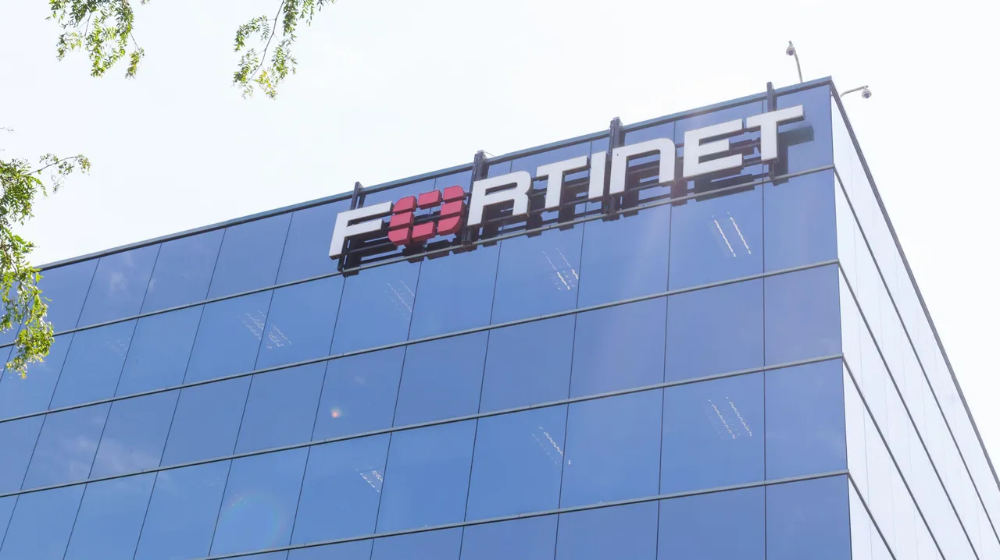
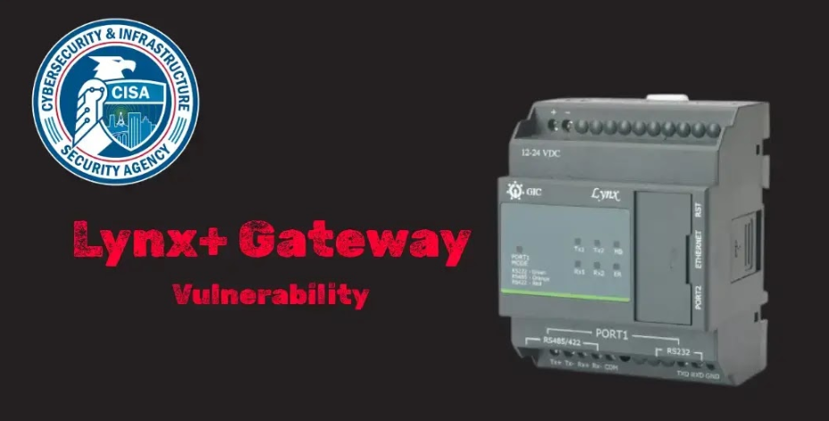

---
hide:
  - navigation
  - toc
---

# Today's Security Incidents

-   
    :material-security:{ .lg .middle } **Critical FortiWeb Exploitation (CVE-2025-58034)**

    **OS Command Injection**{.cve-chip}  
    **CVSS 7.2 High**{.cve-chip}  
    ---------------------------------

    Fortinet’s FortiWeb Web Application Firewall (WAF) is vulnerable to an authenticated OS command injection flaw (**CVE-2025-58034**). Attackers can execute arbitrary OS commands via crafted HTTP requests or CLI commands, enabling full compromise of the device. Affected versions (8.0.0–8.0.1, 7.6.0–7.6.5, 7.4.0–7.4.10, 7.2.0–7.2.11, 7.0.0–7.0.11) are widely deployed, posing significant risks to enterprise environments.

    [:octicons-arrow-right-24: View Full Details](Week47/fortiwebzero.md)

-   
    :material-lock-alert:{ .lg .middle } **Critical Lynx+ Gateway Vulnerabilities (CVE-2025-55034, CVE-2025-58083, CVE-2025-59780, CVE-2025-62765)**

    **Unauthorized Access & Info Disclosure**{.cve-chip}  
    **CVSS 9.2 Critical**{.cve-chip}  
    ---------------------------------

    Multiple flaws in General Industrial Controls Lynx+ Gateway allow a remote, unauthenticated attacker to brute‑force weak passwords, reset devices without authentication, retrieve sensitive configuration data, and capture plaintext credentials over the network. Affected versions (R08, V03, V05, V18) are widely deployed in OT environments, making coordinated attacks and lateral movement into industrial networks a serious risk.

    [:octicons-arrow-right-24: View Full Details](Week47/lynx.md)

