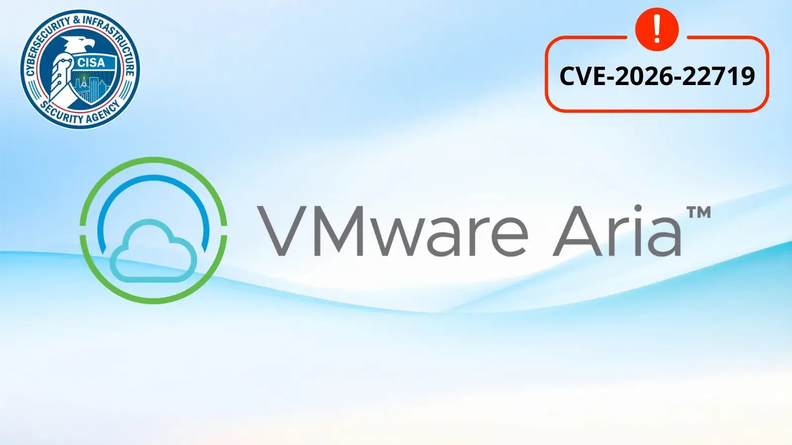
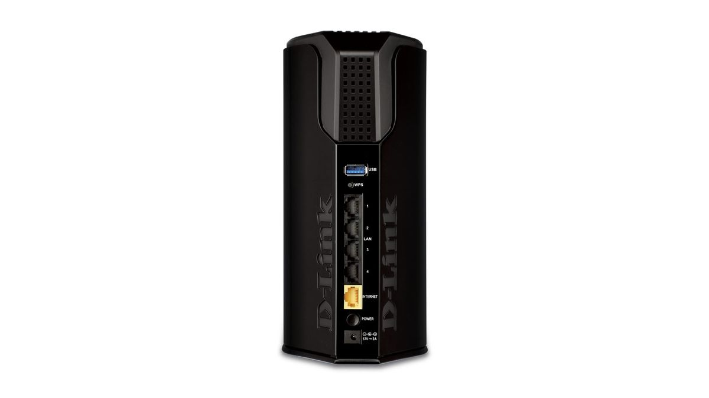

---
hide:
  - navigation
  - toc
---

# Today's Security Incidents

-   

    **CISA Flags VMware Aria Operations RCE Flaw as Exploited in Attacks**

    **CVE-2026-22719**{.cve-chip} **Command Injection**{.cve-chip} **KEV Listed**{.cve-chip} **Aria Operations**{.cve-chip}

    CISA added CVE-2026-22719 in VMware Aria Operations to the KEV catalog after confirmed real-world exploitation. The high-severity command injection bug affects migration-related logic and can enable remote code execution in reachable management environments.

    Attackers can use this foothold to tamper with monitoring infrastructure, establish persistence, and potentially pivot deeper into vSphere and hybrid-cloud estates, especially when chained with related XSS and privilege-escalation weaknesses.

    [:octicons-arrow-right-24: Read more](2026/Week9/vmware.md)

-   

    **CVE-2026-3485 — OS Command Injection in SSDP Service of D-Link DIR-868L 110b03**

    **CVE-2026-3485**{.cve-chip} **OS Command Injection**{.cve-chip} **SSDP/UPnP**{.cve-chip} **Unauthenticated RCE**{.cve-chip}

    A command injection vulnerability in the SSDP service of D-Link DIR-868L firmware 110b03 allows attackers to abuse the `ST` parameter and execute arbitrary shell commands without authentication. The flaw is reachable anywhere the vulnerable SSDP service is exposed, including local segments and misconfigured internet-facing paths.

    Successful exploitation can result in full router takeover, traffic interception/manipulation, malware persistence, and botnet enrollment, with elevated long-term risk because the affected platform may no longer receive vendor security fixes.

    [:octicons-arrow-right-24: Read more](2026/Week9/dlink.md)

