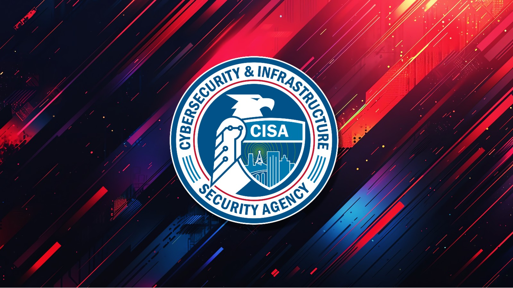

---
hide:
  - navigation
  - toc
---

# Today's Security Incidents

-   

    **China-Linked JDY Botnet Expands to 1,500+ Devices for Cyber Reconnaissance**

    **China-Nexus APT**{.cve-chip} **IoT Botnet**{.cve-chip} **Reconnaissance**{.cve-chip} **Volt Typhoon**{.cve-chip} **Critical Infrastructure**{.cve-chip}

    A China-linked botnet of 1,500+ compromised SOHO routers and IoT devices scans the internet to map exposed services and feed targeting data to Volt Typhoon and other Chinese state actors. Rebuilt after the 2024 KV-botnet takedown, JDY focuses heavily on U.S. military and critical infrastructure networks.

    [Read more](2026/Week23/JDY.md)

-   

    **Check Point VPN Authentication Bypass Vulnerability – CVE-2026-50751**

    **CVE-2026-50751**{.cve-chip} **CVE-2026-50752**{.cve-chip} **Authentication Bypass**{.cve-chip} **Active Exploitation**{.cve-chip} **Ransomware**{.cve-chip}

    A critical authentication bypass in Check Point Remote Access VPN is actively exploited by Qilin ransomware affiliates, allowing unauthorized VPN sessions without valid credentials. CISA issued a 3-day emergency patch directive for U.S. federal agencies. Targets IKEv1-enabled configurations.

    [Read more](2026/Week23/CheckPoint.md)

