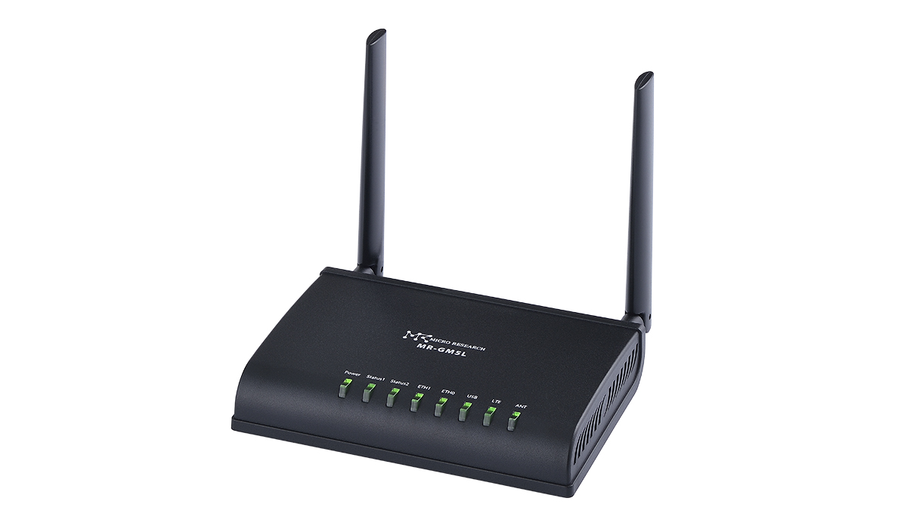

---
hide:
  - navigation
  - toc
---

# Today's Security Incidents

-   

    **BeatBanker Android Malware Campaign (Fake Starlink App)**

    **BeatBanker**{.cve-chip} **Android Banking Trojan**{.cve-chip} **Fake App Distribution**{.cve-chip} **Crypto Miner**{.cve-chip}

    Researchers identified a malicious Android campaign distributing BeatBanker through fake Play Store-style websites and Starlink-themed APK lures. The malware abuses high-risk permissions and downloads modular payloads for credential theft, remote access, and crypto-mining.

    Reported behavior includes overlay attacks on banking/crypto apps, C2-driven module loading, and stealth persistence using near-inaudible looping audio to keep a foreground service active on infected devices.

    [:octicons-arrow-right-24: Read more](2026/Week10/beatbanker.md)

-   

    **KadNap Botnet targeting ASUS Routers**

    **KadNap Botnet**{.cve-chip} **ASUS Routers**{.cve-chip} **Proxy Abuse**{.cve-chip} **P2P C2**{.cve-chip}

    Researchers identified KadNap malware compromising ASUS routers and edge devices, enrolling them into a botnet used as anonymizing proxy infrastructure for cybercrime activity. The campaign uses script-based installation and recurring cron execution to maintain persistence on infected systems.

    By leveraging modified Kademlia-style P2P coordination, attackers reduce centralized command dependency and make takedown more difficult while routing malicious traffic through compromised residential and SMB network gateways.

    [:octicons-arrow-right-24: Read more](2026/Week10/asus.md)

-   

    **CVE-2026-24448 – Hard-coded Credentials in Industrial Network Devices**

    **CVE-2026-24448**{.cve-chip} **Hard-coded Credentials**{.cve-chip} **CWE-798**{.cve-chip} **OT Network Risk**{.cve-chip}

    A critical vulnerability in MR-GM5L-S1 and MR-GM5A-L1 industrial networking devices allows attackers to use embedded firmware credentials to authenticate without prior privileges and gain administrative access to management interfaces.

    Successful exploitation can expose sensitive operational configuration, enable unauthorized device changes, and increase risk of lateral movement and disruption within segmented or weakly protected OT environments.

    [:octicons-arrow-right-24: Read more](2026/Week10/MR_GM.md)

-   

    **Middle East Cloud Infrastructure Attack / AWS Data Center Drone Strikes**

    **Cloud Infrastructure Risk**{.cve-chip} **Physical Disruption**{.cve-chip} **Regional Outage**{.cve-chip} **Geopolitical Escalation**{.cve-chip}

    Reported drone-strike impacts on Gulf-region cloud facilities highlighted how physical conflict can disrupt digital infrastructure through building damage, utility instability, and regional connectivity stress, even when servers are not directly destroyed.

    The incident underscores resilience gaps for organizations concentrated in a single cloud region and reinforces the need for multi-region failover, independent backups, and tested business continuity plans for multi-domain disruptions.

    [:octicons-arrow-right-24: Read more](2026/Week10/cloud.md)

