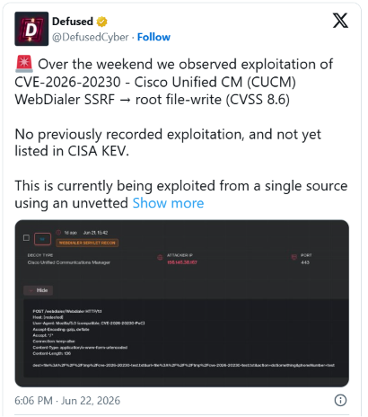
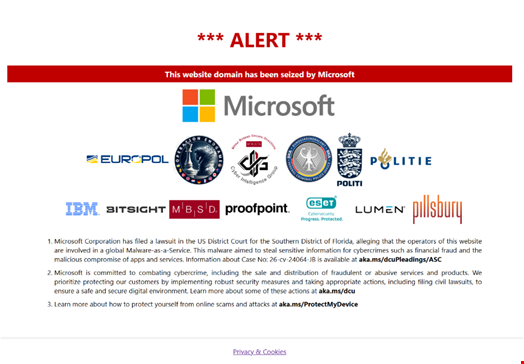
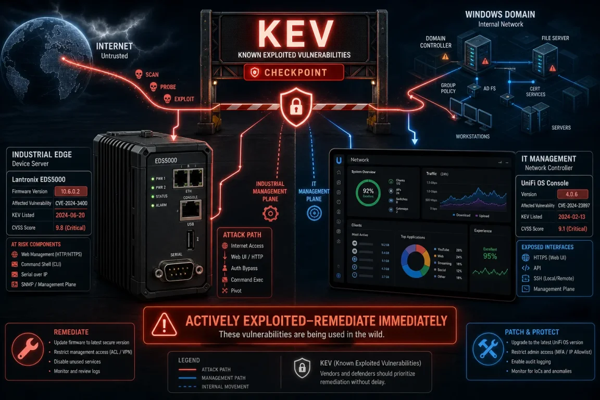

---
hide:
  - navigation
  - toc
---

# Today's Security Incidents

-   

    **Cisco Catalyst SD-WAN Zero-Day Exploitation**

    **Authentication Bypass**{.cve-chip} **Privilege Escalation**{.cve-chip} **Network Infrastructure**{.cve-chip} **Persistence**{.cve-chip}

    Multiple Cisco Catalyst SD-WAN zero-days, including CVE-2026-20127 and related flaws, were exploited against vManage and vSmart systems to gain privileged access, manipulate NETCONF configuration, and ultimately establish root-level persistence in enterprise SD-WAN environments.Cisco-linked reporting indicates the activity may have dated back to 2023, making exposed controllers a high-value foothold for policy manipulation, traffic monitoring, and pivoting across distributed branch networks.

    [Read more](2026/Week25/SD-WAN.md)

-   

    **Cisco Unified CM SSRF Vulnerability Enables Root Compromise**

    **SSRF**{.cve-chip} **VoIP Infrastructure**{.cve-chip} **Root Escalation**{.cve-chip} **WebDialer**{.cve-chip}

    CVE-2026-20230 is a critical server-side request forgery flaw in Cisco Unified CM and Unified CM SME that lets unauthenticated attackers send crafted HTTP requests through the WebDialer component and write files to the underlying operating system.Because those files can be used to escalate privileges to root, exposed systems with WebDialer enabled face a direct path to full compromise, persistence, call-system abuse, and lateral movement unless upgraded to fixed releases or otherwise mitigated

    [Read more](2026/Week25/SSRF.md)

-   

    **Operation Endgame Disrupts Amadey and StealC Malware Infrastructure**

    **Malware Loader**{.cve-chip} **Infostealer**{.cve-chip} **Credential Theft**{.cve-chip} **C2 Disruption**{.cve-chip}

    International law enforcement and private-sector partners disrupted infrastructure tied to the Amadey loader and StealC infostealer as part of Operation Endgame, targeting the backend services used to infect victims, steal credentials, and support follow-on ransomware and fraud operations.The action disrupted 326 servers and 142 domains, recovered about 27 million stolen credentials from more than 385,000 compromised systems, and identified over $47 million in linked criminal cryptocurrency assets.

    [Read more](2026/Week25/Amadey.md)

-   

    **Lantronix EDS5000 Critical Vulnerability Under Active Exploitation**

    **Command Injection**{.cve-chip} **OT Edge Device**{.cve-chip} **Remote Root Access**{.cve-chip} **Network Infrastructure**{.cve-chip}

    CVE-2025-67038 is a critical OS command injection flaw in Lantronix EDS5000 serial device servers that allows remote attackers to inject commands through the username field in the HTTP RPC module, with execution occurring as root.CISA has warned that the vulnerability is being actively exploited in the wild, making exposed EDS5000 devices a high-risk entry point for full device compromise, OT pivoting, and lateral movement into internal networks.

    [Read more](2026/Week25/Lantronix.md)

