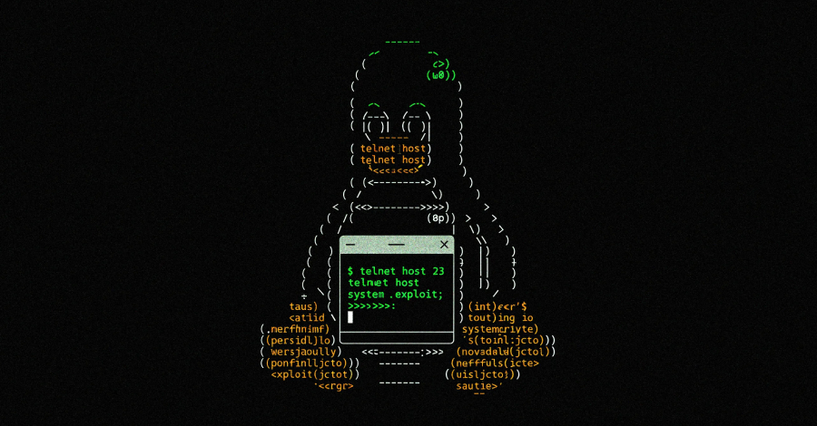

---
hide:
  - navigation
  - toc
---

# Today's Security Incidents

-   

    **CVE-2026-32746 - Critical Telnetd Buffer Overflow Vulnerability**

    **GNU Inetutils**{.cve-chip} **Buffer Overflow**{.cve-chip} **Remote Code Execution**{.cve-chip}

    A critical flaw in GNU Inetutils `telnetd` can be triggered with crafted LINEMODE SLC packets, potentially causing out-of-bounds writes and remote code execution.

    Because exploitation can occur before authentication on exposed port 23 services, unpatched Telnet deployments face elevated compromise risk.

    [Read more](2026/Week11/telnetd.md)

-   

    **EU Sanctions on Chinese and Iranian Cyber Actors Targeting Critical Infrastructure**

    **Geopolitical Cybersecurity**{.cve-chip} **Critical Infrastructure**{.cve-chip} **State-Linked Activity**{.cve-chip}

    The European Union sanctioned Chinese and Iranian entities and individuals over coordinated cyber operations targeting member-state infrastructure.

    Public reporting links the campaigns to large-scale device compromise, telecom and data intrusion, and disinformation activity across multiple EU countries.

    [Read more](2026/Week11/sanctions.md)

