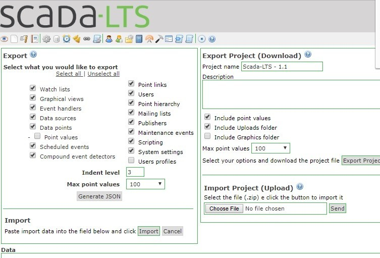

---
hide:
  - navigation
  - toc
---

# Today's Security Incidents

-   
    :material-bug:{ .lg .middle } **OpenPLC ScadaBR CVE-2021-26829 Active Exploitation**

    **Stored XSS**{.cve-chip}  
    **SCADA/HMI Compromise**{.cve-chip}  
    ---------------------------------

    Stored XSS vulnerability in OpenPLC ScadaBR's `system_settings.shtm` page (versions up to 1.12.4 on Windows, 0.9.1 on Linux). Actively exploited by TwoNet against honeypots mimicking water-treatment facilities. Attackers inject malicious JavaScript to manipulate HMI interfaces, disable logs/alarms, steal credentials, and create backdoor accounts—all at the web-application layer without host-level access.

    [:octicons-arrow-right-24: View Full Details](Week49/openplc.md)

-   
    :material-folder-alert:{ .lg .middle } **Scada-LTS Project Import Path Traversal (CVE-2025-13791)**

    **Path Traversal**{.cve-chip}  
    **Remote Exploitation**{.cve-chip}  
    ---------------------------------

    Path traversal vulnerability in Scada-LTS (up to 2.7.8.1) Project Import component. Malicious ZIP or crafted import requests can traverse outside intended directories, allowing remote attackers to read/write sensitive configuration files, credentials, and logs. Public exploit code available. Vendor reportedly unresponsive to disclosure.

    [:octicons-arrow-right-24: View Full Details](Week49/scadalts.md)

-   
    :material-file-document-alert:{ .lg .middle } **Mercedes-Benz USA Breach Claim by Threat Actor 'zestix'**

    **Data Breach Claim**{.cve-chip}  
    **Legal & Customer Data**{.cve-chip}  
    ---------------------------------

    Threat actor 'zestix' claims to have exfiltrated **18.3 GB of data** from Mercedes-Benz USA, including internal legal documents (litigation files across 48 U.S. states), customer PII, vendor forms, defensive strategies, billing rates, and warranty claim documents. The data is reportedly being sold on a dark-web forum for USD 5,000. **Breach claim remains unconfirmed** by MBUSA.

    [:octicons-arrow-right-24: View Full Details](Week49/benz.md)

