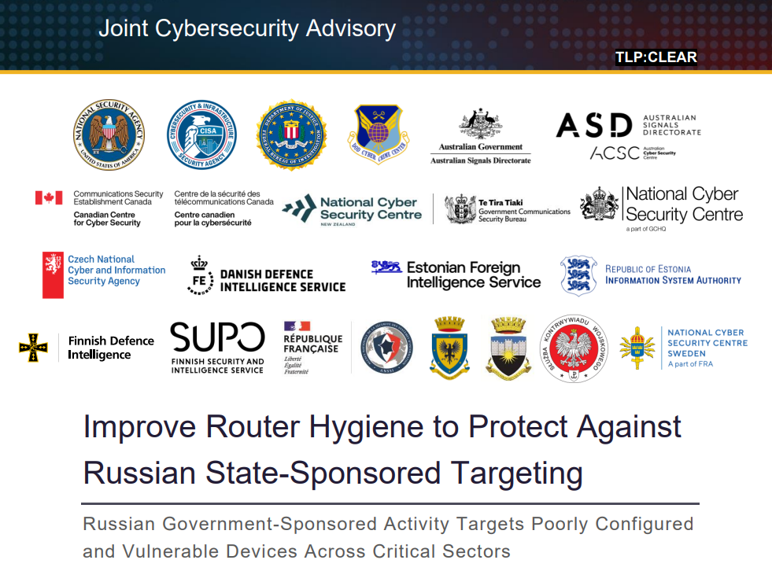

---
hide:
  - navigation
  - toc
---

# Today's Security Incidents

-   

    **Cyberattack on Nichirei Logistics Disrupting KFC Japan and Food Supply Chain**

    **Supply Chain Cyberattack**{.cve-chip} **Third-Party Risk**{.cve-chip} **Cold-Chain Logistics**{.cve-chip} **Operational Disruption**{.cve-chip} **Food Sector Impact**{.cve-chip}

    A cyberattack on Nichirei disrupted frozen and refrigerated food distribution across Japan, affecting KFC Japan and other downstream organizations. Confirmed unauthorized access and logistics-system failures triggered shortages, delivery suspension, and service disruption across restaurants and related sectors.

    [Read more](2026/Week28/KFC.md)

-   

    **Zoom Critical Account Takeover Vulnerability (CVE-2026-53412)**

    **CVE-2026-53412**{.cve-chip} **Account Takeover**{.cve-chip} **Improper Input Validation**{.cve-chip} **Zoom Windows Clients**{.cve-chip} **Critical Patch**{.cve-chip}

    Zoom disclosed CVE-2026-53412 (CVSS 9.8), a critical improper input validation flaw in Windows Zoom clients and SDK components that could allow unauthenticated remote account takeover. Zoom released fixes and recommends immediate patching; no active exploitation was publicly confirmed at disclosure.

    [Read more](2026/Week28/Zoom.md)

-   

    **US and allies warn of Russian APT groups targeting routers and network devices**

    **Russian State-Sponsored Activity**{.cve-chip} **Network Infrastructure Targeting**{.cve-chip} **Credential Abuse**{.cve-chip} **Router Hygiene**{.cve-chip} **Critical Infrastructure Risk**{.cve-chip}

    NSA, CISA, FBI, and allied agencies warn that FSB-linked actors are compromising internet-exposed routers and network appliances using weak/default credentials, known patched flaws, and legacy protocols, then stealing configuration data and VPN secrets for persistent espionage footholds.

    [Read more](2026/Week28/Russian.md)

-   

    **Unpatched Cursor IDE Local Git Executable Vulnerability**

    **Cursor IDE**{.cve-chip} **Local Executable Hijack**{.cve-chip} **Arbitrary Code Execution**{.cve-chip} **Windows Developers**{.cve-chip} **Supply Chain Risk**{.cve-chip}

    A Windows Cursor vulnerability allows attacker-controlled repositories to execute a local trojanized `git.exe` from the project directory instead of trusted system Git, enabling code execution on developer workstations and increasing software supply-chain compromise risk.

    [Read more](2026/Week28/Cursor.md)

-   

    **AsyncAPI npm Supply Chain Attack**

    **Supply Chain Compromise**{.cve-chip} **npm Packages**{.cve-chip} **CI/CD Abuse**{.cve-chip} **GitHub Actions**{.cve-chip} **Miasma RAT**{.cve-chip}

    Attackers abused an unsafe GitHub Actions workflow to hijack AsyncAPI release automation and publish malicious code in legitimate npm packages, exposing developer systems and CI/CD pipelines to RAT delivery and credential theft at significant ecosystem scale.

    [Read more](2026/Week28/AsyncAPI.md)

