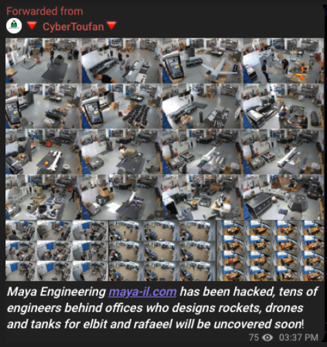

---
hide:
  - navigation
  - toc
---

# Today's Security Incidents

-   

    :material-security:{ .lg .middle } __Cyber Toufan – Maya Engineering Surveillance Breach__

    **Espionage Operation**{.cve-chip} 
    **Data Exfiltration**{.cve-chip} 
    **Surveillance Compromise**{.cve-chip}
    ---

    An Iran-linked threat group **Cyber Toufan** claims to have infiltrated Israeli defense contractor **Maya Engineering**, accessing internal surveillance cameras, QNAP archives, and other networked systems and releasing dozens of internal videos. The authenticity of the claims remains unverified, but the operation — if true — represents long-term espionage and psychological-warfare tactics.

    [:octicons-arrow-right-24: View Full Details](Week45/maya-engineering-breach.md)

