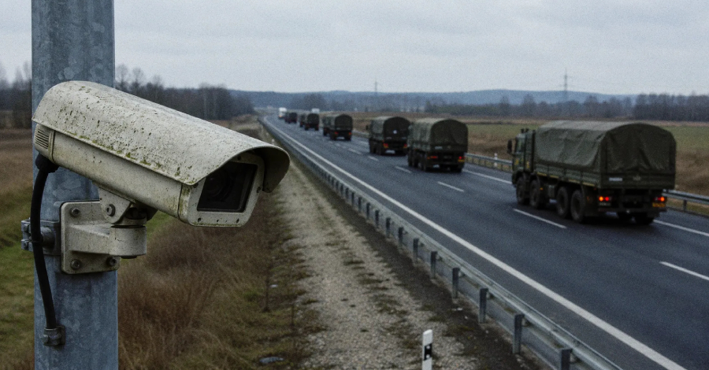

---
hide:
  - navigation
  - toc
---

# Today's Security Incidents

-   

    **Russian Intelligence Campaign Targeting Internet-Connected IP Cameras for Military Espionage**

    **Russian Espionage**{.cve-chip} **IP Camera Compromise**{.cve-chip} **Military Logistics Surveillance**{.cve-chip} **IoT Exposure**{.cve-chip} **OPSEC Risk**{.cve-chip}

    Dutch intelligence warns Russian actors are compromising internet-exposed IP cameras near military-relevant logistics routes across Europe to monitor troop and equipment movement, using weak credentials, exposed services, and unpatched firmware rather than direct military-network intrusion.

    [Read more](2026/Week29/Russian.md)

-   

    **Russian-Speaking Threat Actor Uses Google Gemini CLI to Operate Botnet Infrastructure**

    **AI-Assisted Operations**{.cve-chip} **Botnet Management**{.cve-chip} **Gemini CLI Abuse**{.cve-chip} **Cloudflare Tunnel**{.cve-chip} **PowerShell Tradecraft**{.cve-chip}

    Trend Micro reported a Russian-speaking actor using Gemini CLI across roughly 200 sessions to deploy, troubleshoot, and migrate botnet infrastructure, accelerating C2 operations and endpoint command execution through AI-generated administrative workflows.

    [Read more](2026/Week29/Gemini.md)

