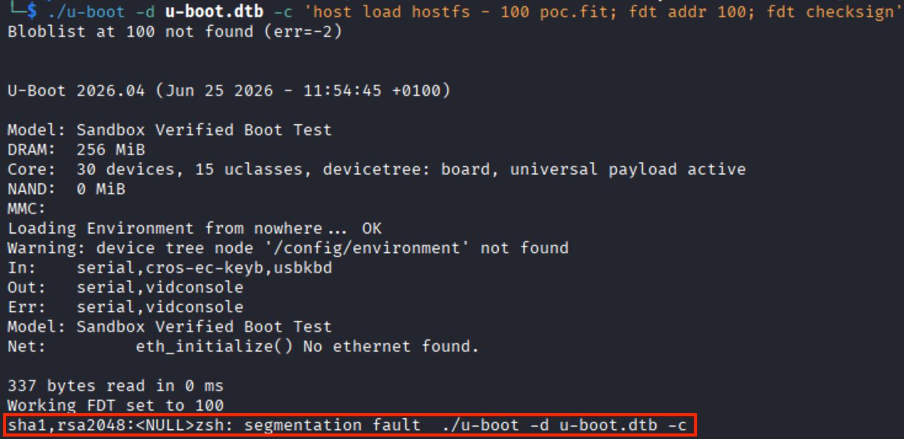
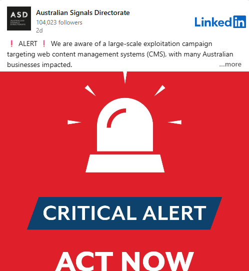
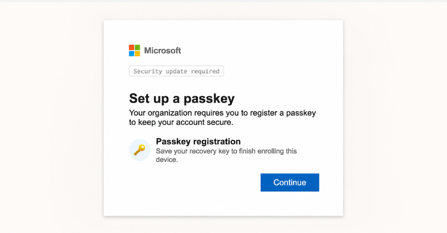

---
hide:
  - navigation
  - toc
---

# Today's Security Incidents

-      

    **Critical U-Boot Secure Boot Vulnerabilities (FIT Image Verification Flaws)**

    **Firmware Security**{.cve-chip} **U-Boot**{.cve-chip} **FIT Parser**{.cve-chip} **Secure Boot Bypass**{.cve-chip} **Pre-OS RCE Risk**{.cve-chip}

    Six newly disclosed U-Boot FIT verification flaws can be triggered before Secure Boot validation completes, enabling trusted-boot bypass and potential bootloader-level code execution that compromises devices before OS startup.

    [Read more](2026/Week28/U-Boot.md)

-      

    **Global Campaign Targeting Vulnerable CMS Platforms with Webshell Deployment**

    **Webshell Deployment**{.cve-chip} **Known CVE Exploitation**{.cve-chip} **CMS Platforms**{.cve-chip} **Persistence**{.cve-chip} **ACSC Alert**{.cve-chip}

    ACSC warns of a global campaign exploiting known but unpatched CMS and plugin flaws to implant webshells, establish persistent access, and enable credential theft, data exfiltration, ransomware deployment, and broader follow-on compromise.

    [Read more](2026/Week28/CMS.md)

-     

    **Fake Microsoft Entra Passkey Enrollment Vishing Campaign**

    **Vishing**{.cve-chip} **Microsoft Entra**{.cve-chip} **Passkey Abuse**{.cve-chip} **FIDO2/WebAuthn**{.cve-chip} **Account Persistence**{.cve-chip}

    Threat actor O-UNC-066 impersonates Microsoft or IT support to trick users into fake passkey enrollment, then registers attacker-controlled FIDO2/WebAuthn credentials for persistent unauthorized Microsoft 365 access even after password changes.

    [Read more](2026/Week28/Microsoft.md)

