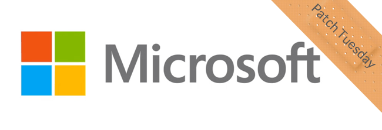

---
hide:
  - navigation
  - toc
---

# Today's Security Incidents

-   

    **Malicious Chrome Extensions Campaign (108 Extensions Data Theft Operation)**

    **Credential Theft**{.cve-chip} **Browser Security**{.cve-chip} **Supply Chain Attack**{.cve-chip}

    108 malicious extensions disguised as Telegram tools, video enhancers, and translators were uploaded to the Chrome Web Store and stole Google OAuth tokens and Telegram session cookies from ~20,000 users. Attackers leveraged the stolen tokens to hijack accounts and bypass MFA entirely, with some extensions also providing backdoor command execution capabilities.

    [Read more](2026/Week15/chrome.md)

-   

    **Microsoft Patch Tuesday April 2026 — 165 Vulnerabilities Fixed, SharePoint Zero-Day Exploited**

    **Patch Tuesday**{.cve-chip} **Zero-Day**{.cve-chip} **Remote Code Execution**{.cve-chip}

    Microsoft's April 2026 Patch Tuesday addressed 165 vulnerabilities, including a critical actively-exploited zero-day in on-premises SharePoint Server. Attackers can exploit the flaw remotely to execute code, move laterally, and deploy ransomware — unpatched internet-facing SharePoint servers remain at immediate risk.

    [Read more](2026/Week15/microsoft.md)

