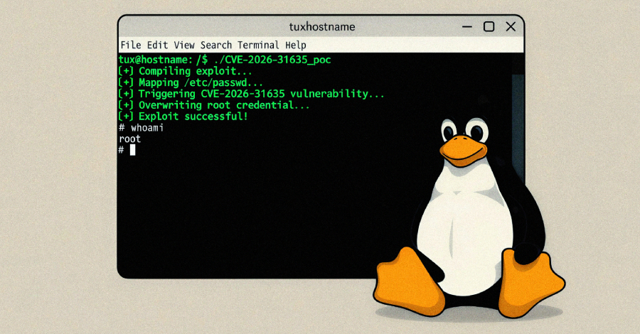

---
hide:
  - navigation
  - toc
---

# Today's Security Incidents

-   

    **TP-Link Archer AX53 Stack-Based Buffer Overflow - CVE-2026-30814**

    **CVE-2026-30814**{.cve-chip} **TP-Link**{.cve-chip} **Stack-Based Buffer Overflow**{.cve-chip} **Router Security**{.cve-chip}

    A high-severity stack-based buffer overflow in the `tmpServer` component of TP-Link Archer AX53 firmware (prior to 1.7.1 Build 20260213) allows an authenticated adjacent-network attacker to overflow stack memory via a crafted configuration payload, potentially enabling remote code execution, DNS hijacking, or denial of service.

    [Read more](2026/Week20/Tp.md)

-   

    **GitHub Internal Repository Breach**

    **GitHub**{.cve-chip} **Supply Chain Risk**{.cve-chip} **Malicious VS Code Extension**{.cve-chip}

    A GitHub employee installed a malicious VS Code extension that compromised their endpoint, allowing threat actor TeamPCP to steal authentication tokens and exfiltrate ~3,800–4,000 internal repositories. Stolen data includes source code, CI/CD workflows, and infrastructure configurations; no customer repository impact confirmed.

    [Read more](2026/Week20/GitHub.md)

-   

    **PinTheft Linux Privilege Escalation Vulnerability - CVE-2026-31635**

    **CVE-2026-31635**{.cve-chip} **Linux Kernel LPE**{.cve-chip} **RDS Subsystem**{.cve-chip} **Public Exploit**{.cve-chip}

    A double-free in the Linux kernel RDS zerocopy send path (`rds_message_zcopy_from_user()`) allows a local unprivileged user to achieve page-cache overwrites via `io_uring` fixed buffer abuse and escalate to root. Public PoC code is available, significantly lowering the bar for exploitation.

    [Read more](2026/Week20/PinTheft.md)

