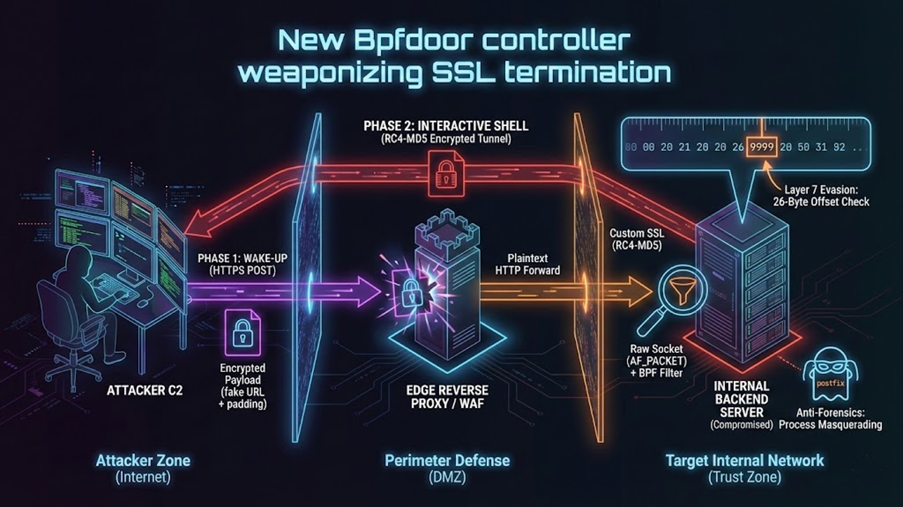
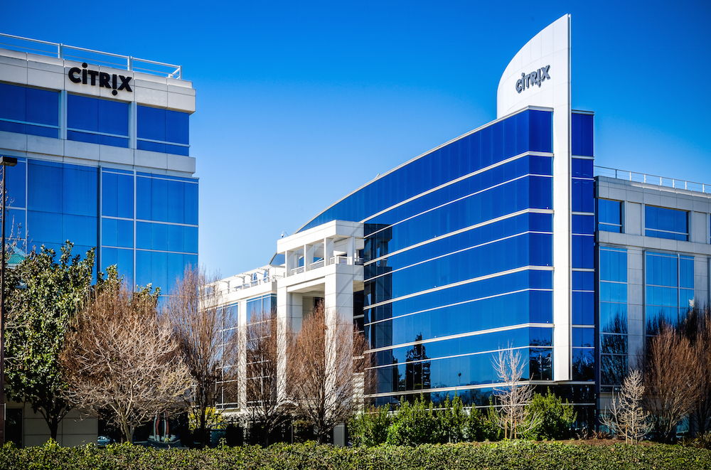

---
hide:
  - navigation
  - toc
---

# Today's Security Incidents

-   

    **Handala Hack of Kash Patel (FBI Director) Personal Email**

    **Account Compromise**{.cve-chip} **Hacktivism**{.cve-chip} **Data Leak**{.cve-chip}

    The pro-Iranian Handala group claimed compromise of FBI Director Kash Patel's personal email account and leaked historical personal communications and files.

    Authorities stated no classified information was affected, but the case highlights persistent high-profile risk from personal-account targeting.

    [Read more](2026/Week13/FBI.md)

-   

    **ShinyHunters Claims Breach of European Commission**

    **Cloud Security**{.cve-chip} **Data Breach**{.cve-chip} **ShinyHunters**{.cve-chip}

    ShinyHunters claimed a breach of a cloud-hosted European Commission web platform and alleged large-scale data theft.

    The Commission stated the impact was limited to a web platform and that core internal systems remained unaffected.

    [Read more](2026/Week13/EuropeanCommission.md)

-   

    **Red Menshen APT - BPFdoor Telecom Espionage Campaign**

    **APT Activity**{.cve-chip} **Telecom Espionage**{.cve-chip} **Linux Backdoor**{.cve-chip}

    China-linked Red Menshen operators reportedly used stealthy BPFdoor implants to maintain covert long-term access in telecom environments.

    Dormant trigger-based activation and low-noise behavior make detection difficult while enabling persistent intelligence collection.

    [Read more](2026/Week13/BPFdoor.md)

-   

    **NetScaler Memory Disclosure Vulnerability - CVE-2026-3055**

    **Citrix NetScaler**{.cve-chip} **Memory Disclosure**{.cve-chip} **Active Probing**{.cve-chip}

    CVE-2026-3055 is a critical NetScaler memory overread flaw tied to SAML handling that can expose sensitive authentication data via crafted requests.

    Active probing raises risk of token theft, session hijacking, and broader compromise of remote access infrastructure.

    [Read more](2026/Week13/NetScaler.md)

