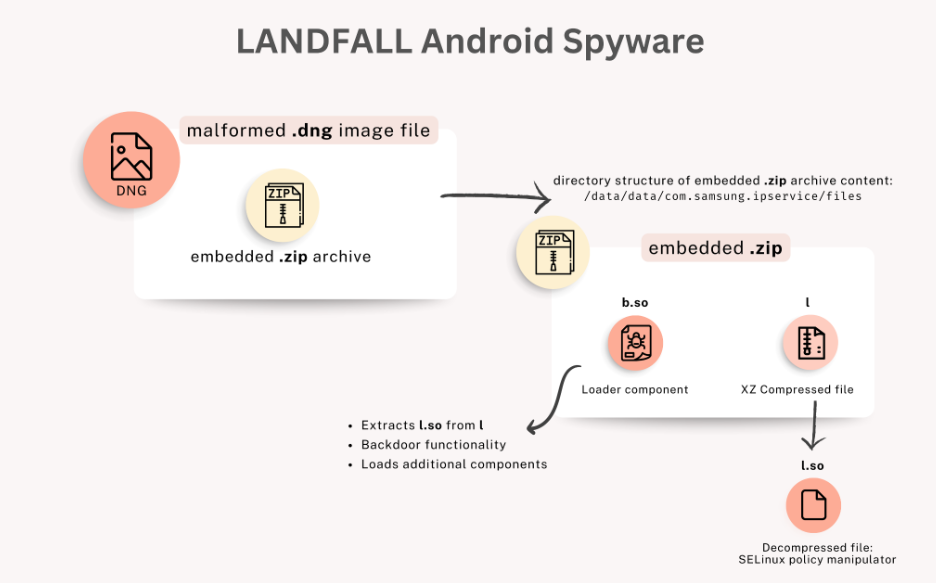
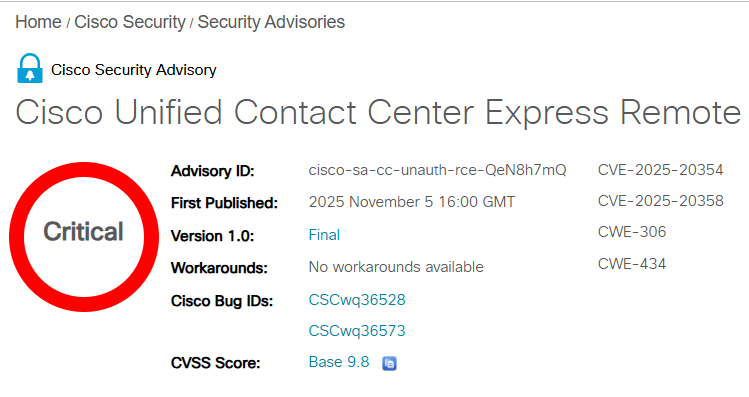

---
hide:
  - navigation
  - toc
---

# Today's Security Incidents

-   

    :material-cellphone:{ .lg .middle } **LANDFALL Android Spyware — Samsung Galaxy Zero‑Day Campaign**

    **CVE-2025-21042**{.cve-chip}
    **Full device takeover**{.cve-chip}
    **Persistent surveillance**{.cve-chip}
    --------------------------------------

    A previously unknown Android spyware family, **LANDFALL**, exploited a zero‑day in Samsung's image decoder (`libimagecodec.quram.so`) to achieve remote code execution via crafted DNG images. Targets included Samsung Galaxy devices in Iraq, Iran, Turkey, and Morocco. Patch with April 2025 security update.

    [:octicons-arrow-right-24: View Full Details](Week46/samsung-spyware.md)

-   

    :material-lock-alert:{ .lg .middle } **Cisco Unified Contact Center Express (Unified CCX) Critical Vulnerabilities**

    **CVE-2025-20354**{.cve-chip}
    **CVE-2025-20358**{.cve-chip}
    **Remote Code Execution**{.cve-chip}
    **Authentication Bypass**{.cve-chip}
    ------------------------------------

    Cisco disclosed two critical vulnerabilities in its **Unified Contact Center Express (Unified CCX)** appliance that could allow remote attackers to execute arbitrary commands or gain administrative control without authentication. The flaws reside in the **Java RMI process** and the **CCX Editor authentication flow**. Cisco released fixed versions **12.5 SU3 ES07** and **15.0 ES01**. No exploitation has been observed in the wild at publication time.

    [:octicons-arrow-right-24: View Full Details](Week46/cisco-ccx.md)

