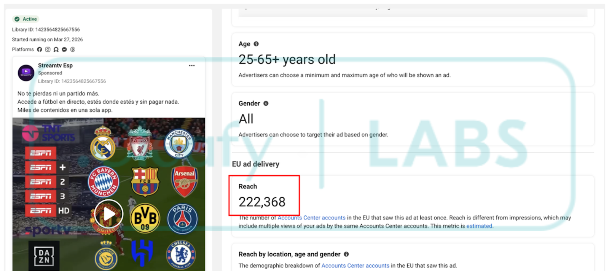
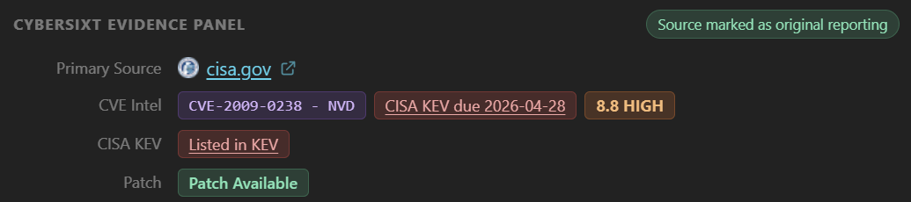

---
hide:
  - navigation
  - toc
---

# Today's Security Incidents

-   

    **Mirax Android Malware Campaign**

    **Android Malware**{.cve-chip} **Banking Trojan**{.cve-chip} **Malware-as-a-Service**{.cve-chip}

    Mirax is a fully-featured Android RAT distributed via malvertising that infected 220,000+ devices. It steals banking credentials through overlay attacks, intercepts OTPs, and silently converts victim devices into SOCKS5 proxy nodes. Operated as a MaaS platform, it primarily targets Spanish-speaking users.

    [Read more](2026/Week15/Mirax.md)

-   

    **Microsoft Excel Legacy Vulnerability Exploitation (CVE-2009-0238)**

    **CVE-2009-0238**{.cve-chip} **Remote Code Execution**{.cve-chip} **Active Exploitation**{.cve-chip}

    A 15-year-old memory corruption flaw in legacy Microsoft Excel is being actively exploited. Attackers deliver malicious `.xls` files via phishing to trigger arbitrary code execution on unpatched systems, enabling full compromise, data theft, and lateral movement. CISA has added the vulnerability to its Known Exploited Vulnerabilities catalog.

    [Read more](2026/Week15/excel.md)

-   

    **WordPress Plugin Supply Chain Attack (EssentialPlugin Compromise)**

    **Supply Chain Attack**{.cve-chip} **WordPress**{.cve-chip} **Backdoor**{.cve-chip}

    An attacker compromised the EssentialPlugin developer to backdoor 30+ WordPress plugins and distribute malicious updates through official channels. Thousands of sites were infected with remote-access backdoors enabling spam injection, malicious redirects, and full admin takeover.

    [Read more](2026/Week15/WordPress.md)

