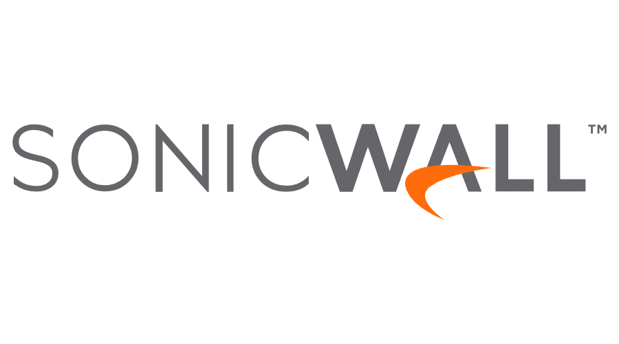

---
hide:
  - navigation
  - toc
---

# Today's Security Incidents

-   

    **WP2Shell WordPress Vulnerabilities Exploited in the Wild**

    **CVE-2026-63030**{.cve-chip} **CVE-2026-60137**{.cve-chip} **Pre-Auth RCE**{.cve-chip} **WordPress Core**{.cve-chip} **Active Exploitation**{.cve-chip}

    Attackers are actively chaining two WordPress core flaws to achieve anonymous pre-auth remote code execution on default vulnerable installations, with public PoCs available and post-exploitation activity including rogue admin creation and web shell deployment.

    [Read more](2026/Week29/WP2Shell.md)

-   

    **SonicWall SMA 1000 SSRF + post-auth code-injection zero-days**

    **CVE-2026-15409**{.cve-chip} **CVE-2026-15410**{.cve-chip} **SMA 1000**{.cve-chip} **Zero-Day Chain**{.cve-chip} **Root RCE**{.cve-chip}

    SonicWall disclosed active exploitation of two SMA 1000 zero-days where CVE-2026-15409 (SSRF) can be chained with CVE-2026-15410 (post-auth code injection) to achieve effective unauthenticated root-level code execution on remote-access gateways.

    [Read more](2026/Week29/SonicWall.md)

